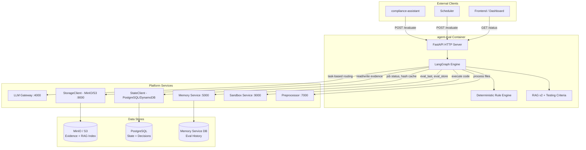
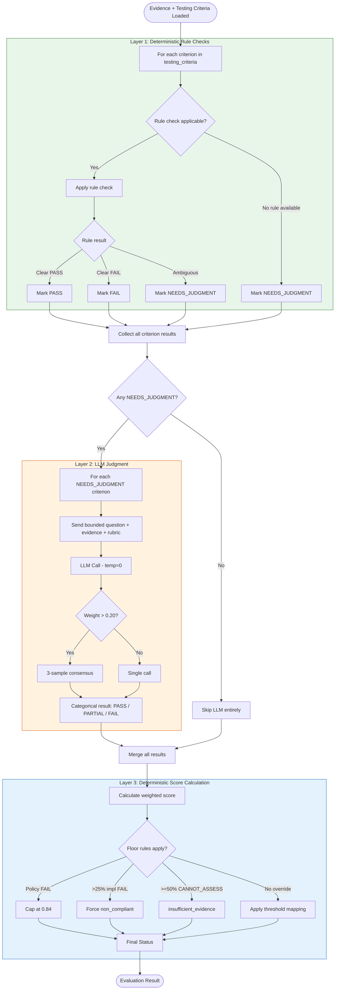
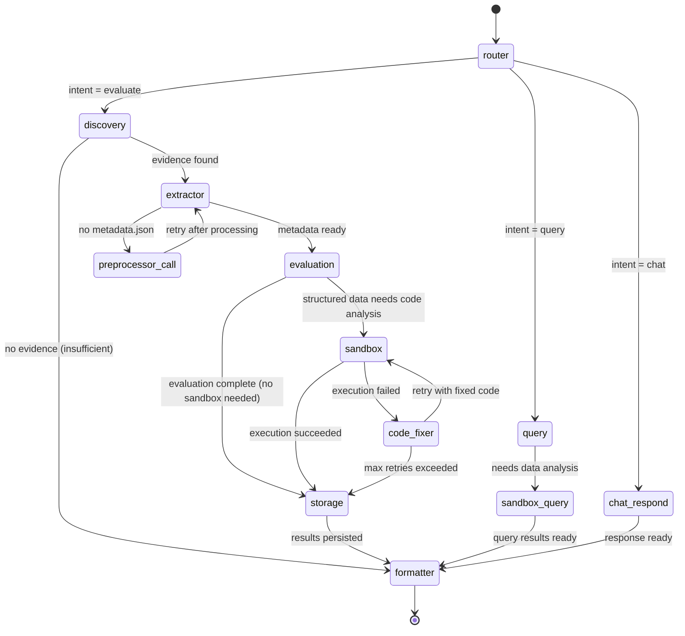
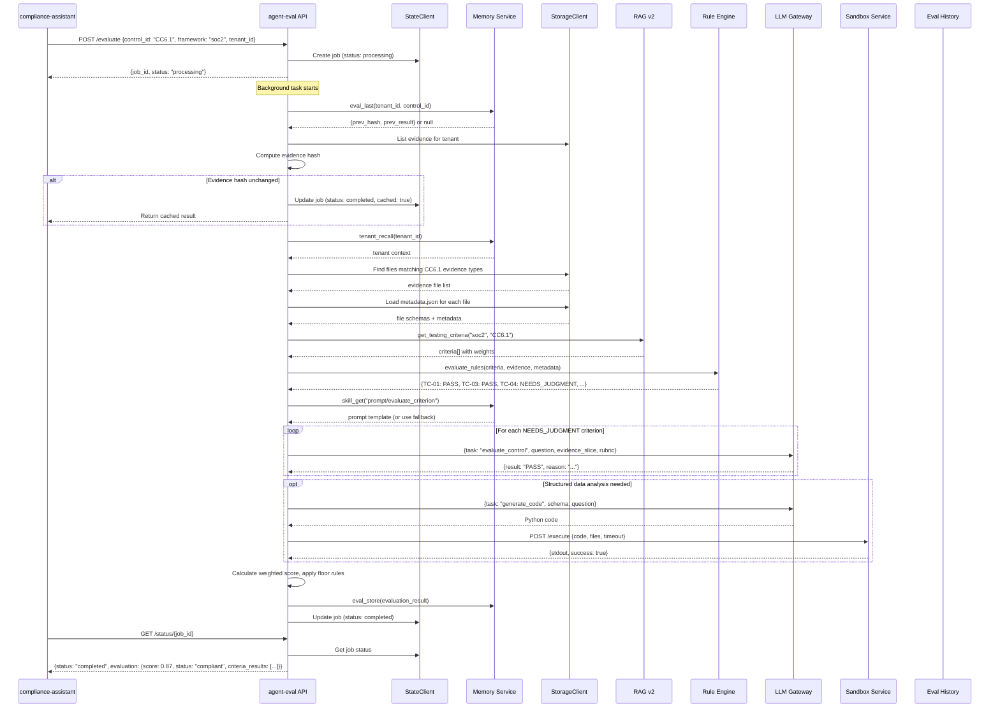
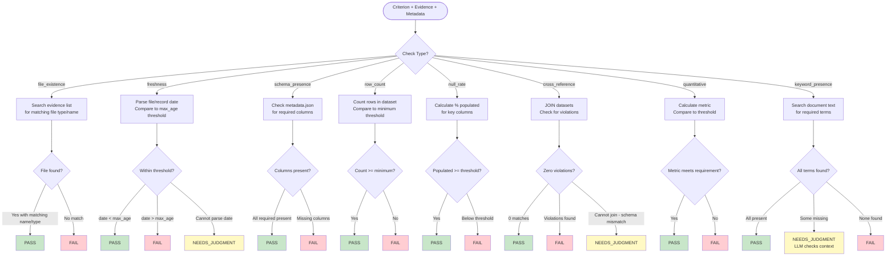
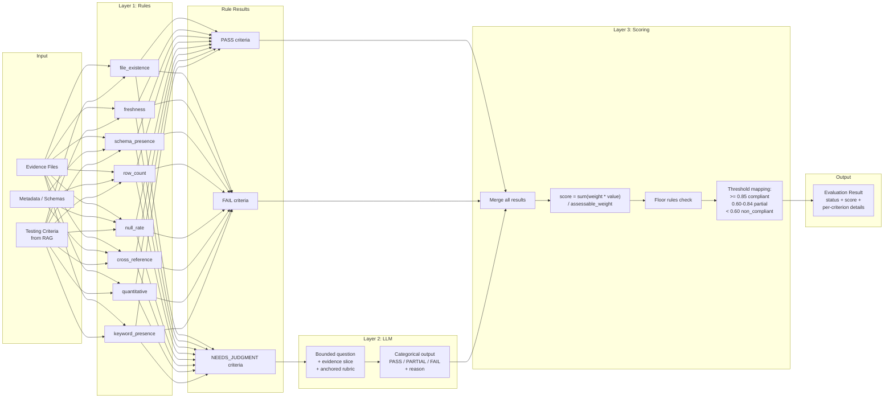
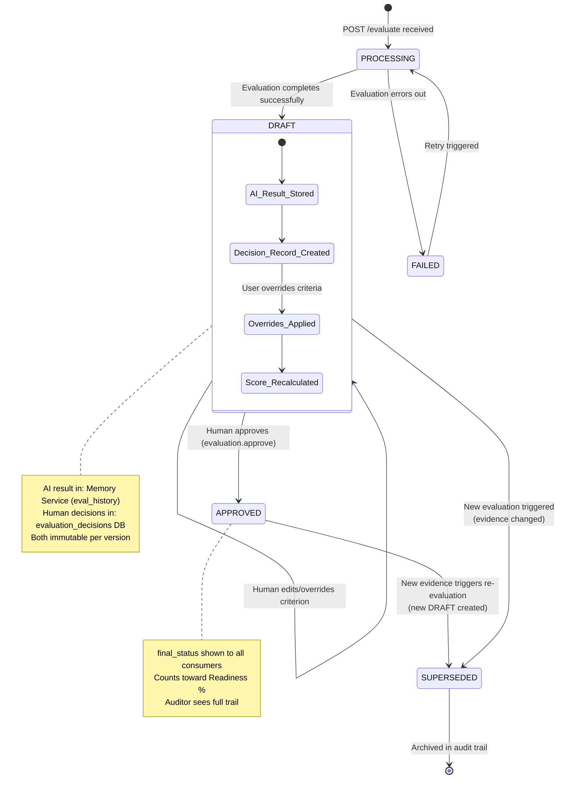

# Agent-Eval: Architecture Design Document

## Overview

Agent-eval is a stateful compliance evaluation engine that takes evidence (structured + unstructured), evaluates it against regulatory controls, and generates compliance assessments with gaps and recommendations. It evaluates **one control per request** as a single unit of work, with batch coordination handled externally by the compliance-assistant.

The engine uses a 3-layer evaluation pipeline that maximizes determinism: deterministic rule checks first, LLM judgment only when rules cannot resolve, and a deterministic scoring formula to produce the final result.

---

## High-Level Architecture



---

## 3-Layer Evaluation Pipeline



---

## LangGraph Node Graph



---

## Sequence Diagram: Single Control Evaluation



---

## Deterministic Rule Engine Logic



---

## Data Flow: Evidence to Score



---

## Evaluation Lifecycle



---

## Module Structure

```mermaid
graph TD
    subgraph "src/"
        subgraph "src/agent_eval/"
            MAIN[__main__.py<br/>Entry point]
            SERVER[server.py<br/>FastAPI HTTP server]
            CONFIG[config.py<br/>Environment config]

            subgraph "graph/"
                GRAPH_MOD[graph.py<br/>LangGraph definition]
                STATE_MOD[state.py<br/>Graph state schema]
                NODES[nodes/]
            end

            subgraph "nodes/"
                ROUTER_N[router.py<br/>Intent classification]
                DISCOVERY_N[discovery.py<br/>Evidence discovery]
                EXTRACTOR_N[extractor.py<br/>Metadata extraction]
                EVAL_N[evaluation.py<br/>3-layer pipeline orchestrator]
                SANDBOX_N[sandbox.py<br/>Sandbox service client]
                CODEFIXER_N[code_fixer.py<br/>Fix failed code]
                STORAGE_N[storage.py<br/>Persist results]
                FORMATTER_N[formatter.py<br/>Format output]
                QUERY_N[query.py<br/>Data query handler]
                CHAT_N[chat.py<br/>Chat response]
            end

            subgraph "evaluation/"
                RULES_MOD[rules.py<br/>Deterministic rule engine]
                SCORING[scoring.py<br/>Layer 3 formula]
                CRITERIA[criteria.py<br/>Testing criteria loader]
                JUDGMENT[judgment.py<br/>Layer 2 LLM calls]
            end

            subgraph "rag/"
                RAG_MOD[rag_v2.py<br/>RAG index + retrieval]
                CROSS[cross_framework.py<br/>SCF mappings]
            end

            subgraph "clients/"
                LLM_C[llm.py<br/>LLMClient wrapper]
                STORAGE_C[storage.py<br/>StorageClient wrapper]
                STATE_C[state.py<br/>StateClient wrapper]
                MEMORY_C[memory.py<br/>MemoryClient wrapper]
                SANDBOX_C[sandbox.py<br/>Sandbox HTTP client]
                PREPROC_C[preprocessor.py<br/>Preprocessor HTTP client]
            end

            subgraph "models/"
                EVAL_M[evaluation.py<br/>EvaluationResult, CriterionResult]
                EVIDENCE_M[evidence.py<br/>EvidenceFile, Metadata]
                CRITERIA_M[criteria.py<br/>TestingCriteria, Criterion]
                JOB_M[job.py<br/>JobStatus]
            end

            PROMPTS[prompts/<br/>Default prompt templates]
            LOGGER_MOD[logger.py<br/>Structured logging]
        end
    end

    subgraph "tests/"
        T_RULES[test_rules.py]
        T_SCORING[test_scoring.py]
        T_GRAPH[test_graph.py]
        T_INTEGRATION[test_integration.py]
    end

    SERVER --> GRAPH_MOD
    GRAPH_MOD --> NODES
    EVAL_N --> RULES_MOD & SCORING & JUDGMENT & CRITERIA
    NODES --> LLM_C & STORAGE_C & STATE_C & MEMORY_C
    SANDBOX_N --> SANDBOX_C
    EXTRACTOR_N --> PREPROC_C
```



---

## Key Design Decisions

### 1. Single Control per Request

**Decision:** Agent-eval always evaluates exactly one control per invocation. Batch coordination is external.

**Rationale:**
- Simplifies the agent's state management (no multi-control tracking)
- Enables horizontal scaling (orchestrator controls concurrency)
- Each evaluation is independently cacheable and retryable
- Failure isolation: one control failure does not block others
- The compliance-assistant or batch-manager handles fan-out, progress tracking, and aggregation

### 2. Three-Layer Pipeline over Pure LLM

**Decision:** Use deterministic rules first, LLM only for items rules cannot resolve, then a deterministic scoring formula.

**Rationale:**
- 60-70% of criteria resolve without LLM (instant, free, 100% reproducible)
- LLM is bounded to specific questions (not open-ended "evaluate this control")
- Final score is always deterministic given criterion results
- Overall reproducibility: 97-99% (100% with evidence hash caching)
- Cost savings: many evaluations complete with zero LLM calls
- Auditability: every decision step is traceable and explainable

### 3. Results are DRAFT until Human Approves

**Decision:** AI results and human decisions live in separate databases. All AI results start as DRAFT.

**Rationale:**
- AI results are immutable (never edit what the AI said)
- Human override is recorded separately with reason and attribution
- Auditor sees full trail: "AI said X, human decided Y, because Z"
- Re-evaluation does not destroy human decisions (versioned)
- Different access patterns: agents write AI store, humans write decisions store

### 4. LLM Agnostic via Gateway

**Decision:** All LLM calls go through LLM Gateway with task-based routing. Agent declares task type, not model.

**Rationale:**
- Supports on-prem (Ollama, vLLM) and cloud (Bedrock, OpenAI) without code changes
- Observer can optimize routing without agent redeploy
- Task types enable tier-based routing (fast/mid/strong)
- Agent has zero knowledge of which model handles the request
- Enables cost optimization and failover at the gateway level

### 5. Evidence Hash Caching

**Decision:** Hash all evidence files before evaluation. If hash matches previous evaluation, return cached result.

**Rationale:**
- Provides 100% deterministic results for unchanged evidence (anti-flapping)
- Prevents redundant evaluations during batch re-runs
- Enables incremental re-evaluation (only re-check criteria affected by changed files)
- Reduces LLM costs and latency for stable controls

### 6. Storage and State Abstraction

**Decision:** All I/O through abstract clients (StorageClient, StateClient, MemoryClient).

**Rationale:**
- Enables on-prem deployment (MinIO, PostgreSQL) without code changes
- Cloud deployment uses same code (S3, DynamoDB)
- Single configuration point per service (environment variables)
- Testability: mock clients for unit tests

### 7. Sandbox as External Service

**Decision:** Code execution happens in a separate sandbox-service, not within agent-eval.

**Rationale:**
- Security isolation (untrusted generated code runs in containers)
- Resource limits managed independently
- Multiple agents can share the sandbox service
- Agent-eval only generates code and interprets results
- Sandbox lifecycle management is not agent-eval's concern

---

## Testing Criteria: Loading and Usage

### Loading Flow

1. **Startup:** RAG v2 loads `chunks.json` from StorageClient (mounted at `RAG_INDEX_PATH` or fetched from storage)
2. **Indexing:** Chunks with `chunk_type: "testing_criteria"` are indexed in `_cache["by_criteria"]` mapping `(framework, control_id) -> chunk_index`
3. **Runtime:** When evaluation node receives a control, it calls `rag.get_testing_criteria(framework, control_id)`
4. **Versioning:** Criteria can be updated via memory-service skills (`memory.skill_get("criteria/{framework}/{control_id}")`). Observer can push new versions without agent redeploy.
5. **Fallback:** If memory-service is unreachable, use built-in criteria from RAG index (bundled at build time)

### Usage in Evaluation

```python
# evaluation/criteria.py
def load_criteria(framework: str, control_id: str) -> TestingCriteria:
    """Load testing criteria, with memory-service override check."""
    # Try memory-service first (may have observer-updated version)
    versioned = memory_client.skill_get(f"criteria/{framework}/{control_id}")
    if versioned:
        return TestingCriteria.parse(versioned)
    # Fallback to bundled RAG index
    return rag.get_testing_criteria(framework, control_id)

# evaluation/rules.py
def evaluate_rules(criteria: TestingCriteria, evidence: List[Evidence]) -> Dict[str, RuleResult]:
    """Layer 1: Apply deterministic rules to each criterion."""
    results = {}
    for criterion in criteria.criteria:
        rule = select_rule(criterion.evidence_type, criterion.pass_condition)
        if rule:
            results[criterion.id] = rule.evaluate(criterion, evidence)
        else:
            results[criterion.id] = RuleResult(status="NEEDS_JUDGMENT")
    return results

# evaluation/judgment.py
def evaluate_with_llm(criteria_needing_judgment, evidence, prompt_template) -> Dict[str, JudgmentResult]:
    """Layer 2: LLM evaluates only NEEDS_JUDGMENT criteria."""
    results = {}
    for criterion in criteria_needing_judgment:
        evidence_slice = extract_relevant_evidence(criterion, evidence)
        response = llm_client.invoke(
            task="evaluate_control",
            messages=format_judgment_prompt(criterion, evidence_slice, prompt_template),
            temperature=0,
            confidence_threshold=0.8
        )
        results[criterion.id] = parse_judgment(response)
    return results

# evaluation/scoring.py
def calculate_score(all_results: Dict[str, CriterionResult], criteria: TestingCriteria) -> EvaluationScore:
    """Layer 3: Deterministic weighted score with floor rules."""
    score_values = {"PASS": 1.0, "PARTIAL": 0.5, "FAIL": 0.0}
    
    assessable_weight = sum(c.weight for c in criteria.criteria 
                           if all_results[c.id].status != "CANNOT_ASSESS")
    
    if assessable_weight < 0.5:
        return EvaluationScore(status="insufficient_evidence")
    
    raw_score = sum(c.weight * score_values[all_results[c.id].status] 
                    for c in criteria.criteria 
                    if all_results[c.id].status != "CANNOT_ASSESS") / assessable_weight
    
    # Apply floor rules
    final_score = apply_floor_rules(raw_score, all_results, criteria)
    
    return EvaluationScore(
        score=final_score,
        status=threshold_map(final_score)
    )
```

---

## Sandbox Integration

### Architecture

Agent-eval generates Python code via LLM for structured data analysis. The code is executed by the external sandbox-service.

### Flow

1. **Code Generation:** The evaluation node identifies criteria requiring structured data analysis (e.g., cross-references, quantitative thresholds). It asks the LLM (`task="generate_code"`) to generate Python that loads the data and checks conditions.

2. **Execution Request:**
   ```python
   response = sandbox_client.execute(
       code=generated_python,
       files=[
           {"key": "tenant/evidence/access_reviews.csv", "type": "csv"},
           {"key": "tenant/evidence/terminations.csv", "type": "csv"}
       ],
       timeout_sec=60
   )
   ```

3. **Sandbox Service Responsibilities:**
   - Fetches files from StorageClient into isolated container
   - Executes code with resource limits (CPU, memory, time)
   - Returns stdout/stderr and success status
   - Cleans up container after execution

4. **Result Interpretation:** Agent-eval parses stdout (expected to be structured JSON output from the generated code) and uses it as evidence for rule engine or LLM judgment.

5. **Error Recovery:** If execution fails (`success: false`), the code_fixer node sends the error to LLM (`task="fix_code"`) and retries (max `MAX_SANDBOX_RETRIES` times).

### Contract

```
POST http://sandbox-service:9000/execute
Request:  {code: str, files: [{key: str, type: str}], timeout_sec: int}
Response: {stdout: str, stderr: str, success: bool, duration_ms: int}
```

---

## Evidence Hash Caching

### Purpose

Prevent redundant evaluations when evidence has not changed. Provides 100% deterministic results and eliminates LLM cost for stable controls.

### Mechanism

```python
# In evaluation startup (before Layer 1)

def compute_evidence_hash(evidence_files: List[EvidenceFile]) -> str:
    """Deterministic hash of all evidence relevant to this control."""
    hasher = hashlib.sha256()
    for f in sorted(evidence_files, key=lambda x: x.storage_key):
        hasher.update(f.storage_key.encode())
        hasher.update(f.last_modified.isoformat().encode())
        hasher.update(str(f.size_bytes).encode())
    return hasher.hexdigest()

def check_cache(tenant_id, control_id, current_hash) -> Optional[EvaluationResult]:
    """Check if we can return a cached result."""
    previous = memory_client.eval_last(tenant_id, control_id)
    if previous and previous.evidence_hash == current_hash:
        return previous.result  # 100% deterministic, zero cost
    return None
```

### Cache Invalidation

- **Explicit:** New evidence uploaded (preprocessor event triggers re-evaluation)
- **Implicit:** Evidence file modified (last_modified changes -> hash changes)
- **Forced:** User requests fresh evaluation (bypass cache flag)
- **Time-based:** Optional staleness threshold (e.g., re-evaluate if cached result > 7 days old)

### Incremental Re-evaluation

When evidence hash changes but only some files differ:

1. Identify which criteria are affected by the changed files (via `evidence_type` mapping)
2. Re-evaluate only affected criteria (Layer 1 -> Layer 2 if needed)
3. Merge with previous results for unchanged criteria
4. Recalculate score (Layer 3) with merged results

This reduces evaluation time and LLM calls for partial evidence updates.

---

## API Contract

| Endpoint | Method | Purpose | Response |
|----------|--------|---------|----------|
| `/evaluate` | POST | Start async evaluation | `{job_id, status: "processing"}` |
| `/status/{job_id}` | GET | Poll for result | `{status, evaluation}` |
| `/chat` | POST | Synchronous compliance chat | `{response}` |
| `/health` | GET | Container health | `{status: "healthy"}` |
| `/ready` | GET | Readiness (RAG loaded) | `{ready: true/false}` |

### Evaluate Request

```json
{
  "control_id": "CC6.1",
  "framework": "soc2",
  "tenant_id": "tenant-123",
  "bypass_cache": false
}
```

### Evaluate Response (via /status)

```json
{
  "status": "completed",
  "evaluation": {
    "evaluation_id": "eval-uuid",
    "control_id": "CC6.1",
    "framework": "soc2",
    "score": 0.87,
    "status": "compliant",
    "evidence_hash": "sha256:abc123...",
    "criteria_results": [
      {
        "criterion_id": "TC-CC6.1-01",
        "category": "policy",
        "result": "PASS",
        "method": "rule:keyword_presence",
        "reason": "Policy contains required terms: provisioning, de-provisioning, least privilege, quarterly review"
      },
      {
        "criterion_id": "TC-CC6.1-04",
        "category": "implementation",
        "result": "PASS",
        "method": "rule:cross_reference",
        "reason": "0 terminated users found in active access list (cross-reference of terminations.csv and active_users.csv)"
      },
      {
        "criterion_id": "TC-CC6.1-05",
        "category": "implementation",
        "result": "PARTIAL",
        "method": "llm_judgment",
        "reason": "Role-based model documented but 3 admin accounts lack written justification"
      }
    ],
    "layer_stats": {
      "layer1_resolved": 4,
      "layer2_resolved": 2,
      "total_criteria": 6,
      "llm_calls": 2,
      "sandbox_calls": 1
    },
    "timing": {
      "total_ms": 12400,
      "layer1_ms": 230,
      "layer2_ms": 8900,
      "layer3_ms": 5,
      "sandbox_ms": 3100
    }
  }
}
```

---

## Observability

Every LLM call emits a structured log entry consumed by the observer:

```json
{
  "trace_id": "trace-uuid",
  "agent": "agent-eval",
  "node": "evaluation",
  "task": "evaluate_control",
  "tier_requested": "mid",
  "latency_ms": 2340,
  "confidence": 0.92,
  "success": true,
  "tenant_id": "tenant-123",
  "control_id": "CC6.1",
  "criterion_id": "TC-CC6.1-05",
  "context": {
    "layer": 2,
    "evidence_type": "unstructured",
    "token_input": 3200,
    "token_output": 85
  }
}
```

Per-node timing is tracked for the full graph execution, enabling the observer to identify bottlenecks and optimize routing.

---

## Configuration Summary

| Variable | Default | Purpose |
|----------|---------|---------|
| `LLM_GATEWAY_URL` | `http://llm-gateway:4000` | LLM Gateway endpoint |
| `MEMORY_URL` | `http://memory-service:5000` | Memory Service endpoint |
| `STORAGE_ENDPOINT` | `http://minio:9000` | Storage (MinIO/S3) endpoint |
| `STORAGE_BUCKET` | `compliance-artifacts` | Evidence bucket |
| `STATE_BACKEND` | `postgres` | State store type |
| `STATE_DSN` | `postgresql://...` | State store connection |
| `PREPROCESSOR_URL` | `http://preprocessor:7000` | Preprocessor service |
| `SANDBOX_URL` | `http://sandbox-service:9000` | Sandbox service |
| `LOG_LEVEL` | `info` | Logging level |
| `MAX_EVAL_TIMEOUT_SEC` | `300` | Max evaluation duration |
| `MAX_SANDBOX_RETRIES` | `2` | Sandbox retry attempts |
| `RAG_INDEX_PATH` | `/data/rag/` | RAG index location |

---

## Deployment

- **Image:** Single Docker container, independently versioned (`EVAL_VERSION` env var)
- **Resources:** 2GB max memory (default), no GPU required
- **Scaling:** Horizontal via orchestrator concurrency control
- **Startup:** Load RAG index from storage, report `/ready` when index is loaded
- **Shutdown:** Graceful on SIGTERM (finish in-progress evaluation before exit)
- **Health:** `/health` returns immediately, `/ready` gates traffic until RAG is loaded
