# Agent-Eval: Architecture Design Document

## Overview

Agent-eval is a stateful compliance evaluation engine that takes evidence (structured + unstructured), evaluates it against regulatory controls, and generates compliance assessments with gaps and recommendations. It evaluates **one control per request** as a single unit of work, with batch coordination handled externally by the compliance-assistant.

The engine uses a 3-layer evaluation pipeline that maximizes determinism: deterministic rule checks first, LLM judgment only when rules cannot resolve, and a deterministic scoring formula to produce the final result.

---

## High-Level Architecture

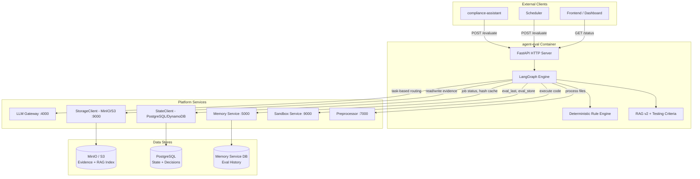

---

## 3-Layer Evaluation Pipeline

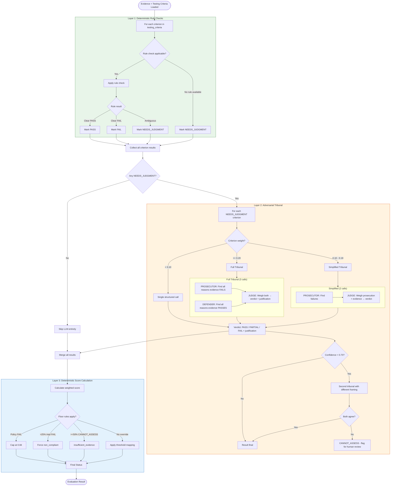

---

## LangGraph Node Graph

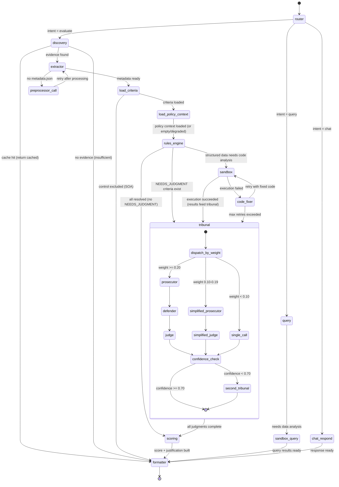

---

## Sequence Diagram: Single Control Evaluation

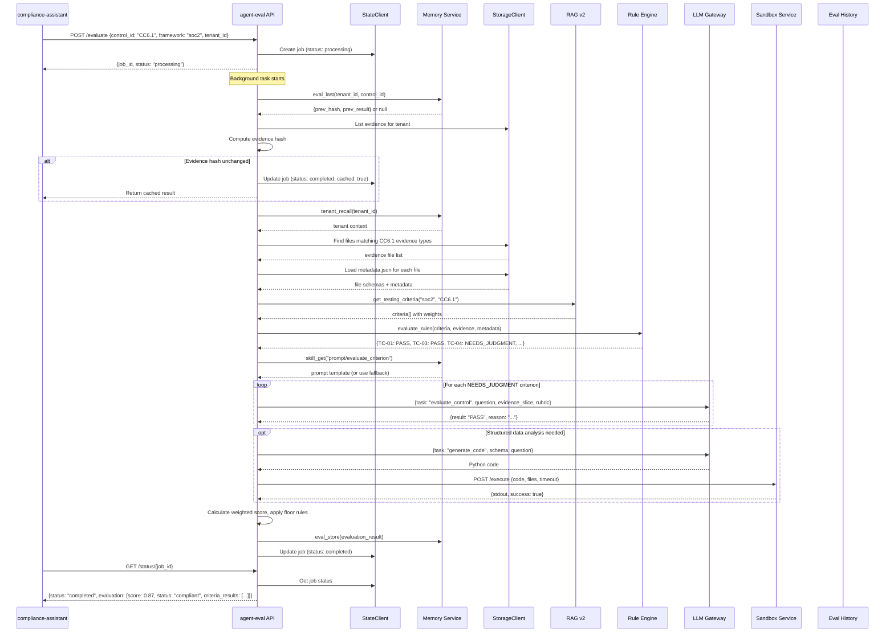

---

## Deterministic Rule Engine Logic


---

## Data Flow: Evidence to Score

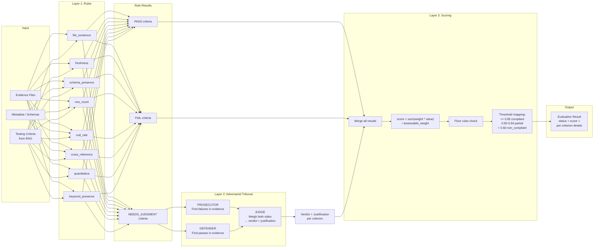

---

## Evaluation Lifecycle

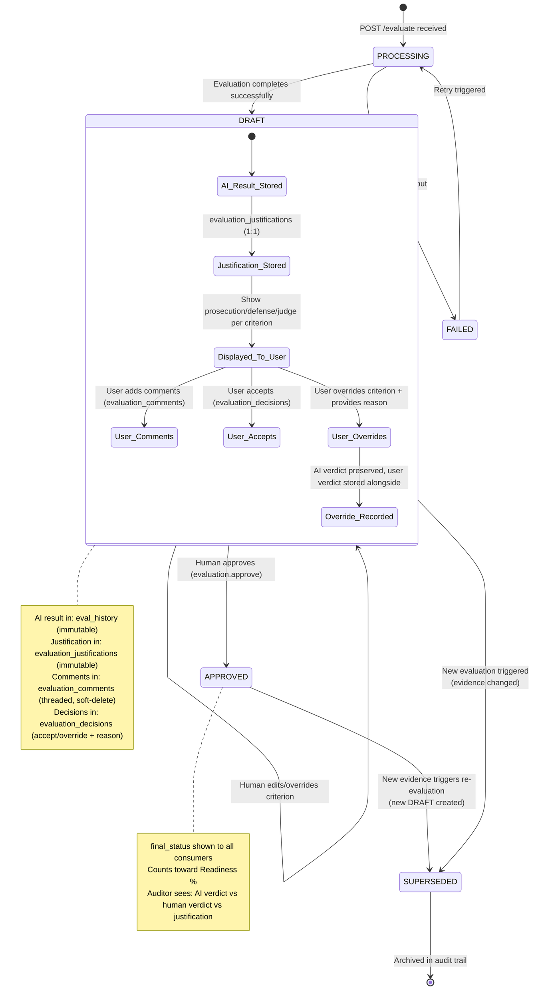

---

## Module Structure

```mermaid
graph TD
    subgraph "src/"
        subgraph "src/agent_eval/"
            MAIN[__main__.py<br/>Entry point]
            SERVER[server.py<br/>FastAPI HTTP server]
            CONFIG[config.py<br/>Environment config]

            subgraph "graph/"
                GRAPH_MOD[graph.py<br/>LangGraph definition]
                STATE_MOD[state.py<br/>Graph state schema]
                NODES[nodes/]
            end

            subgraph "nodes/"
                ROUTER_N[router.py<br/>Intent classification]
                DISCOVERY_N[discovery.py<br/>Evidence discovery]
                EXTRACTOR_N[extractor.py<br/>Metadata extraction]
                CRITERIA_N[load_criteria.py<br/>Criteria + SOA check]
                POLICY_CTX_N[load_policy_context.py<br/>Graph traverse + obligations]
                EVAL_N[evaluation.py<br/>3-layer pipeline orchestrator]
                SANDBOX_N[sandbox.py<br/>Sandbox service client]
                CODEFIXER_N[code_fixer.py<br/>Fix failed code]
                STORAGE_N[storage.py<br/>Persist results]
                FORMATTER_N[formatter.py<br/>Format output + justification]
                QUERY_N[query.py<br/>Data query handler]
                CHAT_N[chat.py<br/>Chat response]
            end

            subgraph "evaluation/"
                RULES_MOD[rules.py<br/>Deterministic rule engine]
                SCORING[scoring.py<br/>Layer 3 formula]
                CRITERIA[criteria.py<br/>Testing criteria loader]
                TRIBUNAL[tribunal.py<br/>Layer 2 adversarial tribunal]
                JUSTIFICATION[justification.py<br/>Justification document builder]
            end

            subgraph "rag/"
                RAG_MOD[rag_v2.py<br/>RAG index + retrieval]
                CROSS[cross_framework.py<br/>SCF mappings]
            end

            subgraph "clients/"
                LLM_C[llm.py<br/>LLMClient wrapper]
                STORAGE_C[storage.py<br/>StorageClient wrapper]
                STATE_C[state.py<br/>StateClient wrapper]
                MEMORY_C[memory.py<br/>MemoryClient wrapper]
                SANDBOX_C[sandbox.py<br/>Sandbox HTTP client]
                PREPROC_C[preprocessor.py<br/>Preprocessor HTTP client]
            end

            subgraph "models/"
                EVAL_M[evaluation.py<br/>EvaluationResult, CriterionResult]
                EVIDENCE_M[evidence.py<br/>EvidenceFile, Metadata]
                CRITERIA_M[criteria.py<br/>TestingCriteria, Criterion]
                JOB_M[job.py<br/>JobStatus]
            end

            PROMPTS[prompts/<br/>Default prompt templates]
            LOGGER_MOD[logger.py<br/>Structured logging]
        end
    end

    subgraph "tests/"
        T_RULES[test_rules.py]
        T_SCORING[test_scoring.py]
        T_GRAPH[test_graph.py]
        T_INTEGRATION[test_integration.py]
    end

    SERVER --> GRAPH_MOD
    GRAPH_MOD --> NODES
    EVAL_N --> RULES_MOD & SCORING & JUDGMENT & CRITERIA
    NODES --> LLM_C & STORAGE_C & STATE_C & MEMORY_C
    SANDBOX_N --> SANDBOX_C
    EXTRACTOR_N --> PREPROC_C
```

---

## Key Design Decisions

### 1. Single Control per Request

**Decision:** Agent-eval always evaluates exactly one control per invocation. Batch coordination is external.

**Rationale:**
- Simplifies the agent's state management (no multi-control tracking)
- Enables horizontal scaling (orchestrator controls concurrency)
- Each evaluation is independently cacheable and retryable
- Failure isolation: one control failure does not block others
- The compliance-assistant or batch-manager handles fan-out, progress tracking, and aggregation

### 2. Three-Layer Pipeline over Pure LLM

**Decision:** Use deterministic rules first, LLM only for items rules cannot resolve, then a deterministic scoring formula.

**Rationale:**
- 60-70% of criteria resolve without LLM (instant, free, 100% reproducible)
- LLM is bounded to specific questions (not open-ended "evaluate this control")
- Final score is always deterministic given criterion results
- Overall reproducibility: 97-99% (100% with evidence hash caching)
- Cost savings: many evaluations complete with zero LLM calls
- Auditability: every decision step is traceable and explainable

### 3. Results are DRAFT until Human Approves

**Decision:** AI results and human decisions live in separate databases. All AI results start as DRAFT.

**Rationale:**
- AI results are immutable (never edit what the AI said)
- Human override is recorded separately with reason and attribution
- Auditor sees full trail: "AI said X, human decided Y, because Z"
- Re-evaluation does not destroy human decisions (versioned)
- Different access patterns: agents write AI store, humans write decisions store

### 4. LLM Agnostic via Gateway

**Decision:** All LLM calls go through LLM Gateway with task-based routing. Agent declares task type, not model.

**Rationale:**
- Supports on-prem (Ollama, vLLM) and cloud (Bedrock, OpenAI) without code changes
- Observer can optimize routing without agent redeploy
- Task types enable tier-based routing (fast/mid/strong)
- Agent has zero knowledge of which model handles the request
- Enables cost optimization and failover at the gateway level

### 5. Evidence Hash Caching

**Decision:** Hash all evidence files before evaluation. If hash matches previous evaluation, return cached result.

**Rationale:**
- Provides 100% deterministic results for unchanged evidence (anti-flapping)
- Prevents redundant evaluations during batch re-runs
- Enables incremental re-evaluation (only re-check criteria affected by changed files)
- Reduces LLM costs and latency for stable controls

### 6. Storage and State Abstraction

**Decision:** All I/O through abstract clients (StorageClient, StateClient, MemoryClient).

**Rationale:**
- Enables on-prem deployment (MinIO, PostgreSQL) without code changes
- Cloud deployment uses same code (S3, DynamoDB)
- Single configuration point per service (environment variables)
- Testability: mock clients for unit tests

### 7. Sandbox as External Service

**Decision:** Code execution happens in a separate sandbox-service, not within agent-eval.

**Rationale:**
- Security isolation (untrusted generated code runs in containers)
- Resource limits managed independently
- Multiple agents can share the sandbox service
- Agent-eval only generates code and interprets results
- Sandbox lifecycle management is not agent-eval's concern

---

## Policy Analysis Pipeline (Independent Process)

The policy pipeline is a **separate, independent process** — it does NOT run inside agent-eval. Agent-eval only READS the policy graph at evaluation time via `load_policy_context`. The pipeline itself is orchestrated by the compliance-assistant (or a scheduler/batch-manager).

### Separation of Concerns

| Component | Responsibility |
|-----------|---------------|
| **Preprocessor** | Structural parsing of policy PDF (sections, clauses, hierarchy). No LLM. |
| **Policy Pipeline** (independent service or compliance-assistant skill) | Graph extraction, control mapping, criteria generation. Heavy LLM usage. |
| **Memory Service** | Stores policy graph, obligations, applicability, criteria. |
| **Agent-eval** | READS policy graph at eval time. Never writes to it. Read-only consumer. |
| **Compliance-assistant** | Orchestrator — decides WHEN to run the pipeline, triggers it, handles human review. |

### Why Independent (Not Inside Agent-eval)

1. **Different lifecycle** — Policies change rarely (quarterly/annually). Evaluations run daily. Coupling them means policy re-analysis blocks evaluations.
2. **Different cost profile** — Policy analysis: 50-100 LLM calls, runs once per policy upload. Evaluation: 3-6 LLM calls, runs per control. Bundling inflates evaluation cost.
3. **Different triggers** — Policy pipeline triggers on document upload. Evaluation triggers on evidence upload or schedule.
4. **Different concurrency** — Policy analysis is serial per tenant (avoid conflicts). Evaluations run 5-10 concurrent.
5. **Human-in-loop** — Policy pipeline requires compliance manager approval before criteria go active. Evaluations are fully automated once criteria exist.
6. **Failure isolation** — If policy analysis fails, evaluations continue with existing criteria. If evaluations fail, policy graph is unaffected.

### Orchestration: Who Runs the Pipeline and When

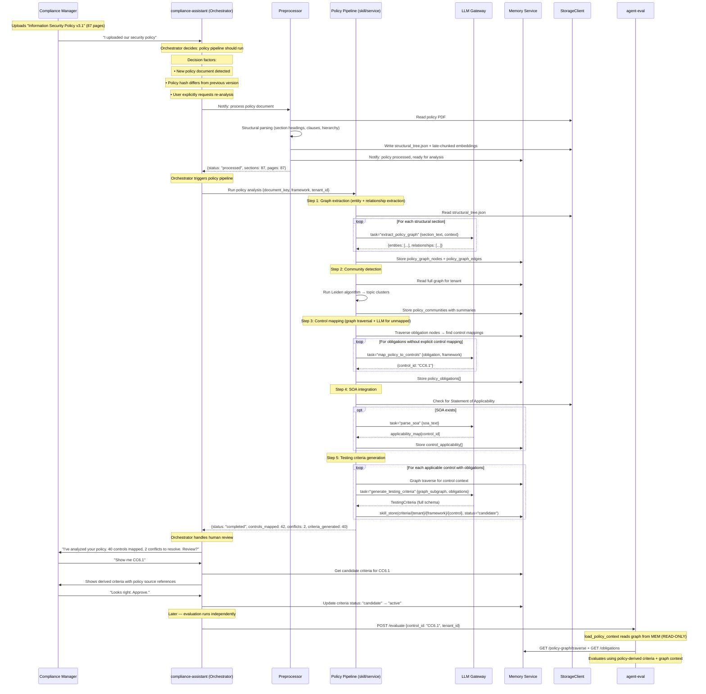

### When the Orchestrator Triggers the Pipeline

| Trigger | Who Detects | Action |
|---------|-------------|--------|
| New policy uploaded | Preprocessor (file watcher) → notifies compliance-assistant | CA asks user: "New policy detected. Analyze it?" |
| Policy document updated (hash changed) | Preprocessor | CA: "ISP v3.1 updated. Re-analyze? Previous criteria will be superseded." |
| SOA uploaded/updated | Preprocessor | CA: "New SOA detected. Update control applicability?" |
| User explicitly requests | Compliance Manager via chat | CA triggers pipeline immediately |
| Scheduled re-analysis | Cron/scheduler (e.g., monthly) | CA: "Monthly policy re-analysis. 0 policies changed — skipping." |
| Audit approaching | Observer detects audit_date approaching | CA: "Audit in 30 days. 3 policies haven't been analyzed. Run now?" |
| Conflict resolution needed | Pipeline detected conflicts | CA: "Policy A says quarterly, Policy B says monthly for CC6.1. Which is correct?" |

### What Agent-Eval Sees (Read-Only Consumer)

Agent-eval has ZERO knowledge of:
- When the pipeline ran
- Whether policies are fully analyzed
- Whether criteria are candidate or active (memory-service handles this)
- How the graph was constructed

Agent-eval ONLY:
1. Calls `memory.get_applicability()` — gets "applicable" or "excluded"
2. Calls `memory.skill_get("criteria/{tenant}/{framework}/{control}")` — gets active criteria (or empty)
3. Calls `memory.policy_graph_traverse()` — gets graph context (or empty)
4. Calls `memory.get_policy_obligations()` — gets obligations (or empty)

If any of these return empty → evaluation continues with generic criteria and no policy context. Graceful degradation, never failure.

### Criteria Loading Priority (in evaluation)

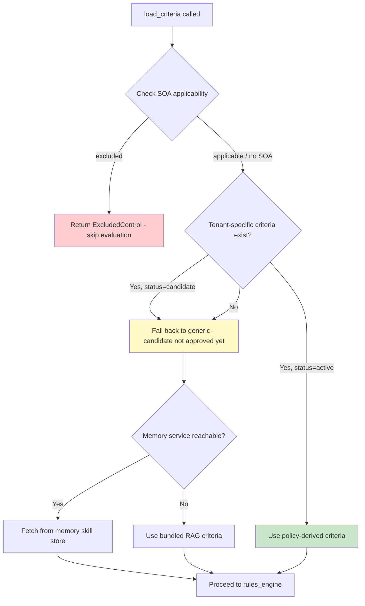

---

## Testing Criteria: Loading and Usage

### Loading Flow

1. **Startup:** RAG v2 loads `chunks.json` from StorageClient (mounted at `RAG_INDEX_PATH` or fetched from storage)
2. **Indexing:** Chunks with `chunk_type: "testing_criteria"` are indexed in `_cache["by_criteria"]` mapping `(framework, control_id) -> chunk_index`
3. **Runtime:** When evaluation node receives a control, it calls `rag.get_testing_criteria(framework, control_id)`
4. **Priority:** Tenant-specific criteria (from policy analysis) take precedence over generic RAG criteria
5. **Versioning:** Criteria can be updated via memory-service skills (`memory.skill_get("criteria/{framework}/{control_id}")`). Observer can push new versions without agent redeploy.
6. **Fallback:** If memory-service is unreachable, use built-in criteria from RAG index (bundled at build time)

### Usage in Evaluation (Full Integration with Policy Graph)

The policy graph integrates at multiple points in the evaluation pipeline — not just criteria loading. Here's the complete flow:

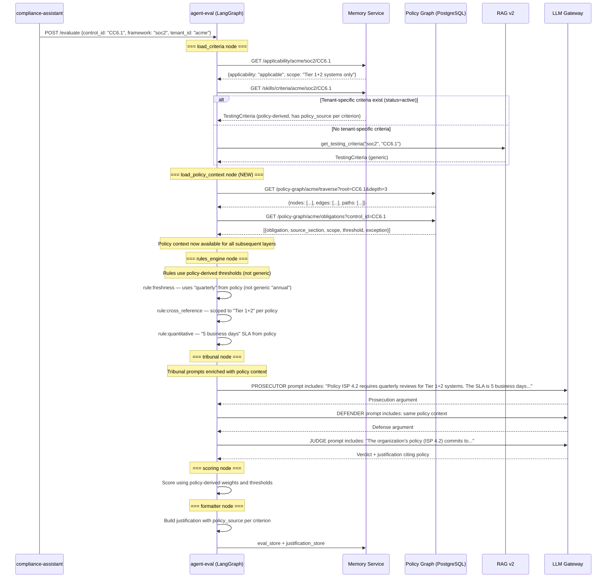

### The `load_policy_context` Node (NEW)

This is a **new node** in the LangGraph that runs after `load_criteria` and before `rules_engine`. It fetches the policy graph context that enriches the entire evaluation.

```python
# graph/nodes/load_policy_context.py

async def load_policy_context_node(state: EvalGraphState) -> dict:
    """Fetch policy graph context for this control.
    
    Enriches evaluation with:
    - Organization's specific obligations (from policy documents)
    - Scope limitations (from SOA)
    - Thresholds and SLAs (from policy clauses)
    - Exceptions (conditions under which obligations are relaxed)
    - Cross-references (related controls, dependent policies)
    
    This context is used by:
    - rules_engine: policy-specific thresholds replace generic ones
    - tribunal: prosecution/defense/judge prompts cite policy commitments
    - formatter: justification references policy sections
    """
    tenant_id = state["tenant_id"]
    control_id = state["control_id"]
    framework = state["framework"]
    
    # 1. Traverse policy graph from this control (3 hops covers most context)
    graph_context = await memory.policy_graph_traverse(
        tenant_id=tenant_id,
        root_node=control_id,
        depth=3,
        relationships=[
            "maps_to", "requires", "applies_to", "defined_by",
            "measured_by", "has_exception", "scoped_to", "owned_by"
        ]
    )
    
    # 2. Get consolidated obligations for this control
    obligations = await memory.get_policy_obligations(
        tenant_id=tenant_id,
        framework=framework,
        control_id=control_id,
    )
    
    # 3. Get applicability scope (from SOA)
    applicability = await memory.get_applicability(
        tenant_id=tenant_id,
        framework=framework,
        control_id=control_id,
    )
    
    # 4. Build policy context summary for downstream nodes
    policy_context = PolicyContext(
        control_id=control_id,
        has_policy=len(obligations) > 0,
        obligations=obligations,
        scope=applicability.scope_limitation if applicability else None,
        thresholds=_extract_thresholds(obligations),
        exceptions=_extract_exceptions(graph_context),
        source_sections=_extract_sources(obligations),
        graph_subgraph=graph_context,
    )
    
    return {
        "policy_context": policy_context,
    }


def _extract_thresholds(obligations: list) -> dict:
    """Pull measurable thresholds from obligations.
    
    Used by rules_engine to replace generic thresholds with policy-specific ones.
    """
    thresholds = {}
    for ob in obligations:
        specifics = ob.get("specifics", {})
        if "cadence" in specifics:
            thresholds["cadence"] = specifics["cadence"]  # "quarterly"
        if "sla_days" in specifics:
            thresholds["sla_days"] = specifics["sla_days"]  # 5
        if "scope" in specifics:
            thresholds["scope"] = specifics["scope"]  # "tier_1_tier_2"
        if "threshold" in specifics:
            thresholds["threshold"] = specifics["threshold"]
    return thresholds


def _extract_exceptions(graph_context: dict) -> list:
    """Find exception nodes connected to this control's obligations."""
    exceptions = []
    for node in graph_context.get("nodes", []):
        if node["node_type"] == "exception":
            exceptions.append({
                "condition": node["label"],
                "source": node.get("section_ref"),
                "text": node.get("source_text"),
            })
    return exceptions
```

### Updated Graph: Where `load_policy_context` Fits

```
router → discovery → extractor → load_criteria → load_policy_context → rules_engine → ...
```

The conditional routing from `load_policy_context`:
- If `applicability == "excluded"` → skip directly to formatter (control not in scope)
- If no policy context available → continue with generic criteria (degraded but functional)
- Otherwise → pass enriched context to rules_engine

### How Each Layer Uses Policy Context

#### Layer 1 (rules_engine) — Policy-Specific Thresholds

```python
# evaluation/rules.py — updated

def evaluate_rules(
    criteria: TestingCriteria, 
    evidence: list[EvidenceMetadata],
    policy_context: PolicyContext | None,  # NEW parameter
) -> dict[str, CriterionResult]:
    """Layer 1: Apply deterministic rules with policy-aware thresholds."""
    results = {}
    
    for criterion in criteria.criteria:
        # Override generic check_params with policy-specific values
        effective_params = criterion.check_params.copy()
        
        if policy_context and policy_context.thresholds:
            # Example: criterion says freshness max_age=365 (generic annual)
            # Policy says cadence="quarterly" → override to max_age=95
            if criterion.check_type == "freshness" and "cadence" in policy_context.thresholds:
                effective_params["max_age_days"] = cadence_to_days(
                    policy_context.thresholds["cadence"]
                )  # quarterly → 95 days (90 + 5 grace)
            
            # Example: criterion says threshold=48h (generic)
            # Policy says sla_days=5 → override
            if criterion.check_type == "quantitative" and "sla_days" in policy_context.thresholds:
                effective_params["threshold"] = policy_context.thresholds["sla_days"]
                effective_params["unit"] = "business_days"
            
            # Example: criterion says scope="all_systems"
            # Policy says scope="tier_1_tier_2" → filter evidence to matching systems
            if "scope" in policy_context.thresholds:
                effective_params["scope_filter"] = policy_context.thresholds["scope"]
        
        rule = select_rule(criterion.check_type or infer_check_type(criterion))
        if rule:
            results[criterion.id] = rule.evaluate(criterion, evidence, effective_params)
        else:
            results[criterion.id] = CriterionResult(
                criterion_id=criterion.id,
                result="NEEDS_JUDGMENT",
                method="none",
                reason="No deterministic rule applicable"
            )
    
    return results


def cadence_to_days(cadence: str) -> int:
    """Convert policy cadence to freshness threshold (with grace period)."""
    mapping = {
        "daily": 2,
        "weekly": 10,
        "monthly": 35,
        "quarterly": 95,
        "semi-annually": 185,
        "annually": 370,
    }
    return mapping.get(cadence, 370)  # Default to annual if unknown
```

#### Layer 2 (tribunal) — Policy-Enriched Prompts

```python
# evaluation/tribunal.py — updated

async def _full_tribunal(
    criterion: Criterion,
    evidence_slice: str,
    state: EvalGraphState,
) -> TribunalVerdict:
    """Full adversarial tribunal with policy context."""
    
    policy_context = state.get("policy_context")
    
    # Build policy context block for prompts
    policy_block = ""
    if policy_context and policy_context.has_policy:
        policy_block = _format_policy_block(policy_context, criterion)
    
    # ─── PROSECUTOR (enriched with policy) ───
    prosecution = await llm.complete(
        task="evaluate_prosecute",
        messages=[{"role": "system", "content": f"""You are a strict compliance prosecutor.
Your ONLY job: find reasons this evidence FAILS criterion {criterion.id}.

{policy_block}

Criterion: {criterion.question}
Fail conditions: {criterion.fail_condition}
Evidence:
{evidence_slice}

Rules:
- Judge evidence against what the ORGANIZATION'S POLICY committed to — not generic standards.
- If the policy says "5 business days" and evidence shows 7 days, that's a FAIL per their own commitment.
- Cite specific policy clauses when arguing failure.
- If genuinely strong, say "No material weaknesses" but note minor concerns.
- Output 3-5 bullet points."""}],
        tenant_id=state["tenant_id"],
    )
    
    # ─── DEFENDER (enriched with policy) ───
    defense = await llm.complete(
        task="evaluate_defend",
        messages=[{"role": "system", "content": f"""You are a compliance defense advocate.
Your ONLY job: find reasons this evidence SATISFIES criterion {criterion.id}.

{policy_block}

Criterion: {criterion.question}
Pass conditions: {criterion.pass_condition}
Evidence:
{evidence_slice}

Rules:
- Show how evidence meets the ORGANIZATION'S OWN COMMITMENTS from their policy.
- If the policy says "quarterly" and evidence shows quarterly reviews, cite that alignment.
- Reference policy exceptions if they apply (e.g., "CISO approved exception per Section 7.1").
- If genuinely weak, say "Limited supporting evidence" but note partial compliance.
- Output 3-5 bullet points."""}],
        tenant_id=state["tenant_id"],
    )
    
    # ─── JUDGE (enriched with policy) ───
    judgment = await llm.complete(
        task="evaluate_judge",
        messages=[{"role": "system", "content": f"""You are an impartial compliance judge.

{policy_block}

Criterion: {criterion.id} — {criterion.question}
Category: {criterion.category} | Weight: {criterion.weight}

═══ PROSECUTION ═══
{prosecution.content}

═══ DEFENSE ═══
{defense.content}

═══ YOUR TASK ═══
1. Judge against the organization's OWN policy commitments (not generic best practice)
2. Accept policy exceptions where properly documented and approved
3. Identify which prosecution/defense points are valid vs. overstated
4. Deliver verdict: PASS, PARTIAL, or FAIL
5. Write justification citing policy section + decisive factors

Respond in JSON:
{{
  "verdict": "PASS" | "PARTIAL" | "FAIL",
  "prosecution_points_accepted": ["..."],
  "prosecution_points_rejected": ["..."],
  "defense_points_accepted": ["..."],
  "defense_points_rejected": ["..."],
  "justification": "2-3 sentences citing policy section and decisive factors",
  "confidence": 0.0-1.0
}}"""}],
        tenant_id=state["tenant_id"],
    )
    
    # ... parse and return TribunalVerdict


def _format_policy_block(policy_context: PolicyContext, criterion: Criterion) -> str:
    """Format policy context as a prompt block for tribunal members."""
    lines = ["═══ ORGANIZATION POLICY CONTEXT ═══"]
    
    # Obligations relevant to this criterion
    relevant_obligations = [
        ob for ob in policy_context.obligations
        if _obligation_relevant_to_criterion(ob, criterion)
    ]
    
    if relevant_obligations:
        lines.append("Policy commitments for this control:")
        for ob in relevant_obligations:
            lines.append(f"  • {ob['obligation_summary']} (Source: {ob['document_name']}, {ob['section_ref']})")
            if ob.get("specifics"):
                for k, v in ob["specifics"].items():
                    lines.append(f"    - {k}: {v}")
    
    # Thresholds
    if policy_context.thresholds:
        lines.append("Policy-defined thresholds:")
        for k, v in policy_context.thresholds.items():
            lines.append(f"  • {k}: {v}")
    
    # Scope
    if policy_context.scope:
        lines.append(f"Scope limitation: {policy_context.scope}")
    
    # Exceptions
    if policy_context.exceptions:
        lines.append("Documented exceptions:")
        for exc in policy_context.exceptions:
            lines.append(f"  • {exc['condition']} (Source: {exc['source']})")
    
    lines.append("═══════════════════════════════════")
    return "\n".join(lines)
```

#### Layer 3 (scoring) — No Change Needed

Scoring is purely mathematical — weights and floor rules don't change based on policy context. The policy influence already happened upstream:
- Criteria were generated FROM policies (weights reflect policy importance)
- Thresholds were policy-specific (so PASS/FAIL reflects policy alignment)
- The score formula itself doesn't need policy awareness

#### Formatter — Policy Source in Justification

```python
# graph/nodes/formatter.py — updated justification builder

def _build_justification(state: EvalGraphState) -> dict:
    """Build justification with policy provenance."""
    policy_context = state.get("policy_context")
    
    justification = {
        "summary": _generate_summary(state),
        
        # NEW: Policy context used in this evaluation
        "policy_basis": {
            "has_policy": policy_context.has_policy if policy_context else False,
            "documents_referenced": [
                {"name": ob["document_name"], "section": ob["section_ref"]}
                for ob in (policy_context.obligations if policy_context else [])
            ],
            "scope": policy_context.scope if policy_context else None,
            "thresholds_applied": policy_context.thresholds if policy_context else {},
            "exceptions_available": [
                exc["condition"] for exc in (policy_context.exceptions if policy_context else [])
            ],
        },
        
        "layer1_justification": {
            "method": "deterministic_rules",
            "criteria": [
                {
                    "criterion_id": cid,
                    "result": r.result,
                    "method": r.method,
                    "justification": r.reason,
                    # NEW: cite policy source for threshold
                    "policy_source": _get_policy_source(cid, policy_context),
                    "threshold_used": _get_threshold_used(cid, state),
                    "evidence_cited": r.evidence_used,
                }
                for cid, r in state["rule_results"].items()
                if r.result != "NEEDS_JUDGMENT"
            ]
        },
        
        "layer2_justification": {
            "method": "adversarial_tribunal",
            "criteria": [
                {
                    "criterion_id": cid,
                    "result": t["verdict"],
                    "confidence": t["confidence"],
                    "prosecution": t["prosecution_argument"],
                    "defense": t["defense_argument"],
                    "judge_reasoning": {...},
                    # NEW: policy source cited by judge
                    "policy_source": _get_policy_source(cid, policy_context),
                }
                for cid, t in state["tribunal_results"].items()
            ]
        },
        
        "layer3_justification": {...}
    }
    
    return justification
```

### Complete Updated Graph Flow

```
POST /evaluate {control_id, framework, tenant_id}
    │
    ▼
┌─────────────────────────────────────────────────────────────────┐
│ router → discovery → extractor                                   │
│                                                                   │
│              ┌──────────────────────────────────────┐            │
│              │ load_criteria                         │            │
│              │ • Check SOA → excluded? → SKIP       │            │
│              │ • Tenant criteria (policy-derived)?   │            │
│              │ • Generic RAG criteria (fallback)     │            │
│              └───────────────┬──────────────────────┘            │
│                              │                                    │
│                              ▼                                    │
│              ┌──────────────────────────────────────┐            │
│              │ load_policy_context (NEW)             │            │
│              │ • Graph traverse from control (3 hop) │            │
│              │ • Get obligations + thresholds        │            │
│              │ • Get scope from SOA                  │            │
│              │ • Get exceptions from graph           │            │
│              │                                       │            │
│              │ Output: PolicyContext object that      │            │
│              │ enriches ALL downstream layers         │            │
│              └───────────────┬──────────────────────┘            │
│                              │                                    │
│                              ▼                                    │
│              ┌──────────────────────────────────────┐            │
│              │ rules_engine (ENRICHED)               │            │
│              │ • freshness: quarterly → 95 days      │            │
│              │   (not generic 365)                   │            │
│              │ • quantitative: 5 biz days            │            │
│              │   (not generic 48h)                   │            │
│              │ • scope: filter to Tier 1+2 only      │            │
│              │   (not all systems)                   │            │
│              └───────────────┬──────────────────────┘            │
│                              │                                    │
│                              ▼                                    │
│              ┌──────────────────────────────────────┐            │
│              │ tribunal (ENRICHED)                    │            │
│              │ • Prosecutor cites policy violations  │            │
│              │ • Defender cites policy compliance    │            │
│              │ • Judge rules per org's own policy    │            │
│              │   (not generic best practice)         │            │
│              └───────────────┬──────────────────────┘            │
│                              │                                    │
│                              ▼                                    │
│              ┌──────────────────────────────────────┐            │
│              │ scoring (unchanged — math is math)    │            │
│              └───────────────┬──────────────────────┘            │
│                              │                                    │
│                              ▼                                    │
│              ┌──────────────────────────────────────┐            │
│              │ formatter (ENRICHED)                   │            │
│              │ • Justification cites policy sections │            │
│              │ • "ISP 4.2 requires quarterly.        │            │
│              │   Evidence shows Q2 complete for all  │            │
│              │   Tier 1/2 systems. PASS."            │            │
│              └──────────────────────────────────────┘            │
└─────────────────────────────────────────────────────────────────┘
```

### Degradation: When Policy Graph Is Unavailable

| Scenario | Behavior |
|----------|----------|
| No policies uploaded yet | `load_policy_context` returns empty. Rules use generic thresholds. Tribunal has no policy block. Evaluation still works — just less specific. |
| Memory service down | `load_policy_context` returns empty (graceful degradation). Falls back to RAG criteria. |
| Policy analyzed but criteria still "candidate" | Uses generic RAG criteria (R7h-2: candidates never used). But policy_context still enriches tribunal prompts. |
| SOA says control excluded | `load_criteria` short-circuits to formatter with `status: "excluded"`. No evaluation runs. |
| Policy graph partially built (mid-processing) | Returns whatever graph nodes exist. Partial context is better than none. |

### Example: Full Evaluation Output with Policy Integration

```json
{
  "evaluation_id": "eval-uuid",
  "control_id": "CC6.1",
  "score": 0.92,
  "status": "compliant",
  
  "justification": {
    "summary": "CC6.1 compliant per ISP Section 4.2. Quarterly reviews completed for all Tier 1/2 systems. Remediation within 5-day SLA.",
    
    "policy_basis": {
      "has_policy": true,
      "documents_referenced": [
        {"name": "Information Security Policy v3.1", "section": "4.2"},
        {"name": "Information Security Policy v3.1", "section": "1.3"}
      ],
      "scope": "Tier 1 and Tier 2 systems per Asset Classification Register",
      "thresholds_applied": {
        "cadence": "quarterly",
        "sla_days": 5,
        "scope": "tier_1_tier_2"
      },
      "exceptions_available": [
        "CISO approval for cadence changes (Section 7.1)"
      ]
    },
    
    "layer1_justification": {
      "criteria": [
        {
          "criterion_id": "TC-CC6.1-03",
          "result": "PASS",
          "method": "rule:freshness",
          "justification": "Latest review dated 2026-05-15 (26 days ago). Policy threshold: quarterly (95 days max). PASS by 69-day margin.",
          "policy_source": "ISP Section 4.2 — 'reviewed quarterly'",
          "threshold_used": {"max_age_days": 95, "source": "policy:quarterly"}
        },
        {
          "criterion_id": "TC-CC6.1-05",
          "result": "PASS",
          "method": "rule:cross_reference",
          "justification": "0 terminated users in active access list. Cross-reference of hr_terminations.csv and active_access.csv.",
          "policy_source": "ISP Section 4.2(c) — 'terminated employees have no active access'",
          "threshold_used": {"expected_matches": 0, "source": "policy:zero_tolerance"}
        }
      ]
    },
    
    "layer2_justification": {
      "criteria": [
        {
          "criterion_id": "TC-CC6.1-04",
          "result": "PASS",
          "confidence": 0.91,
          "prosecution": "Remediation timestamps show max 4 business days. However, 2 records have no documented approval for the remediation action. ISP 4.2 requires remediation within 5 days but also implies approval trail.",
          "defense": "All 18 inappropriate access findings remediated within policy SLA (max 4 days, policy allows 5 per ISP 4.2). System owner sign-off present in 16/18 records. Remaining 2 have automated removal via IAM policy (no manual approval needed per Section 4.2.3).",
          "judge_reasoning": {
            "prosecution_points_accepted": ["2 records lack explicit approval"],
            "prosecution_points_rejected": ["Automated IAM removal per 4.2.3 doesn't require manual approval"],
            "defense_points_accepted": ["All within 5-day SLA per ISP 4.2", "16/18 have explicit sign-off", "Automated removal is valid per 4.2.3"],
            "defense_points_rejected": [],
            "justification": "Evidence satisfies ISP Section 4.2 requirements. Remediation within 5-day SLA (max 4 days observed). Automated removal per Section 4.2.3 is a valid approval mechanism for the 2 records without manual sign-off."
          },
          "policy_source": "ISP Section 4.2 — 'remediation within 5 business days'; Section 4.2.3 — automated IAM enforcement"
        }
      ]
    }
  }
}
```

### State Schema Addition

```python
# graph/state.py — new field

class PolicyContext(TypedDict, total=False):
    control_id: str
    has_policy: bool
    obligations: list[dict]       # From policy_obligations table
    scope: str | None             # From control_applicability.scope_limitation
    thresholds: dict[str, Any]    # Extracted: {cadence, sla_days, scope, threshold}
    exceptions: list[dict]        # From graph exception nodes
    source_sections: list[dict]   # [{document, section, page}]
    graph_subgraph: dict          # Raw graph nodes + edges for this control


class EvalGraphState(TypedDict, total=False):
    # ... existing fields ...
    policy_context: PolicyContext | None  # NEW: from load_policy_context node
```

---

## Sandbox Integration

### Architecture

Agent-eval generates Python code via LLM for structured data analysis. The code is executed by the external sandbox-service.

### Flow

1. **Code Generation:** The evaluation node identifies criteria requiring structured data analysis (e.g., cross-references, quantitative thresholds). It asks the LLM (`task="generate_code"`) to generate Python that loads the data and checks conditions.

2. **Execution Request:**
   ```python
   response = sandbox_client.execute(
       code=generated_python,
       files=[
           {"key": "tenant/evidence/access_reviews.csv", "type": "csv"},
           {"key": "tenant/evidence/terminations.csv", "type": "csv"}
       ],
       timeout_sec=60
   )
   ```

3. **Sandbox Service Responsibilities:**
   - Fetches files from StorageClient into isolated container
   - Executes code with resource limits (CPU, memory, time)
   - Returns stdout/stderr and success status
   - Cleans up container after execution

4. **Result Interpretation:** Agent-eval parses stdout (expected to be structured JSON output from the generated code) and uses it as evidence for rule engine or LLM judgment.

5. **Error Recovery:** If execution fails (`success: false`), the code_fixer node sends the error to LLM (`task="fix_code"`) and retries (max `MAX_SANDBOX_RETRIES` times).

### Contract

```
POST http://sandbox-service:9000/execute
Request:  {code: str, files: [{key: str, type: str}], timeout_sec: int}
Response: {stdout: str, stderr: str, success: bool, duration_ms: int}
```

---

## Evidence Hash Caching

### Purpose

Prevent redundant evaluations when evidence has not changed. Provides 100% deterministic results and eliminates LLM cost for stable controls.

### Mechanism

```python
# In evaluation startup (before Layer 1)

def compute_evidence_hash(evidence_files: List[EvidenceFile]) -> str:
    """Deterministic hash of all evidence relevant to this control."""
    hasher = hashlib.sha256()
    for f in sorted(evidence_files, key=lambda x: x.storage_key):
        hasher.update(f.storage_key.encode())
        hasher.update(f.last_modified.isoformat().encode())
        hasher.update(str(f.size_bytes).encode())
    return hasher.hexdigest()

def check_cache(tenant_id, control_id, current_hash) -> Optional[EvaluationResult]:
    """Check if we can return a cached result."""
    previous = memory_client.eval_last(tenant_id, control_id)
    if previous and previous.evidence_hash == current_hash:
        return previous.result  # 100% deterministic, zero cost
    return None
```

### Cache Invalidation

- **Explicit:** New evidence uploaded (preprocessor event triggers re-evaluation)
- **Implicit:** Evidence file modified (last_modified changes -> hash changes)
- **Forced:** User requests fresh evaluation (bypass cache flag)
- **Time-based:** Optional staleness threshold (e.g., re-evaluate if cached result > 7 days old)

### Incremental Re-evaluation

When evidence hash changes but only some files differ:

1. Identify which criteria are affected by the changed files (via `evidence_type` mapping)
2. Re-evaluate only affected criteria (Layer 1 -> Layer 2 if needed)
3. Merge with previous results for unchanged criteria
4. Recalculate score (Layer 3) with merged results

This reduces evaluation time and LLM calls for partial evidence updates.

---

## Justification Document

Every evaluation produces a **justification document** stored in `evaluation_justifications` (1:1 with `eval_history`). This document contains the complete reasoning chain — not just what the AI decided, but WHY and HOW it was determined.

### Structure

```json
{
  "summary": "Human-readable 1-2 sentence explanation",
  "layer1_justification": {
    "method": "deterministic_rules",
    "resolved_count": 4,
    "criteria": [
      {
        "criterion_id": "TC-CC6.1-01",
        "question": "Does an access review policy exist?",
        "result": "PASS",
        "method": "rule:keyword_presence",
        "justification": "Document contains required terms: 'quarterly review', 'access certification'",
        "evidence_cited": ["s3://tenant/evidence/CC6.1/policy.pdf"]
      }
    ]
  },
  "layer2_justification": {
    "method": "adversarial_tribunal",
    "resolved_count": 2,
    "criteria": [
      {
        "criterion_id": "TC-CC6.1-04",
        "question": "Do reviews demonstrate remediation?",
        "result": "PASS",
        "method": "tribunal:adversarial",
        "confidence": 0.88,
        "prosecution": "No timestamps for when access was removed...",
        "defense": "15/18 rows show completed remediation...",
        "judge_reasoning": {
          "prosecution_points_accepted": ["Lack of timestamps is minor gap"],
          "prosecution_points_rejected": ["Row 12 IS addressed"],
          "defense_points_accepted": ["83% fully remediated"],
          "defense_points_rejected": [],
          "justification": "Substantive remediation demonstrated. Minor gap does not negate action."
        }
      }
    ]
  },
  "layer3_justification": {
    "method": "deterministic_scoring",
    "formula": "weighted_sum / assessable_weight",
    "calculation": {...},
    "floor_rules_applied": [],
    "final_score": 0.87,
    "final_status": "compliant"
  }
}
```

### How Users Interact with Evaluations

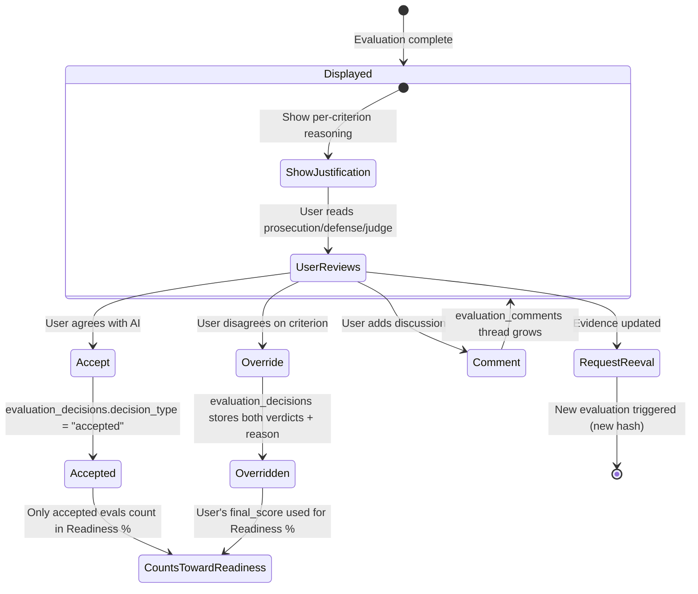

### Database Tables

| Table | Purpose | Relationship |
|-------|---------|-------------|
| `eval_history` | AI evaluation result (immutable) | Source of truth for AI verdict |
| `evaluation_justifications` | Full tribunal reasoning (immutable) | 1:1 with eval_history |
| `evaluation_decisions` | Accept/override per criterion | N:1 with eval_history |
| `evaluation_comments` | Threaded discussion | N:1 with eval_history |

### Auditor View

The auditor sees the complete trail:
1. **AI said**: score 0.87, COMPLIANT (with full prosecution/defense/judge per criterion)
2. **User overrode**: TC-05 from PARTIAL → PASS (reason: "shared access plane covers both systems")
3. **Final**: score 0.92, COMPLIANT (adjusted via user override)
4. **Comments**: 3 discussion threads (2 on TC-04, 1 overall)

---

## API Contract

| Endpoint | Method | Purpose | Response |
|----------|--------|---------|----------|
| `/evaluate` | POST | Start async evaluation | `{job_id, status: "processing"}` |
| `/status/{job_id}` | GET | Poll for result | `{status, evaluation, justification}` |
| `/chat` | POST | Synchronous compliance chat | `{response}` |
| `/health` | GET | Container health | `{status: "healthy"}` |
| `/ready` | GET | Readiness (RAG loaded) | `{ready: true/false}` |

**Note:** Agent-eval does NOT run the policy analysis pipeline. It only READS the policy graph from memory-service. The policy pipeline is an independent process triggered by the orchestrator (compliance-assistant or scheduler). See the Policy Analysis Pipeline section for orchestration details.

### Evaluate Request

```json
{
  "control_id": "CC6.1",
  "framework": "soc2",
  "tenant_id": "tenant-123",
  "bypass_cache": false
}
```

### Evaluate Response (via /status)

```json
{
  "status": "completed",
  "evaluation": {
    "evaluation_id": "eval-uuid",
    "control_id": "CC6.1",
    "framework": "soc2",
    "score": 0.87,
    "status": "compliant",
    "evidence_hash": "sha256:abc123...",
    "decision_status": "pending",
    "criteria_results": [
      {
        "criterion_id": "TC-CC6.1-01",
        "category": "policy",
        "result": "PASS",
        "method": "rule:keyword_presence",
        "reason": "Policy contains required terms: provisioning, de-provisioning, least privilege, quarterly review"
      },
      {
        "criterion_id": "TC-CC6.1-04",
        "category": "implementation",
        "result": "PASS",
        "method": "tribunal:adversarial",
        "confidence": 0.88,
        "reason": "Substantive remediation demonstrated (83% of findings). Minor gap: timestamps not recorded."
      },
      {
        "criterion_id": "TC-CC6.1-05",
        "category": "implementation",
        "result": "PARTIAL",
        "method": "tribunal:adversarial",
        "confidence": 0.75,
        "reason": "4/5 systems effectively covered but analytics-cluster exclusion undocumented."
      }
    ],
    "layer_stats": {
      "layer1_resolved": 4,
      "layer2_resolved": 2,
      "total_criteria": 6,
      "llm_calls": 6,
      "sandbox_calls": 1
    },
    "timing": {
      "total_ms": 14200,
      "layer1_ms": 230,
      "layer2_ms": 10700,
      "layer3_ms": 5,
      "sandbox_ms": 3100
    }
  },
  "justification": {
    "summary": "CC6.1 compliant. 4/6 criteria resolved by deterministic rules, 2/6 via adversarial tribunal. No floor rules triggered.",
    "layer1_justification": {
      "method": "deterministic_rules",
      "resolved_count": 4,
      "criteria": ["...per-criterion justification with evidence_cited..."]
    },
    "layer2_justification": {
      "method": "adversarial_tribunal",
      "resolved_count": 2,
      "criteria": [
        {
          "criterion_id": "TC-CC6.1-04",
          "result": "PASS",
          "confidence": 0.88,
          "prosecution": "No timestamps for when access was removed. Row 12 pending...",
          "defense": "15/18 rows show completed remediation. Row 12 has auto-expiry plan...",
          "judge_reasoning": {
            "prosecution_points_accepted": ["Lack of timestamps is minor gap"],
            "prosecution_points_rejected": ["Row 12 IS addressed (auto-expiry)"],
            "defense_points_accepted": ["83% fully remediated", "Specific actions documented"],
            "defense_points_rejected": [],
            "justification": "Evidence demonstrates substantive remediation. Minor gap does not negate action."
          }
        }
      ]
    },
    "layer3_justification": {
      "method": "deterministic_scoring",
      "calculation": {"raw_score": 0.90, "floor_rules_applied": [], "final_score": 0.87}
    }
  }
}
```

---

## Observability

Every LLM call emits a structured log entry consumed by the observer:

```json
{
  "trace_id": "trace-uuid",
  "agent": "agent-eval",
  "node": "evaluation",
  "task": "evaluate_control",
  "tier_requested": "mid",
  "latency_ms": 2340,
  "confidence": 0.92,
  "success": true,
  "tenant_id": "tenant-123",
  "control_id": "CC6.1",
  "criterion_id": "TC-CC6.1-05",
  "context": {
    "layer": 2,
    "evidence_type": "unstructured",
    "token_input": 3200,
    "token_output": 85
  }
}
```

Per-node timing is tracked for the full graph execution, enabling the observer to identify bottlenecks and optimize routing.

---

## Configuration Summary

| Variable | Default | Purpose |
|----------|---------|---------|
| `LLM_GATEWAY_URL` | `http://llm-gateway:4000` | LLM Gateway endpoint |
| `MEMORY_URL` | `http://memory-service:5000` | Memory Service endpoint |
| `STORAGE_ENDPOINT` | `http://minio:9000` | Storage (MinIO/S3) endpoint |
| `STORAGE_BUCKET` | `compliance-artifacts` | Evidence bucket |
| `STATE_BACKEND` | `postgres` | State store type |
| `STATE_DSN` | `postgresql://...` | State store connection |
| `PREPROCESSOR_URL` | `http://preprocessor:7000` | Preprocessor service |
| `SANDBOX_URL` | `http://sandbox-service:9000` | Sandbox service |
| `LOG_LEVEL` | `info` | Logging level |
| `MAX_EVAL_TIMEOUT_SEC` | `300` | Max evaluation duration |
| `MAX_SANDBOX_RETRIES` | `2` | Sandbox retry attempts |
| `RAG_INDEX_PATH` | `/data/rag/` | RAG index location |

---

## Deployment

- **Image:** Single Docker container, independently versioned (`EVAL_VERSION` env var)
- **Resources:** 2GB max memory (default), no GPU required
- **Scaling:** Horizontal via orchestrator concurrency control
- **Startup:** Load RAG index from storage, report `/ready` when index is loaded
- **Shutdown:** Graceful on SIGTERM (finish in-progress evaluation before exit)
- **Health:** `/health` returns immediately, `/ready` gates traffic until RAG is loaded
