# Compliance Assistant — Architecture Design

## Overview

The compliance assistant is a single agent that adapts its persona, skills, and behavior based on who logs in. It is proactive (opens with status, not "how can I help?"), goal-driven (tracks audit readiness), and workflow-aware (follows playbooks for multi-step tasks).

## High-Level Architecture

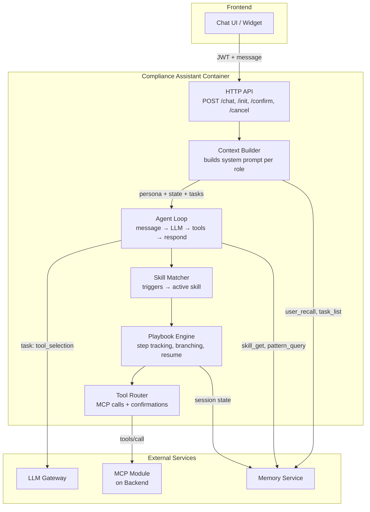

## Agent Loop (Core Processing)

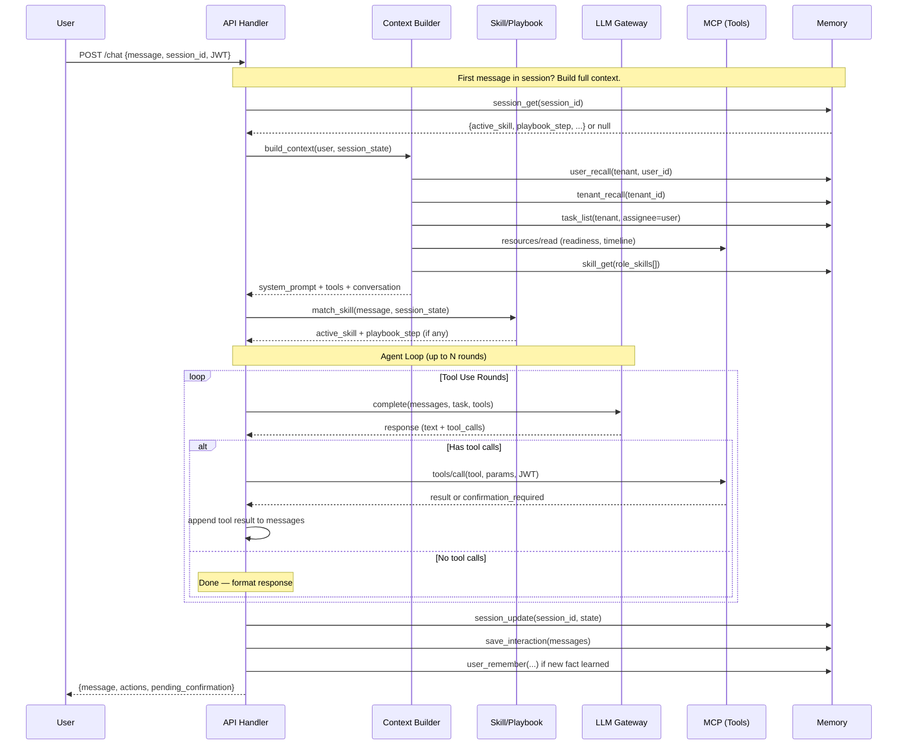

## Context Builder (Dynamic System Prompt)

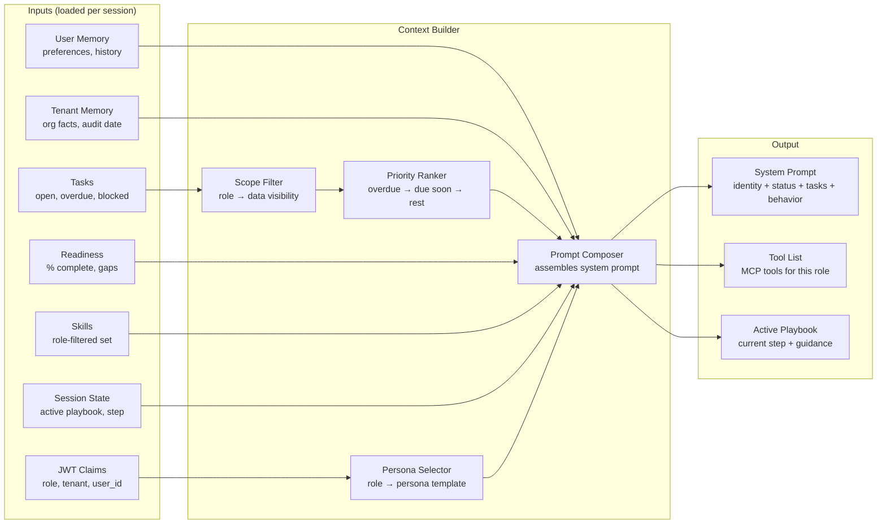

## Skill & Playbook Execution

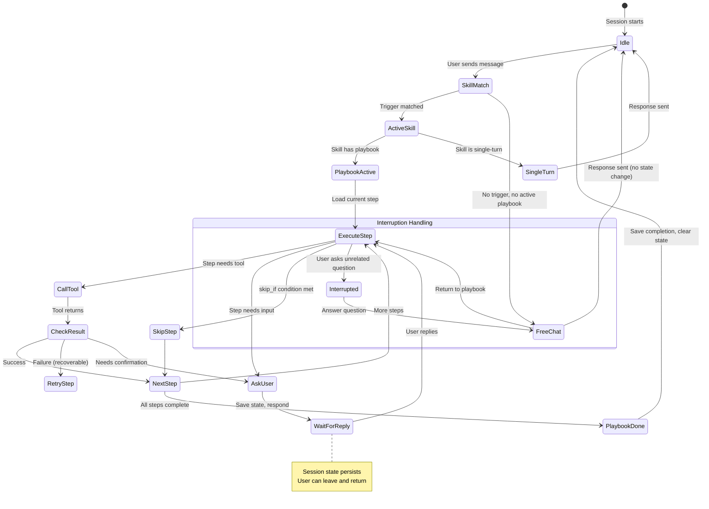

## Session Lifecycle

```mermaid
graph TD
    subgraph "Session Start (POST /init or first /chat)"
        A1[Receive JWT] --> A2[Extract role + user]
        A2 --> A3[Check session state in memory]
        A3 -->|New session| A4[Build full context from scratch]
        A3 -->|Existing session| A5[Resume: load active skill + playbook step]
        A4 --> A6[Select persona + load role skills]
        A5 --> A6
        A6 --> A7[Generate proactive opener<br/>status + next action]
    end

    subgraph "Mid-Session (POST /chat)"
        B1[Receive message] --> B2[Load session state from Redis]
        B2 --> B3{Active playbook?}
        B3 -->|Yes| B4[Continue at current step]
        B3 -->|No| B5[Match skill trigger]
        B5 -->|Match found| B6[Activate skill/playbook]
        B5 -->|No match| B7[Free chat with persona context]
        B4 --> B8[Execute step → tool calls → respond]
        B6 --> B8
        B7 --> B9[LLM responds with context]
        B8 --> B10[Update session state]
        B9 --> B10
    end

    subgraph "Session End (timeout or explicit)"
        C1[TTL expires OR user leaves] --> C2[Session state saved]
        C2 --> C3[Interaction saved to memory]
        C3 --> C4[Facts extracted → user/tenant memory]
    end
```

## Multi-Persona Prompt Assembly

```mermaid
graph TD
    subgraph "Layer 1: Persona (always present)"
        P[Role Persona Template<br/>"You are the compliance program manager..."]
    end

    subgraph "Layer 2: Context (always present)"
        CTX1[Readiness Status]
        CTX2[User-specific tasks]
        CTX3[Audit timeline]
        CTX4[User memory/preferences]
    end

    subgraph "Layer 3: Active Skill (when triggered)"
        SK1[Skill instructions<br/>"The user needs to upload evidence..."]
        SK2[Tools needed for this skill]
    end

    subgraph "Layer 4: Playbook Step (when in workflow)"
        PB1[Current step instruction]
        PB2[Step guidance/decision tree]
        PB3[Success criteria]
        PB4[What to do if stuck]
    end

    subgraph "Layer 5: Conversation History"
        H[Last N messages]
    end

    P --> FINAL[Assembled System Prompt]
    CTX1 --> FINAL
    CTX2 --> FINAL
    CTX3 --> FINAL
    CTX4 --> FINAL
    SK1 --> FINAL
    SK2 --> FINAL
    PB1 --> FINAL
    PB2 --> FINAL
    PB3 --> FINAL
    PB4 --> FINAL
    H --> FINAL

    FINAL --> LLM[Send to LLM Gateway<br/>task: skill_execution or chat_response]
```

## Tool Execution Flow (with confirmations)

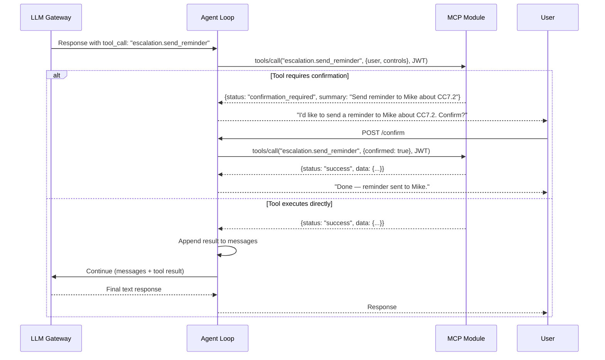

## Module Structure (src/)

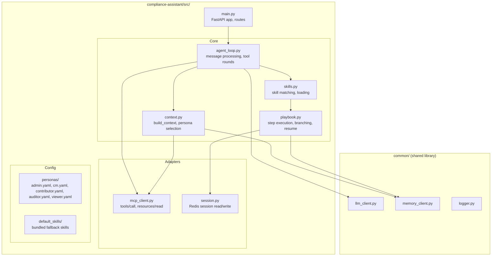

## Data Flow: First Message (New Session)

```mermaid
flowchart TD
    START[User opens chat] --> JWT[Frontend sends JWT + empty message to POST /init]
    JWT --> AUTH[Agent extracts: role=compliance_manager, user=Sarah, tenant=Acme]
    
    AUTH --> PAR{Parallel fetch}
    PAR --> |1| UM[Memory: user_recall Sarah<br/>"Prefers tables, owns CC6.x"]
    PAR --> |2| TM[Memory: tenant_recall Acme<br/>"Audit June 15, uses Okta"]
    PAR --> |3| TK[Memory: task_list assignee=Sarah<br/>2 open, 1 overdue]
    PAR --> |4| RD[MCP: readiness resource<br/>72% ready, 28 controls of 40]
    PAR --> |5| SK[Memory: skill_get cm/*<br/>7 skills for compliance_manager]
    PAR --> |6| SS[Memory: session_get<br/>null — new session]

    UM --> BUILD[Context Builder]
    TM --> BUILD
    TK --> BUILD
    RD --> BUILD
    SK --> BUILD
    SS --> BUILD

    BUILD --> PROMPT[System Prompt:<br/>"You are the program manager for Acme.<br/>Audit June 15, 36 days. 72% ready.<br/>Sarah has 2 open, 1 overdue CC7.2.<br/>Open with status + priorities."]

    PROMPT --> LLM[LLM Gateway<br/>task: chat_response]
    LLM --> RESP["Good morning Sarah. 36 days to audit.<br/>Readiness: 72%.<br/><br/>⚠️ CC7.2 is 12 days overdue (system monitoring).<br/>✅ CC6.1 completed last week.<br/>📋 CC8.1 evidence due Friday.<br/><br/>Want me to help with CC7.2 or start on CC8.1?"]

    RESP --> SAVE[Save session state: persona=cm, skills loaded]
    SAVE --> USER[Return to user]
```

## Data Flow: Mid-Playbook Resumption

```mermaid
flowchart TD
    START[Sarah returns next day] --> INIT[POST /init with JWT]
    INIT --> SESSION[Memory: session_get<br/>active_playbook: evidence_collection<br/>playbook_step: 3<br/>playbook_data: {control: CC8.1}]
    
    SESSION --> BUILD[Context Builder includes:<br/>"Resuming evidence collection for CC8.1.<br/>You were at step 3: show example."]
    
    BUILD --> LLM[LLM Gateway]
    LLM --> RESP["Welcome back Sarah. We were working on<br/>evidence for CC8.1 (change management).<br/><br/>I was about to show you what good evidence<br/>looks like. Here's an example from a similar<br/>company: [change ticket log with approvals].<br/><br/>Ready to upload yours?"]
    
    RESP --> USER[User sees playbook resumed seamlessly]
```

## Interruption Handling

```mermaid
flowchart TD
    PB[Active: playbook/evidence_collection, step 4]
    
    USER[User: "Actually, what's our overall readiness?"]
    
    PB --> USER
    USER --> DETECT{Is this about<br/>current playbook?}
    DETECT -->|No — different topic| PAUSE[Pause playbook<br/>Save step 4 in session]
    DETECT -->|Yes| CONTINUE[Continue step 4]
    
    PAUSE --> ANSWER[Answer readiness question<br/>using persona context]
    ANSWER --> RETURN["Readiness is 72%. Back to your upload —<br/>we were getting CC8.1 evidence ready.<br/>Want to continue?"]
    
    RETURN --> YESNO{User says yes?}
    YESNO -->|Yes| RESUME[Resume playbook at step 4]
    YESNO -->|No / new topic| DEACTIVATE[Deactivate playbook<br/>Clear from session]
```

## Container & Deployment

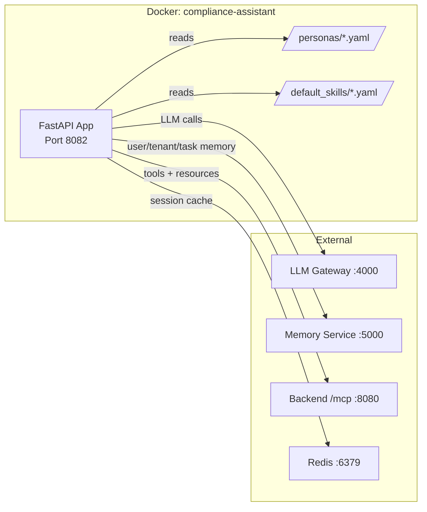

## Post-Processing (after every response)

```mermaid
flowchart TD
    RESP[Response sent to user] --> PAR{Parallel post-processing}
    
    PAR --> |1| SAVE_SESSION[Save session state<br/>active skill, playbook step, tool results]
    PAR --> |2| SAVE_INTERACTION[Save interaction<br/>user message + assistant response]
    PAR --> |3| EXTRACT[Extract facts<br/>Did we learn something new?]
    PAR --> |4| TASK_UPDATE[Update tasks<br/>Did user complete something?]
    PAR --> |5| PROACTIVE[Evaluate: proactive follow-up?<br/>Should we suggest next step?]
    
    EXTRACT --> |new fact| MEM_WRITE[memory.user_remember or tenant_remember]
    TASK_UPDATE --> |task done| TASK_COMPLETE[memory.task_update status=completed]
    PROACTIVE --> |yes| QUEUE[Queue proactive prompt for next interaction<br/>"Next time user logs in, mention X"]
```

The post-processing is non-blocking — response goes to user immediately, these run async after.

**Fact extraction examples:**
- User says "we use Okta" → `tenant_remember("Uses Okta for SSO", category="integration")`
- User uploads file for CC6.1 → `task_update(CC6.1_evidence, status="completed")`
- User says "I prefer tables" → `user_remember("Prefers tabular format", category="preference")`
- User completes onboarding step 3 → `session_update(playbook_step=4)`

**Proactive follow-up evaluation:**
- Did the user leave a playbook mid-step? → Next session: "We were working on X..."
- Did a task just become overdue? → Next session: "Heads up, CC7.2 is now overdue"
- Did readiness % change? → Next session: "Good news — readiness moved from 72% to 78%"

---

## Key Design Decisions

### 1. Prompt composition, not separate agents per role

One agent, one container, one LLM call per turn. The persona difference is entirely in the system prompt. No routing to different agent instances based on role — just different prompt assembly.

**Why:** Simpler ops, less latency, easier to debug. A compliance_manager and contributor use the same code path — only the system prompt and available tools differ.

### 2. Playbook = structured guidance in system prompt, not a state machine executor

The playbook isn't a rigid state machine that FORCES the LLM through steps. It's guidance injected into the prompt. The LLM can deviate (handle interruptions, ask clarifying questions, skip steps). The playbook engine tracks which step we're on and provides the right context.

**Why:** Rigid state machines break on unexpected user input. The LLM is smart enough to follow a playbook without being mechanically forced. The playbook is the "expert's notes" — not a railroad.

### 3. Skills loaded at session start, not per-message

All role-appropriate skills are pre-loaded into context at session start. Skill matching determines which one to ACTIVATE (add to prompt), but they're all available.

**Why:** Avoids per-message latency of fetching skills. Skills are small (few hundred tokens each). 5-7 skills in context is fine. Only the active skill's playbook step adds significant prompt length.

### 4. Session state in Redis (fast) + persistence in Memory Service (durable)

Redis for hot session state (current step, last tool result). Memory Service for durable facts (user preferences, task completion). If Redis dies, session is lost but user just re-starts — no data loss on the memory side.

**Why:** Redis is fast for the per-message read/write loop. Memory Service is the source of truth for anything that matters across sessions.

### 5. Proactive opener via LLM, not template

The opening message isn't a hardcoded template — it's generated by the LLM with all context loaded. This means it's natural, adapts to the situation, and can highlight unexpected things.

**Why:** Templates get stale. The LLM with full context can say "CC7.2 is now 12 days overdue" without us coding that logic. The persona prompt says "open with status" and the LLM figures out what's relevant.

### 6. MCP for all tool execution, no direct DB access

The assistant never touches the database. All actions go through MCP. This means:
- Auth is enforced by MCP (assistant doesn't need to know about permissions)
- Tools can change without assistant redeploy
- The assistant works against any backend that implements MCP

**Why:** Clean boundary. The assistant is pure LLM orchestration + prompt management. The backend is pure business logic. They communicate via a standard protocol.

---

## Shadow Agent V2: Persistent Intelligence Design

### Architecture Change: Session Lifecycle with Reflection

The V1 session lifecycle was: start → process messages → timeout/leave → state lost (only raw facts survive).

V2 adds an explicit **reflection + state update** phase:

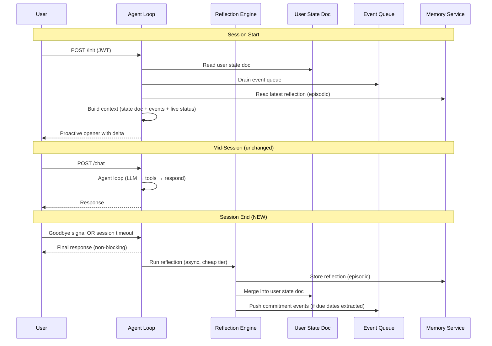

### Component: Reflection Engine

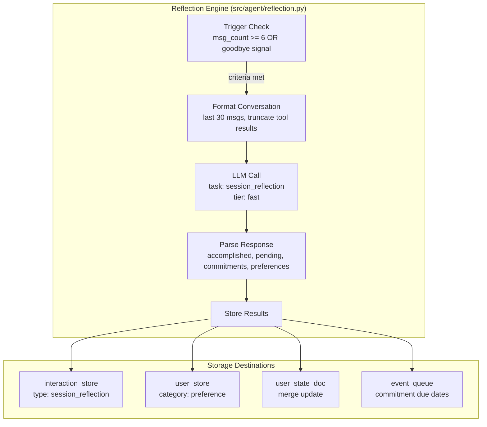

### Component: User State Document

The user state doc replaces scattered vector queries with a single deterministic read.

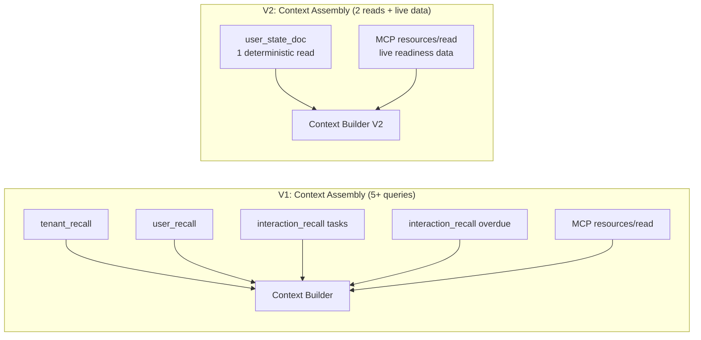

#### Update Flow

The user state doc is updated after every reflected session:

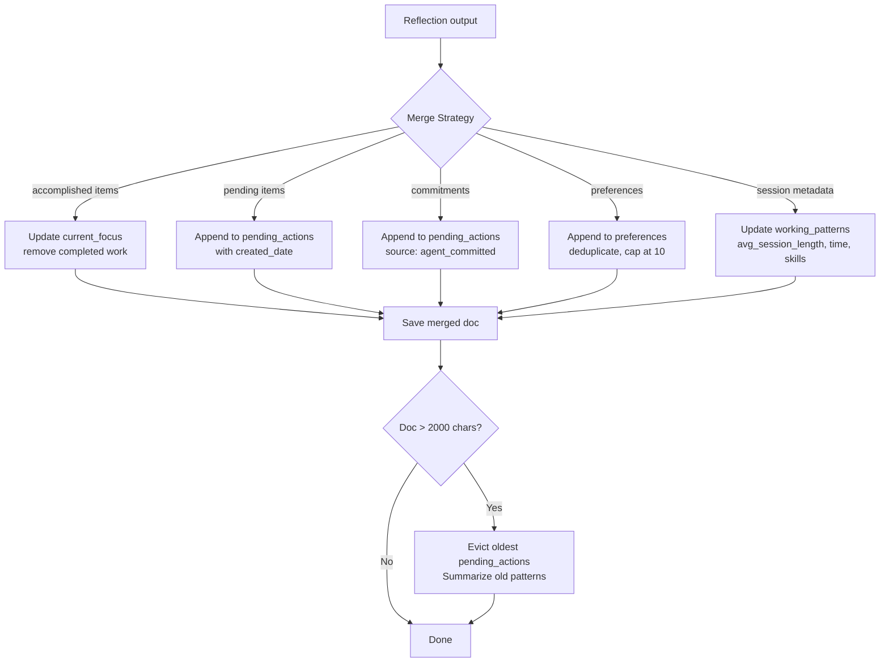

### Component: Event Queue

Events flow from other services into the shadow agent's awareness:

```mermaid
graph TD
    subgraph "Event Producers"
        AE[agent-eval<br/>evaluation_completed<br/>readiness_changed]
        PP[preprocessor<br/>evidence_uploaded]
        SC[scheduler/cron<br/>deadline_approaching<br/>deadline_missed<br/>agent_commitment_due]
        CA[compliance-assistant<br/>other user's agent<br/>escalation_triggered<br/>team_action]
    end

    subgraph "Memory Service"
        EQ[(Event Queue<br/>per user+tenant<br/>max 50 events<br/>priority-sorted)]
    end

    subgraph "Shadow Agent"
        INIT[/init handler]
        CTX[Context Builder]
        OPEN[Proactive Opener]
    end

    AE -->|POST /v1/event/push| EQ
    PP -->|POST /v1/event/push| EQ
    SC -->|POST /v1/event/push| EQ
    CA -->|POST /v1/event/push| EQ

    INIT -->|POST /v1/event/drain| EQ
    EQ -->|events| CTX
    CTX --> OPEN
```

#### Session Opener with Events

The proactive opener changes from pure status to status + delta:

```
V1: "Good morning Sarah. 36 days to audit. Readiness: 72%. CC7.2 is 12 days overdue."

V2: "Good morning Sarah. Since yesterday:
  - CC6.1 re-evaluated: PASS (was PARTIAL) — readiness moved to 75%
  - Marketing uploaded the access review logs you were waiting for
  - CC8.1 evidence is due tomorrow

  You committed to remind the marketing team today about CC7.2. Want me to send that now?"
```

### Component: Memory Hierarchy

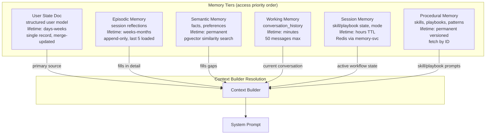

### New Module Structure

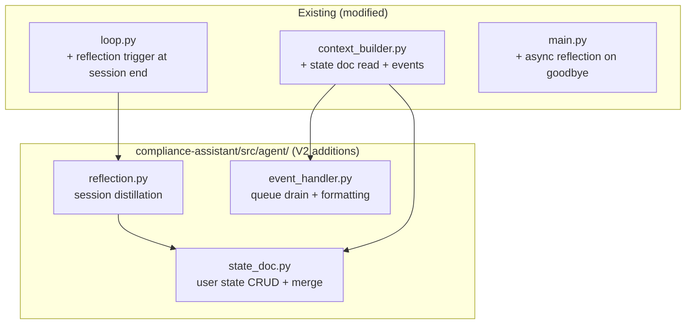

### Data Flow: Returning User (V2)

```mermaid
flowchart TD
    START[Sarah opens chat next day] --> INIT[POST /init with JWT]

    INIT --> PAR{Parallel fetch}
    PAR -->|1| SD[user_state_doc<br/>"Focus: SOC2 CC6.x/CC8.x<br/>Last: uploaded CC6.1, deferred CC8.1<br/>Pending: CC8.1 logs, remind marketing<br/>Prefs: bullet points, show % impact"]
    PAR -->|2| EQ[event_queue drain<br/>3 events since yesterday]
    PAR -->|3| RD[MCP: readiness resource<br/>75% ready (was 72%)]

    SD --> BUILD[Context Builder V2]
    EQ --> BUILD
    RD --> BUILD

    BUILD --> PROMPT[System Prompt includes:<br/>"Sarah's focus: SOC2 CC6.x/CC8.x<br/>Since last session: CC6.1 passed, readiness +3%,<br/>marketing uploaded CC7.2 logs, CC8.1 due tomorrow.<br/>Agent commitment due: remind marketing today.<br/>Preferences: bullet points, show % impact."]

    PROMPT --> LLM[LLM Gateway<br/>task: chat_response]
    LLM --> RESP["Good morning Sarah. Since yesterday:<br/>• CC6.1 passed re-evaluation — readiness now 75%<br/>• Marketing uploaded CC7.2 access review logs<br/>• CC8.1 evidence due tomorrow<br/><br/>I committed to remind marketing about CC7.2 today.<br/>Want me to send that now, or tackle CC8.1 first?"]

    RESP --> USER[User]
```

### Design Decisions (V2 additions)

#### 7. Reflection is cheap and lossy, not perfect

Reflection uses the fast tier and accepts imperfect extraction. A missed preference is fine — it'll be captured next session. The alternative (expensive strong-tier reflection) defeats the purpose of low-cost cross-session intelligence.

**Why:** The value is in the accumulation over many sessions, not perfection in one. 80% recall per session compounds to near-complete user understanding over 10 sessions.

#### 8. User state doc is code-updated, not LLM-updated

The merge logic for user state docs is deterministic Python code (append to list, deduplicate, cap at max, evict oldest). The LLM generates the reflection; code applies it to the doc.

**Why:** LLMs are unreliable at structured document updates (they hallucinate fields, forget to preserve existing entries). Deterministic merge is correct by construction. The LLM's job is insight extraction; the code's job is state management.

#### 9. Events are fire-and-forget from producers

Services push events without knowing if the user will ever see them. No acknowledgment protocol, no retry, no guaranteed delivery. Events are best-effort notifications, not transactions.

**Why:** The event queue is a UX enhancement, not a correctness requirement. If an event is lost, the user still sees current status via MCP resources. Events provide *delta awareness* ("what changed"), not *state* ("what is").

#### 10. No autonomous between-session execution

The shadow agent does NOT act between sessions. It accumulates awareness (events, commitments) and presents them proactively, but waits for the user to approve action. The "remind marketing" commitment surfaces as a suggestion, not an automatic send.

**Why:** Trust. Users must feel the agent is their delegate, not an autonomous actor. Proactive suggestion ("Want me to send this?") builds trust; autonomous action ("I sent it for you") erodes it — especially for compliance work where audit trails matter.
