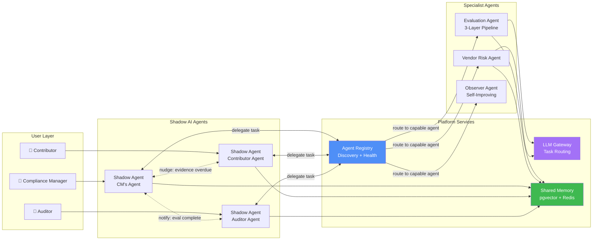
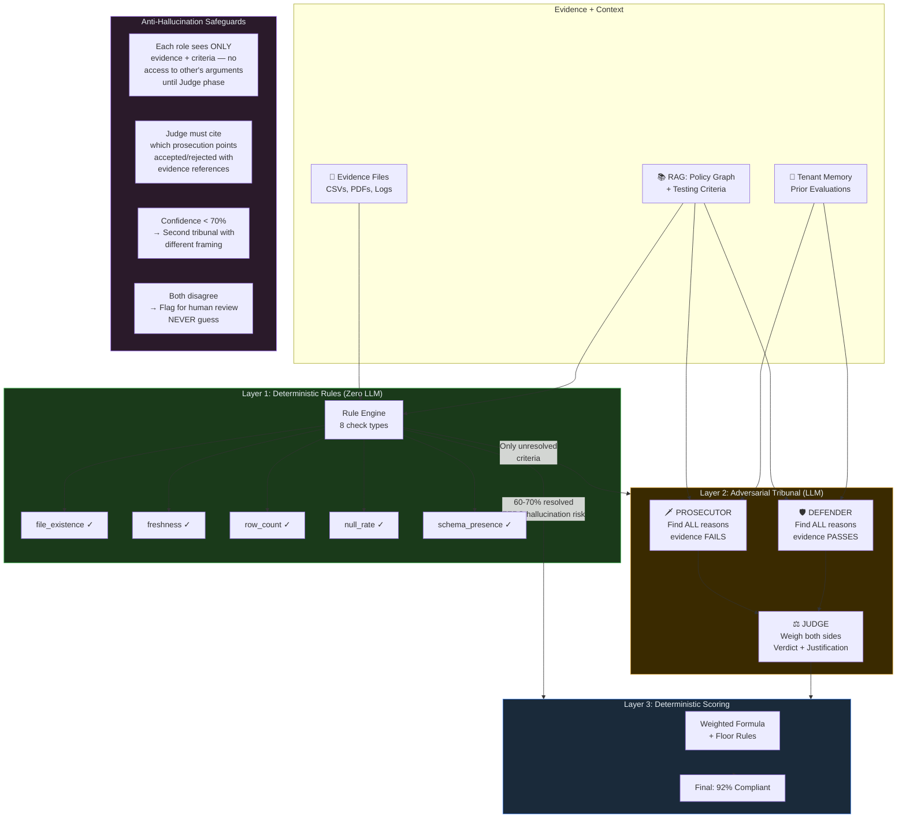

# High-Level Diagrams for Slides

## 1. Agent-to-Agent Communication



---

## 2. Agent Communication Protocol (Sequence)

```mermaid
sequenceDiagram
    participant CM as CM's Shadow Agent
    participant REG as Agent Registry
    participant EVAL as Evaluation Agent
    participant GW as LLM Gateway
    participant MEM as Shared Memory

    Note over CM: "Evaluate CC6.1 for SOC 2"

    CM->>REG: discover(task="evaluate_control")
    REG-->>CM: [{agent: eval-01, health: healthy, load: 30%}]

    CM->>EVAL: delegate(control_id="CC6.1", jwt=original_user_jwt)
    Note over EVAL: JWT propagated — tenant isolation enforced

    EVAL->>MEM: recall(tenant_id, "CC6.1 evidence")
    MEM-->>EVAL: evidence_files[], prior_eval

    EVAL->>GW: complete(task="evaluate_control", messages=[...])
    Note over GW: Routes to Bedrock Claude (strong tier)
    GW-->>EVAL: evaluation_result

    EVAL->>MEM: store(eval_result, score=0.92)
    EVAL-->>CM: {status: compliant, score: 92%}

    CM->>MEM: notify(auditor_agent, "CC6.1 eval ready")
    Note over CM: Inter-agent nudge via shared memory
```



---

## 3. Adversarial Tribunal — Reducing Hallucinations



---

## 4. RAG Pipeline — Policy Graph Retrieval for Evaluation

```mermaid
flowchart LR
    subgraph Ingestion["Policy Ingestion (One-time)"]
        PDF[📄 Policy PDF<br/>87 pages]
        PP[Preprocessor<br/>Structural Parse]
        CHUNK[Late Chunking<br/>+ Embeddings]
        GRAPH[Graph Extraction<br/>Entity + Relationship]
        LEIDEN[Community Detection<br/>Leiden Algorithm]
        STORE[(pgvector<br/>Embeddings + Graph)]

        PDF --> PP --> CHUNK --> STORE
        PP --> GRAPH --> LEIDEN --> STORE
    end

    subgraph Retrieval["At Evaluation Time"]
        QUERY[Query: "CC6.1 access review<br/>requirements"]
        VEC[Vector Search<br/>Top-K chunks]
        GRAPH_WALK[Graph Walk<br/>Related obligations]
        COMMUNITY[Community Context<br/>Topic cluster]
        MERGE[Merge + Rank<br/>Deduplicate]
        CRITERIA[Testing Criteria<br/>with weights]

        QUERY --> VEC --> MERGE
        QUERY --> GRAPH_WALK --> MERGE
        QUERY --> COMMUNITY --> MERGE
        MERGE --> CRITERIA
    end

    subgraph Eval["Feeds into Tribunal"]
        CRITERIA --> PROS2[Prosecutor<br/>uses criteria as<br/>prosecution rubric]
        CRITERIA --> DEF2[Defender<br/>uses criteria to<br/>identify evidence matches]
        CRITERIA --> RULES2[Rule Engine<br/>threshold-based<br/>checks]
    end

    style Ingestion fill:#1a2a3a,stroke:#4f8ff7,color:#e6edf3
    style Retrieval fill:#1a3a1a,stroke:#3fb950,color:#e6edf3
    style Eval fill:#3a2a00,stroke:#d29922,color:#e6edf3
```

---

## 5. Full Evaluation Flow — RAG + Tribunal Combined

```mermaid
flowchart TB
    START([User: "Evaluate CC6.1"])

    subgraph RAG["RAG Retrieval"]
        R1[Policy Graph<br/>→ Obligations for CC6.1]
        R2[Vector Search<br/>→ Relevant policy sections]
        R3[Testing Criteria<br/>→ 11 weighted criteria]
    end

    subgraph Rules["Layer 1: Rules (Deterministic)"]
        RE[Rule Engine]
        P1[8 criteria → PASS/FAIL]
        NJ[3 criteria → NEEDS_JUDGMENT]
    end

    subgraph Tribunal["Layer 2: Adversarial Tribunal"]
        direction LR
        subgraph C1["Criterion 9 (weight: 0.25)"]
            P_1[🗡️ Prosecutor]
            D_1[🛡️ Defender]
            J_1[⚖️ Judge]
            P_1 --> J_1
            D_1 --> J_1
        end
        subgraph C2["Criterion 10 (weight: 0.20)"]
            P_2[🗡️ Prosecutor]
            D_2[🛡️ Defender]
            J_2[⚖️ Judge]
            P_2 --> J_2
            D_2 --> J_2
        end
        subgraph C3["Criterion 11 (weight: 0.15)"]
            P_3[🗡️ Prosecutor]
            J_3[⚖️ Judge<br/>Simplified]
            P_3 --> J_3
        end
    end

    subgraph Scoring["Layer 3: Scoring"]
        CALC[Weighted Sum<br/>+ Floor Rules]
        RESULT[Score: 92%<br/>Status: Compliant]
    end

    START --> RAG
    RAG --> Rules
    Rules --> P1
    Rules --> NJ
    NJ --> Tribunal
    P1 --> Scoring
    Tribunal --> Scoring
    Scoring --> RESULT

    style RAG fill:#1a3a1a,stroke:#3fb950,color:#e6edf3
    style Rules fill:#1a2a3a,stroke:#4f8ff7,color:#e6edf3
    style Tribunal fill:#3a2a00,stroke:#d29922,color:#e6edf3
    style Scoring fill:#2a1a2a,stroke:#a371f7,color:#e6edf3
```

---

## 6. Why the Tribunal Eliminates Hallucination

```mermaid
flowchart LR
    subgraph Problem["Traditional LLM Eval"]
        SINGLE[Single LLM Call<br/>"Is this compliant?"]
        RISK1[❌ Confirmation bias]
        RISK2[❌ Plausible-sounding<br/>but wrong]
        RISK3[❌ No evidence<br/>grounding]
        SINGLE --> RISK1 & RISK2 & RISK3
    end

    subgraph Solution["Our 3-Layer Approach"]
        direction TB
        S1[Layer 1: Rules First<br/>60-70% resolved with<br/>ZERO LLM involvement]
        S2[Prosecutor forced to<br/>argue AGAINST<br/>— surfaces real gaps]
        S3[Defender forced to<br/>argue FOR<br/>— prevents false negatives]
        S4[Judge sees BOTH sides<br/>must cite evidence<br/>for every point accepted]
        S5[Low confidence?<br/>Second tribunal or<br/>flag for human]
        S1 --> S2 --> S3 --> S4 --> S5
    end

    subgraph Result["Outcome"]
        O1[✅ Evidence-grounded]
        O2[✅ Adversarially tested]
        O3[✅ Auditable reasoning]
        O4[✅ Human escalation<br/>when uncertain]
    end

    Problem -.->|"replaced by"| Solution
    Solution --> Result

    style Problem fill:#3a1a1a,stroke:#f85149,color:#e6edf3
    style Solution fill:#1a3a1a,stroke:#3fb950,color:#e6edf3
    style Result fill:#1a2a3a,stroke:#4f8ff7,color:#e6edf3
```
