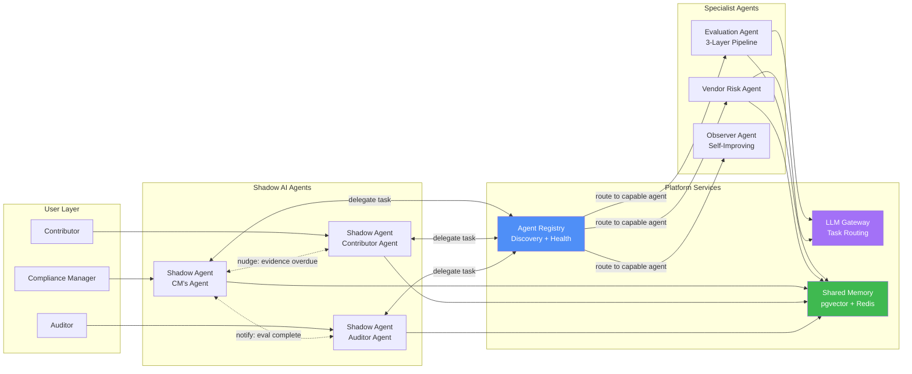
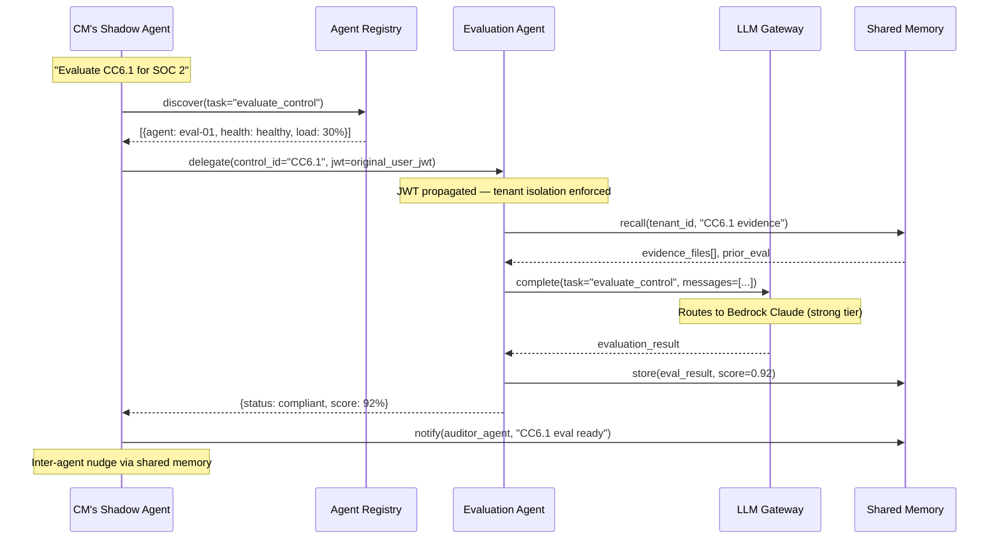
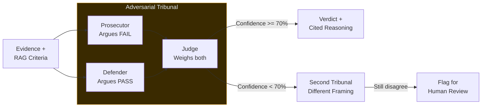
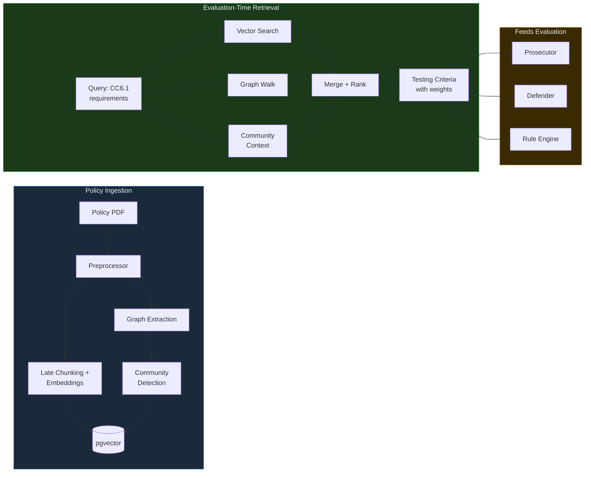
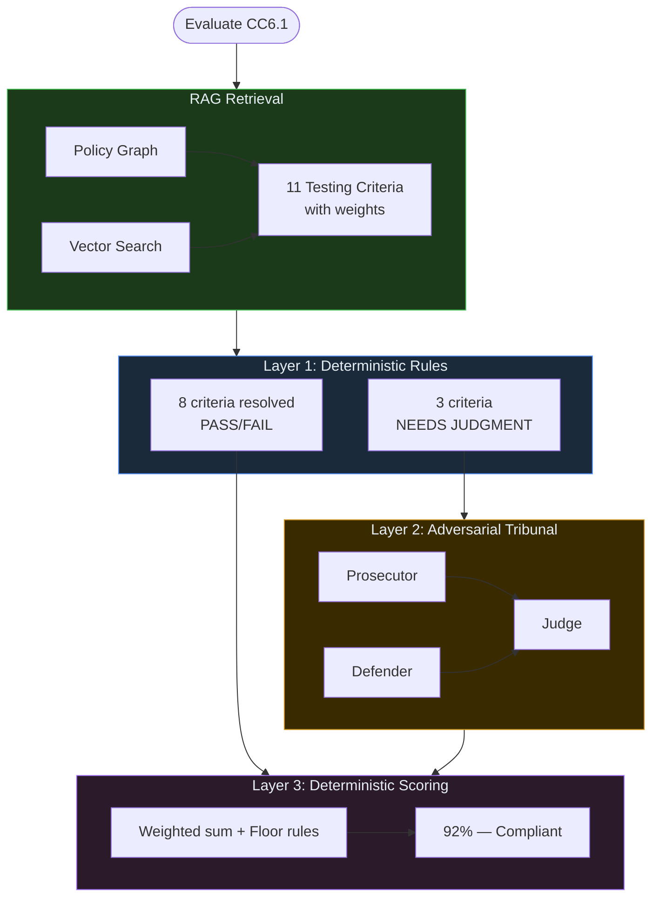
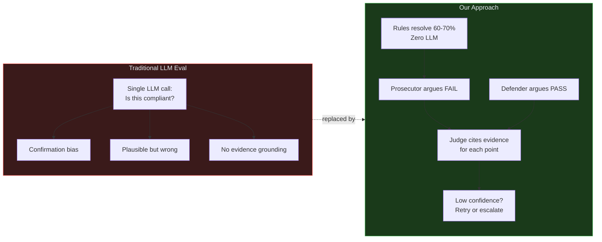

# High-Level Diagrams for Slides

## 1. Agent-to-Agent Communication

---

## 2. Agent Communication Protocol (Sequence)

---

## 3. Adversarial Tribunal — Reducing Hallucinations

**Key anti-hallucination rules:**
- Prosecutor and Defender work **independently** — neither sees the other's arguments
- Judge must **cite specific evidence** for every point accepted or rejected
- Low confidence → automatic retry; persistent disagreement → human escalation, never a guess

---

## 4. RAG Pipeline — Policy Graph Retrieval for Evaluation

---

## 5. Full Evaluation Flow — RAG + Tribunal Combined

---

## 6. Why the Tribunal Eliminates Hallucination

