# LLM Gateway — Architecture Design

## Overview

The LLM Gateway is the single entry point for ALL LLM calls across the system. No agent ever talks to a model directly. The gateway owns routing, escalation, fallback, tool format translation, cost tracking, and logging. Agents declare WHAT they are doing (task name); the gateway decides HOW (which model, which tier, which provider).

This design enables model changes, tier rebalancing, canary testing, and provider migrations without any agent code changes or redeployments.

---

## High-Level Architecture

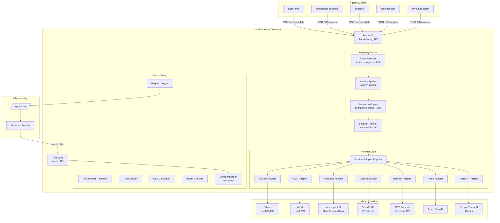

---

## Request Resolution Flow

The routing hierarchy determines which model handles a request. Most specific match wins.

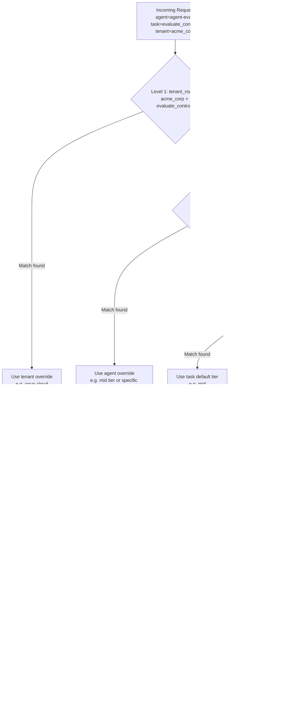

---

## Escalation Flow

When confidence is below threshold, the gateway transparently retries at a higher tier.

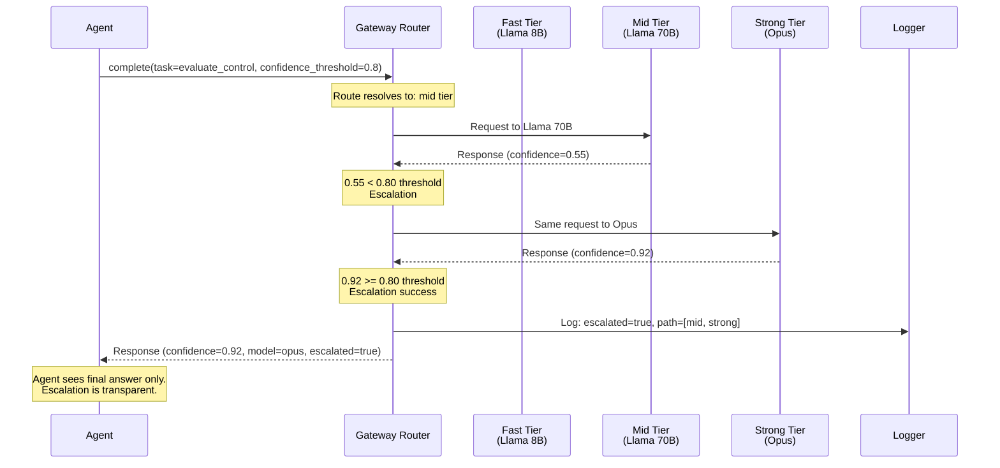

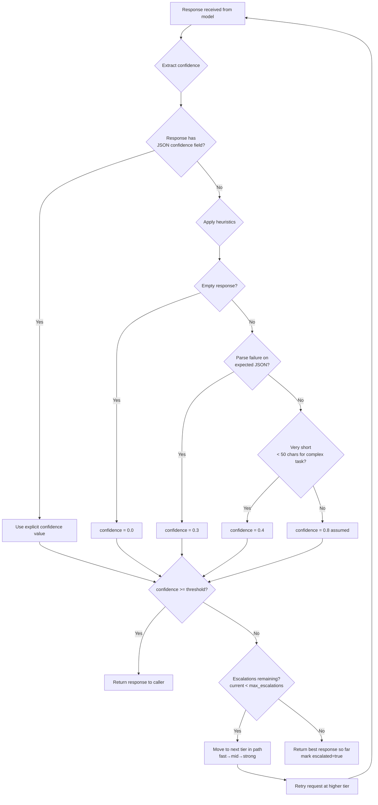

---

## Provider Adapter Pattern

All provider differences are encapsulated behind a common interface. Adding a new provider means implementing one adapter class.

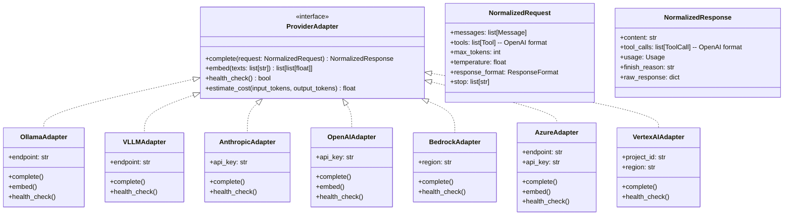

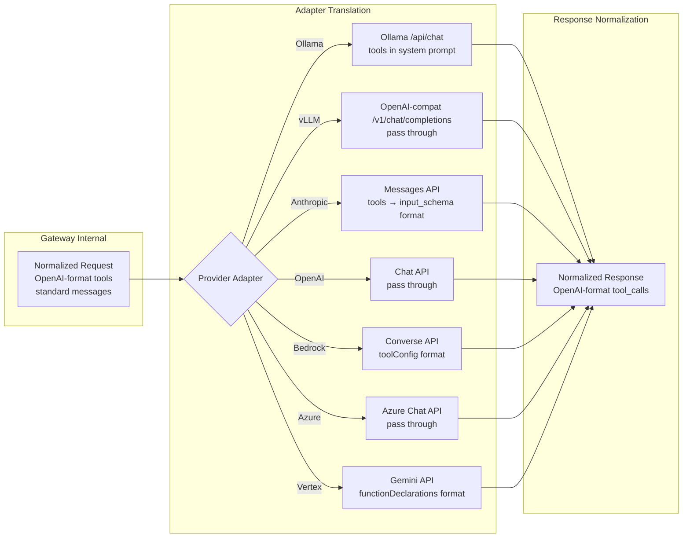

---

## Tool Format Translation Flow

Agents always send tools in OpenAI function-calling format. The gateway handles all translation to/from provider-specific formats.

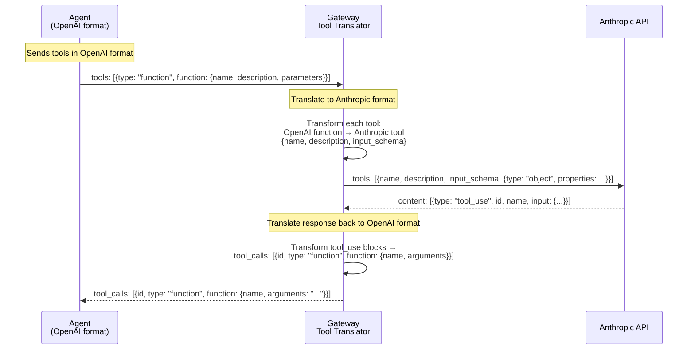

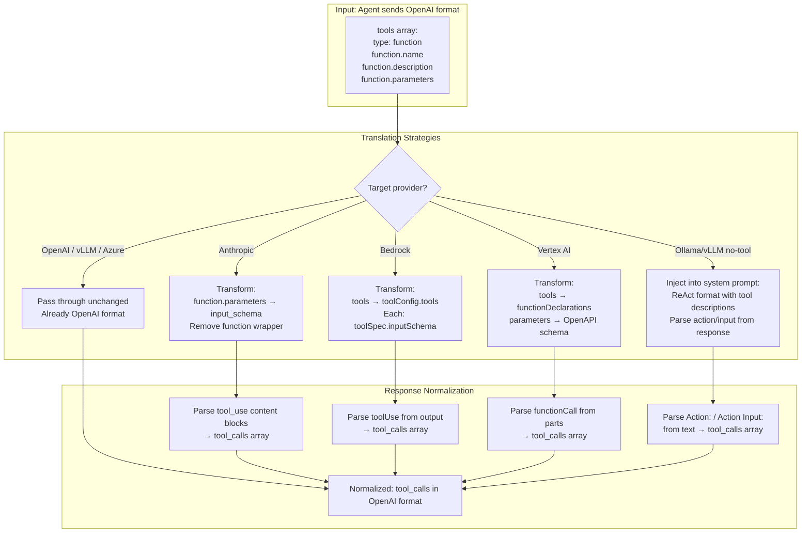

---

## Canary Traffic Splitting

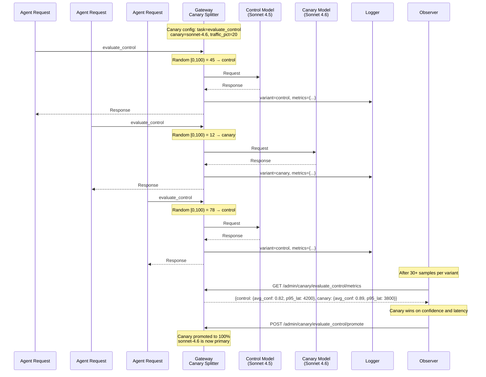

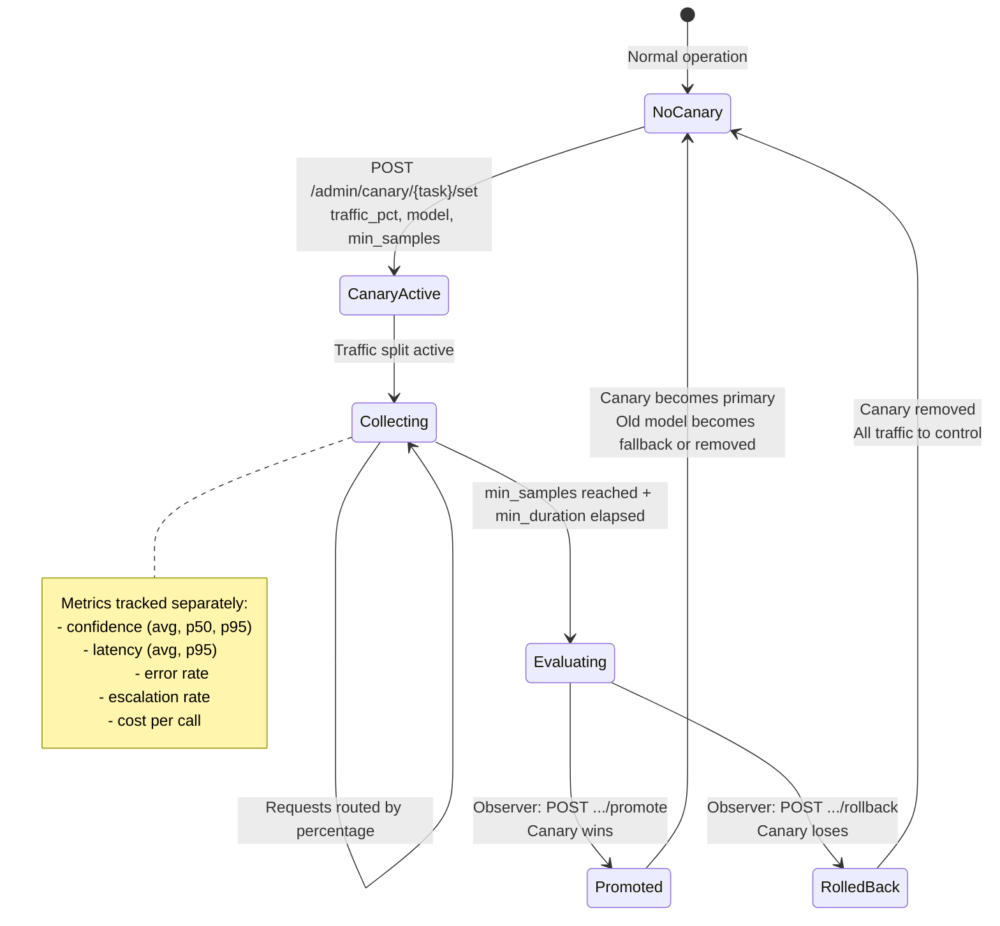

---

## Admin API and Observer Interaction

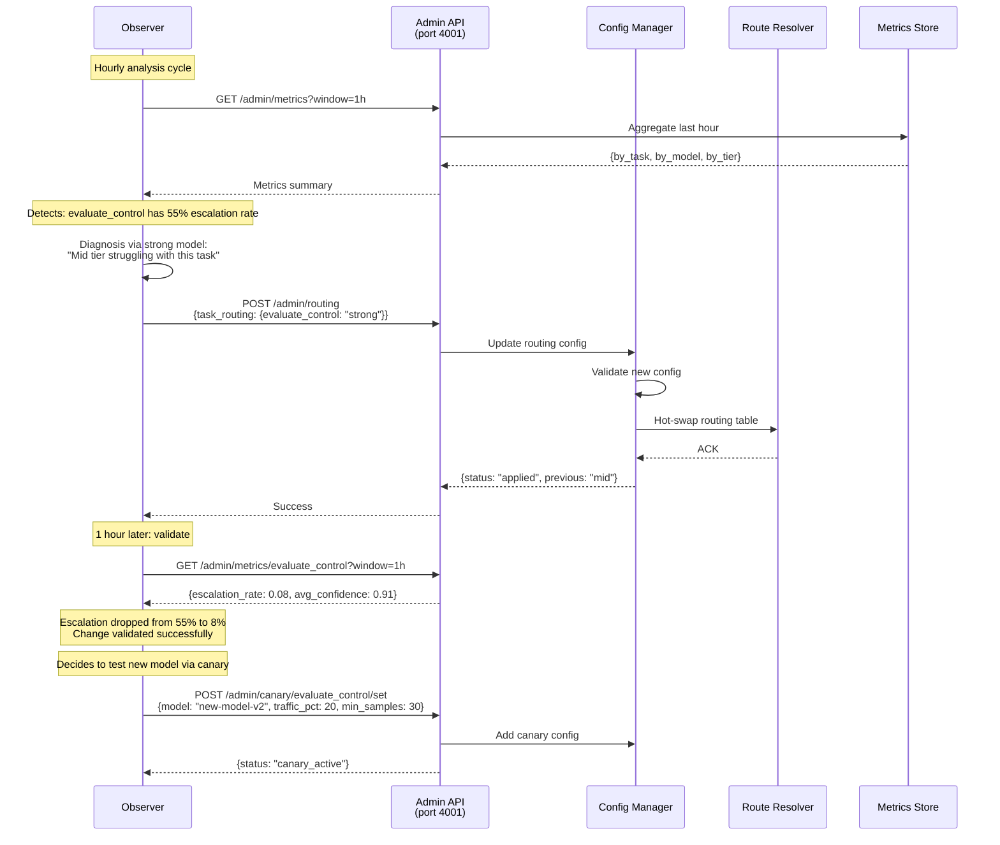

```mermaid
graph TD
    subgraph "Admin API Endpoints (port 4001)"
        subgraph "Metrics"
            M1[GET /admin/metrics?window=1h]
            M2[GET /admin/metrics/{task}]
        end
        
        subgraph "Routing"
            R1[POST /admin/routing<br/>update task→tier]
            R2[POST /admin/threshold<br/>update confidence threshold]
            R3[POST /admin/reload<br/>hot-reload config from file]
        end
        
        subgraph "Canary"
            C1[GET /admin/canary/{task}/metrics]
            C2[POST /admin/canary/{task}/set]
            C3[POST /admin/canary/{task}/promote]
            C4[POST /admin/canary/{task}/rollback]
        end
        
        subgraph "Models"
            MD1[GET /admin/models<br/>list + health status]
            MD2[POST /admin/models/{id}/disable]
        end
    end

    subgraph "Callers"
        OBS[Observer<br/>automated adjustments]
        OPS[Ops Team<br/>manual overrides]
    end

    OBS --> M1 & M2
    OBS --> R1 & R2
    OBS --> C1 & C2 & C3 & C4
    OPS --> R1 & R3
    OPS --> MD1 & MD2
    OPS --> C2 & C3 & C4
```

---

## Module Structure

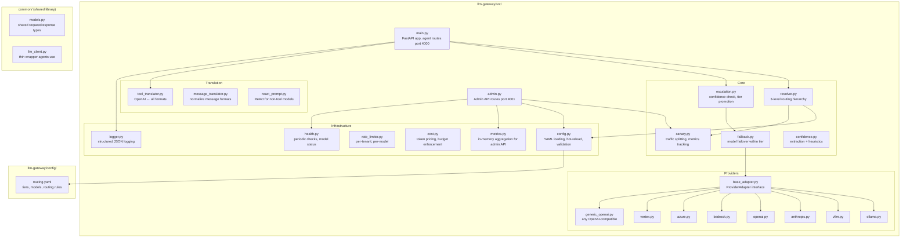

---

## Model Lifecycle

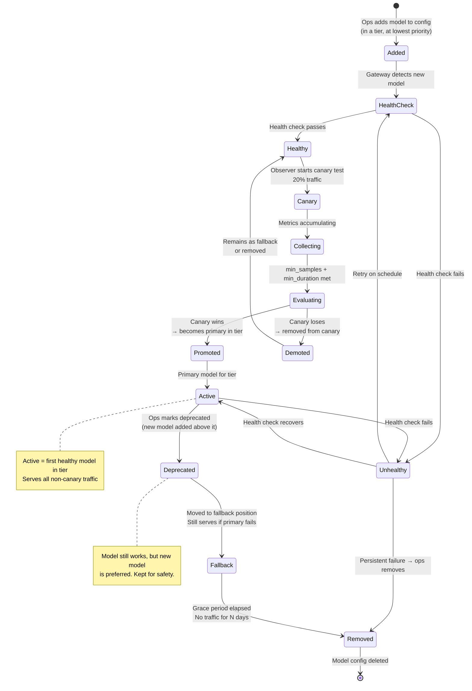

---

## Health Check and Model Rotation

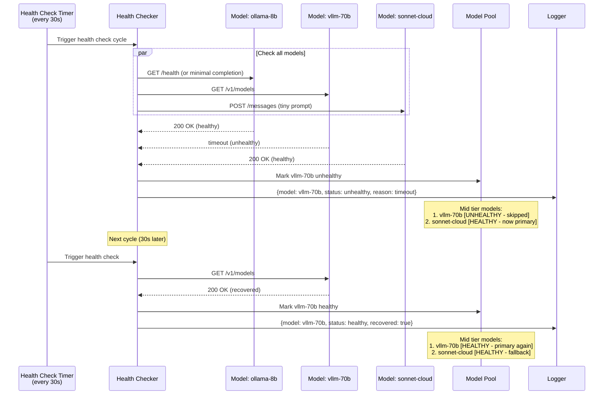

---

## Hot-Reload Mechanism

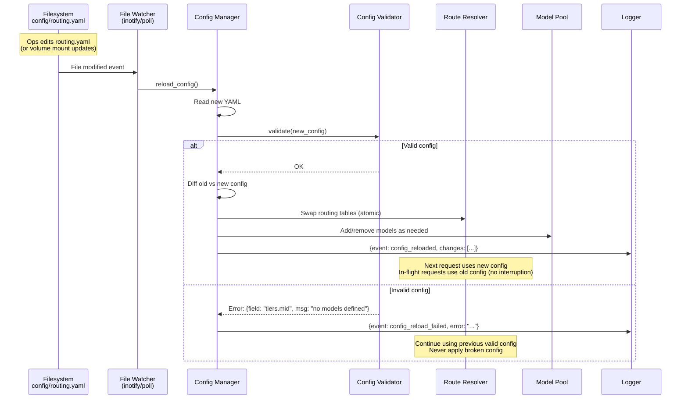

### How Hot-Reload Works (Implementation Detail)

1. **File watching**: On Linux, use `inotify` via `watchdog` library. On macOS/fallback, poll every 5 seconds.
2. **Atomic swap**: The routing table is an immutable snapshot. New config creates a new snapshot, then a single pointer swap makes it active. No locks on the read path.
3. **In-flight safety**: Requests that already resolved a model continue with that model. Only new requests see the new config.
4. **Validation before apply**: Schema validation (required fields, valid tier names, model IDs exist) prevents broken configs from being applied.
5. **Admin API trigger**: `POST /admin/reload` forces an immediate reload (same validation path). Used by observer for programmatic changes.
6. **Config sources**: File-based changes (ops editing YAML) and API-based changes (observer posting to admin API) both funnel through the same validation + swap pipeline.

---

## Cost Calculation and Rate Limiting

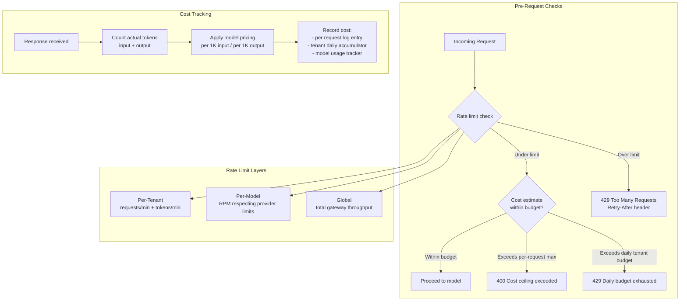

### Cost Calculation Details

| Provider | Pricing Source | Method |
|----------|---------------|--------|
| Ollama / vLLM (local) | Config-defined (amortized GPU cost) | tokens * configured_rate |
| Anthropic | Model-specific pricing | input_tokens * input_rate + output_tokens * output_rate |
| OpenAI | Model-specific pricing | Same formula |
| Bedrock | On-demand pricing per region | Same formula |
| Azure / Vertex | Deployment-specific | Configurable per model |

### Rate Limiting Implementation

- **Algorithm**: Token bucket with sliding window (per-tenant, per-model).
- **Storage**: In-memory (single instance) or Redis (multi-instance deployment).
- **Fairness**: Per-tenant limits prevent one tenant from starving others.
- **Provider respect**: Per-model limits stay below provider API rate limits to avoid 429s from upstream.
- **429 Response**: Includes `Retry-After` header with seconds until tokens refill.

---

## Why This Is NOT LiteLLM

LiteLLM is a popular open-source library for proxying LLM calls across providers. The gateway shares some surface-level goals but differs fundamentally in several areas:

### What LiteLLM does well (and we could use under the hood)

| Capability | LiteLLM | Our Gateway |
|-----------|---------|-------------|
| Provider API translation | Yes | Could delegate to LiteLLM internally |
| Basic load balancing | Yes (router) | Yes, but with richer logic |
| Cost tracking per call | Yes | Yes |
| Retry on failure | Yes | Yes |

### What requires custom implementation (not in LiteLLM)

| Capability | Why custom |
|-----------|-----------|
| 3-level routing hierarchy (tenant > agent > task) | LiteLLM has no concept of tenants, agents, or task-based routing |
| Confidence-based escalation | LiteLLM retries on failure, not on low confidence; it doesn't inspect response content |
| Tool format translation with ReAct fallback | LiteLLM passes tools through; it doesn't inject ReAct prompts for non-tool models |
| Canary traffic splitting with per-variant metrics | LiteLLM has no A/B testing or canary concept |
| Observer integration (admin API for automated tuning) | LiteLLM is a library, not a controllable service with an admin plane |
| Hot-reload config hierarchy | LiteLLM uses static config or code-level routing |
| Per-tenant daily budget enforcement | LiteLLM tracks cost but doesn't enforce tenant-level budgets |
| Structured logging for observer consumption | LiteLLM logs are operational, not designed for automated analysis |

### Decision: Build custom gateway, optionally use LiteLLM as a provider adapter

The gateway is architecturally distinct from LiteLLM. However, for the provider adapter layer specifically, we could optionally use LiteLLM's `completion()` function as the transport layer inside individual adapters — treating it as a convenience library for API format translation rather than as the routing brain.

**Why not just wrap LiteLLM entirely?**
- Our routing logic (3-level hierarchy, canary, escalation) must wrap around the model call, not be wrapped by it.
- We need to inspect responses between tiers (for confidence extraction) which LiteLLM's router doesn't support.
- The admin API + hot-reload + observer loop is a fundamentally different operational model than LiteLLM's "call and forget" pattern.

---

## Key Design Decisions

### 1. Agents declare tasks, never models

Agents send `task="evaluate_control"` — never `model="claude-sonnet-4-20250514"`. This complete decoupling means:
- Models can be swapped without touching agent code
- The observer can rebalance the entire system by editing one config file
- New models can be tested via canary without any agent awareness
- Tenant-specific model preferences are gateway concerns, not agent concerns

**Why:** If agents chose models, every model change would be a multi-repo code change with coordinated deploys. With task-based routing, model changes are config changes.

### 2. Three-tier system, not N arbitrary tiers

Fast/mid/strong is sufficient granularity. More tiers would complicate escalation paths and make it harder for the observer to reason about routing changes. The tiers map to real cost/capability tradeoffs:
- **Fast**: Sub-second, cheap, good for classification/extraction (8B local)
- **Mid**: Few seconds, moderate cost, good for generation/evaluation (70B local or Sonnet)
- **Strong**: Slower, expensive, for complex reasoning or when others fail (Opus)

**Why:** Simplicity. The observer can reason about "promote to strong" without navigating a complex tier graph.

### 3. Fallback within tier BEFORE escalation across tiers

When a model fails (timeout, 5xx, rate limit), try the next model in the same tier first. Only escalate to a higher tier when the response itself is inadequate (low confidence, parse failure). This keeps costs predictable.

**Why:** A timeout from vLLM doesn't mean the task needs a stronger model — it means vLLM is overloaded. Try Sonnet (same tier, cloud) before jumping to Opus.

### 4. Confidence extraction is best-effort, not required

Not all models return confidence scores. The heuristic system (empty = 0.0, parse fail = 0.3, normal = 0.8) means escalation works even without explicit confidence. Agents that want precise escalation control can include a `confidence` field in their structured output schema.

**Why:** We cannot require all models to return confidence. The heuristic makes the system work universally, while structured output schemas provide precision when needed.

### 5. Two ports: one for agents, one for admin

Port 4000 (agent-facing) is the hot path — it needs to be fast and never blocked by admin operations. Port 4001 (admin) is for the observer and ops — it can afford more processing and doesn't need the same latency guarantees. In production, port 4001 is not exposed externally.

**Why:** Security (admin API not reachable from outside), performance (no request interference), clarity (different auth requirements possible in future).

### 6. Logging is synchronous write, not fire-and-forget

Every request/response is logged before the response is returned to the agent. This guarantees the observer has complete data. The log write is to a local volume (fast), not a remote service.

**Why:** The observer's ability to diagnose issues depends on complete logs. Async/lossy logging would create blind spots. Local file writes are fast enough (sub-ms) to not meaningfully impact latency.

### 7. Config is YAML on a volume, not in a database

The routing config is a YAML file mounted into the container. This means:
- GitOps: config changes are reviewable PRs
- Simplicity: no database dependency for the gateway
- Portability: works in air-gapped deployments with no external services
- Hot-reload: file watcher detects changes without restart

The admin API can also modify the in-memory config, but changes that need to persist across restarts must be written to the YAML file (or the orchestrator must handle persistence).

**Why:** The gateway should have minimal dependencies. A database would add a failure mode for something that can be a flat file.

### 8. Provider adapters are stateless and independently testable

Each adapter is a pure function: normalized request in, normalized response out. No shared state between adapters. Each can be unit tested with mock HTTP responses.

**Why:** Provider APIs change frequently. Isolated adapters mean a Bedrock API change doesn't risk breaking the Anthropic path. Testing is straightforward.

### 9. Tool translation supports ReAct as a fallback

For models without native function calling (older Ollama models, some open-source models), the gateway injects tool descriptions into the system prompt using ReAct format and parses `Action:` / `Action Input:` from the response. This means every agent works with every model, even ones without tool support.

**Why:** The system must work with local models that may not support function calling natively. ReAct prompting is well-understood and reliable for simple tool use. This prevents "this agent only works with OpenAI" lock-in.

### 10. Canary state is in-memory with periodic checkpoint

Active canary experiments (traffic percentages, accumulated metrics) live in memory for fast access on every request. Metrics are checkpointed to disk periodically. If the gateway restarts, active canaries resume from the last checkpoint (may lose a few minutes of metrics, but the experiment continues).

**Why:** Canary decisions happen on every request (fast path). Disk I/O on every request is unacceptable. Losing a few data points on restart is fine — the experiment requires 30+ samples anyway.

---

## Request Lifecycle (Complete)

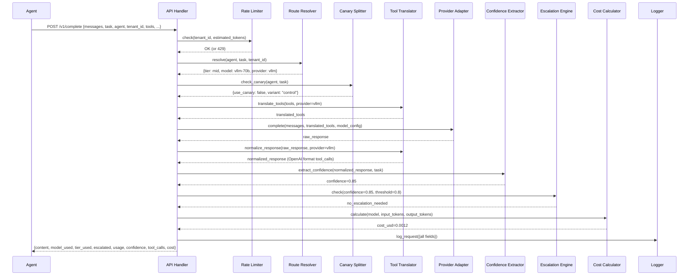

---

## Deployment Topology

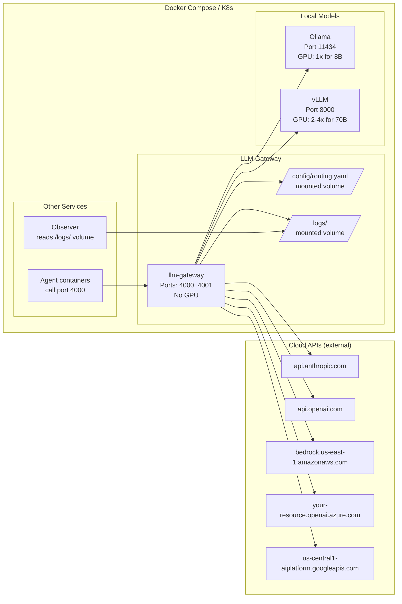

---

## Error Handling Strategy

| Error Type | Handling | Visible to Agent? |
|-----------|----------|-------------------|
| Model timeout | Fallback to next model in tier | No (transparent retry) |
| Model 5xx | Fallback to next model in tier | No |
| Model rate limited (429) | Fallback to next model; if all limited, return 429 to agent | Only if all models exhausted |
| Invalid tool call format | Log warning, attempt best-effort parse | No (degraded tool_calls) |
| All models in tier fail | Escalate to next tier (if enabled) | No (escalation is transparent) |
| All tiers exhausted | Return error to agent with last error detail | Yes |
| Config invalid on reload | Keep previous config, log error | No |
| Tenant over daily budget | Return 429 with budget_exhausted reason | Yes |
| Tenant rate limited | Return 429 with retry_after | Yes |
| Unparseable response (expected JSON) | Confidence = 0.3, may trigger escalation | No (escalation handles it) |
| Provider auth failure (bad API key) | Mark model unhealthy, fallback | No (if fallback succeeds) |

---

## Configuration Reference

```yaml
# config/routing.yaml — the single source of truth for routing

tiers:
  fast:
    models:
      - id: ollama-8b          # unique identifier
        provider: ollama       # adapter to use
        model: llama3.1:8b     # provider-specific model name
        endpoint: http://ollama:11434
        max_tokens: 2048
        timeout_ms: 15000
  mid:
    models:
      - id: vllm-70b
        provider: vllm
        model: meta-llama/Llama-3.1-70B-Instruct
        endpoint: http://vllm:8000
        max_tokens: 4096
        timeout_ms: 60000
      - id: sonnet-cloud
        provider: anthropic
        model: claude-sonnet-4-20250514
        api_key: ${ANTHROPIC_API_KEY}
        max_tokens: 4096
        timeout_ms: 60000
  strong:
    models:
      - id: opus-cloud
        provider: anthropic
        model: claude-opus-4-20250514
        api_key: ${ANTHROPIC_API_KEY}
        max_tokens: 8192
        timeout_ms: 120000

# 3-level routing hierarchy
task_routing:        # Level 3 (default)
  classify_intent: fast
  evaluate_control: mid
  complex_reasoning: strong
  # ... (see REQUIREMENTS.md for full list)

agent_routing:       # Level 2 (per-agent override)
  agent-eval:
    evaluate_control: mid
    generate_code:
      model: sonnet-cloud

tenant_routing:      # Level 1 (most specific, wins)
  acme_corp:
    evaluate_control:
      model: opus-cloud

# Canary experiments (managed by observer or ops)
canary:
  agent-eval/evaluate_control:
    model: sonnet-4.6
    traffic_pct: 20
    min_samples: 30
    min_duration_hours: 4

# Escalation
escalation:
  enabled: true
  max_escalations: 2
  path: [fast, mid, strong]

# Embedding
embedding:
  model:
    provider: ollama
    model: nomic-embed-text
    endpoint: http://ollama:11434

# Limits
rate_limits:
  per_tenant:
    requests_per_minute: 60
    tokens_per_minute: 100000
  per_model:
    ollama-8b: {rpm: 100}
    vllm-70b: {rpm: 50}

cost:
  max_per_request_usd: 1.00
  max_per_tenant_per_day_usd: 50.00

# Health checks
health:
  interval_seconds: 30
  timeout_ms: 5000
  unhealthy_threshold: 3    # consecutive failures before marking unhealthy
  healthy_threshold: 1      # consecutive successes to recover

# Policy
policy:
  allow_cloud_fallback: true
  log_prompts: true
  log_responses: true
```

---

## Summary

The LLM Gateway is a stateless routing service that sits between all agents and all model providers. Its core value propositions:

1. **Decoupling**: Agents never know which model they are using. Models can be swapped freely.
2. **Intelligence**: Routing hierarchy + escalation + canary = the system gets smarter over time via the observer.
3. **Reliability**: Fallback chains ensure requests succeed even when individual models fail.
4. **Universality**: Tool format translation means any agent works with any model, regardless of native capabilities.
5. **Observability**: Complete structured logs enable the observer to diagnose and fix issues autonomously.
6. **Simplicity**: One YAML file controls all routing. No code changes for model operations.
