# Memory Service - Architecture Design Document

## Overview

The memory service is the shared brain for all agents in the compliance platform. It provides a single source of truth for session state, user knowledge, tenant knowledge, task tracking, evaluation history, cross-tenant patterns, versioned skills, interaction logs, and an immutable audit trail.

No agent maintains its own persistence. Every agent reads from and writes to memory-service, which in turn manages PostgreSQL (long-term structured data + vector search) and Redis (ephemeral session state).

---

## High-Level Architecture

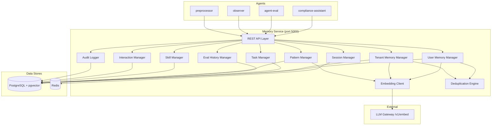

---

## Data Model / Schema

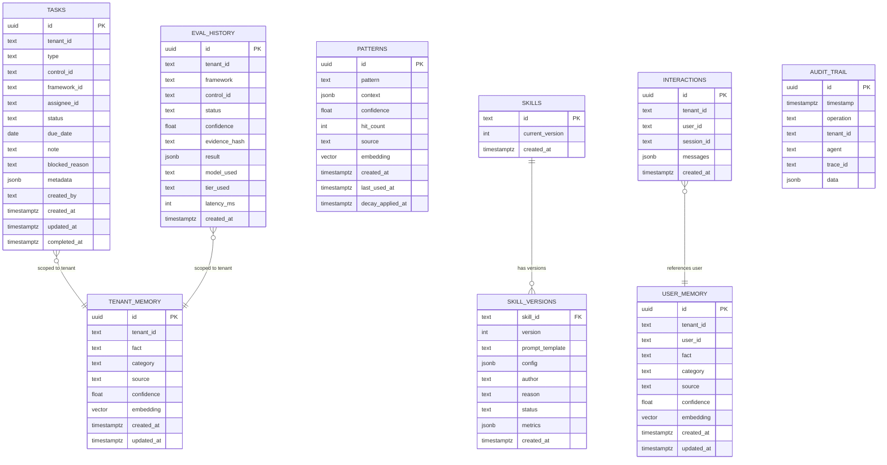

---

## Memory Types and Their Lifecycles

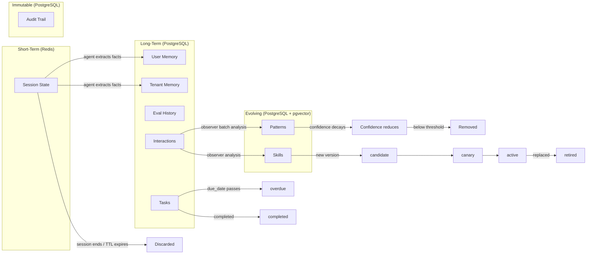

### Lifecycle Summary

| Memory Type | Duration | Eviction Strategy |
|-------------|----------|-------------------|
| Session state | 4h TTL | Auto-expire in Redis |
| User memory | Indefinite | Manual delete or dedup-merge |
| Tenant memory | Indefinite | Manual delete or dedup-merge |
| Tasks | Until completed/cancelled | Status transitions, never deleted |
| Eval history | Indefinite | Grows append-only |
| Patterns | Until decayed below threshold | Confidence decay if unused |
| Skills | Versioned forever | Versions retired, never deleted |
| Interactions | 90 days (configurable) | TTL-based batch cleanup |
| Audit trail | Forever | Append-only, never deleted |

---

## Read Path: Agent Loads Context on Session Start

When an agent begins a session, it issues parallel fetches to build its working context:

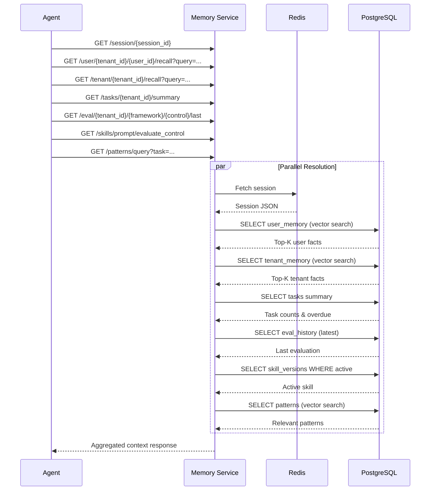

All seven fetches execute in parallel on the agent side. The memory service handles each independently. This ensures session startup latency is bounded by the slowest single query (typically vector search at ~20-50ms) rather than the sum of all queries.

---

## Write Path: Storing Facts with Deduplication

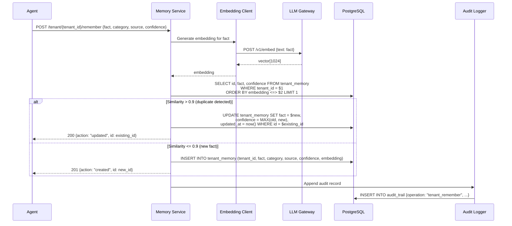

### Deduplication Rules

1. Generate embedding for the incoming fact
2. Query existing facts for the same tenant (or user, for user memory) using cosine similarity
3. If closest match has similarity > 0.9:
   - Update the existing fact text (in case phrasing improved)
   - Set confidence to the higher of old vs new
   - Bump `updated_at`
4. If no match above threshold: insert as new fact
5. Always log to audit trail regardless of outcome

---

## Semantic Search Flow

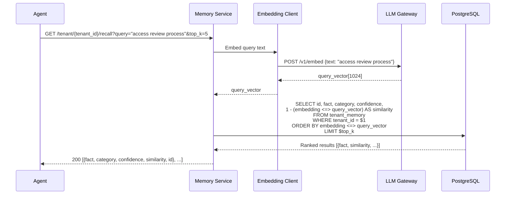

### Search Implementation Details

- Uses pgvector's `<=>` operator (cosine distance)
- IVFFlat index for approximate nearest neighbor (faster than exact at scale)
- Results filtered by tenant_id BEFORE vector search (partition pruning)
- Similarity score returned so agents can decide relevance threshold
- Patterns search is cross-tenant (no tenant_id filter)

---

## Task Lifecycle State Machine

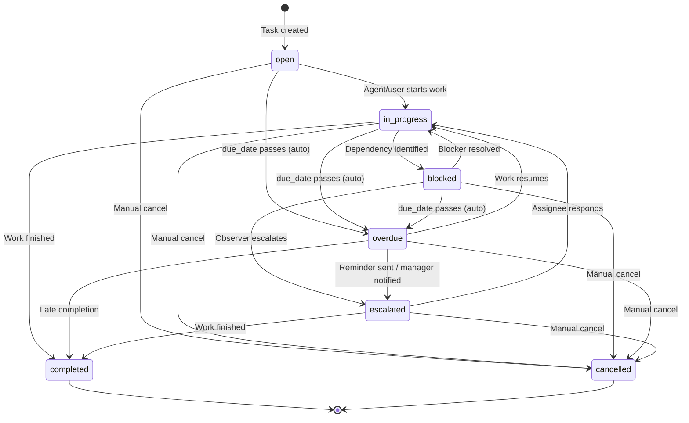

### Auto-Transition Rules

| Trigger | From | To | Actor |
|---------|------|------|-------|
| `due_date` passes current time | open, in_progress, blocked | overdue | Agent on read (lazy) or observer (batch) |
| Evidence uploaded for control | evidence_needed (open) | evidence_uploaded | preprocessor |
| Evaluation completes | evaluation_pending | completed | agent-eval |
| Observer detects stuck task | overdue | escalated | observer |

---

## Skill Versioning Flow

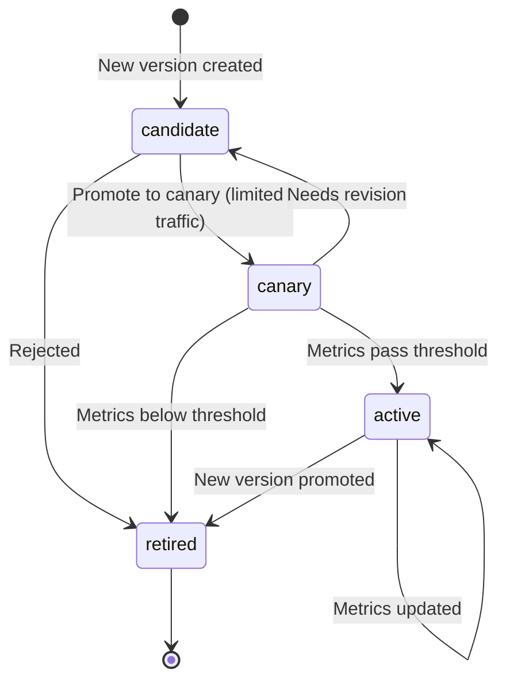

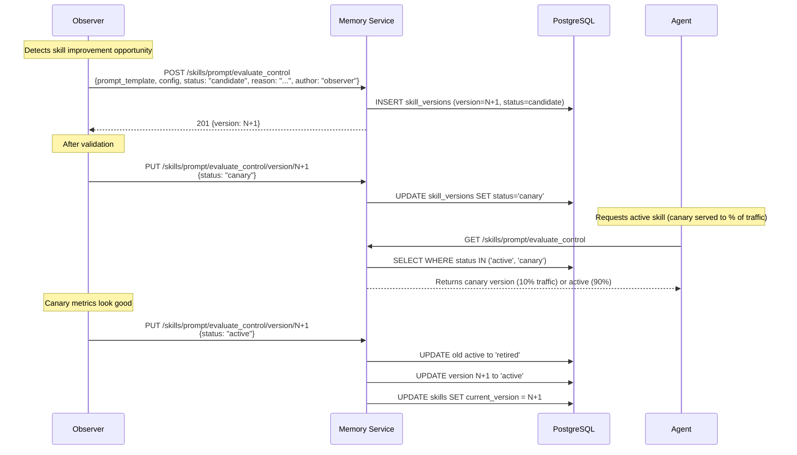

### Skill Versioning Rules

- Only one version can be `active` at a time per skill_id
- Canary versions receive a configurable percentage of requests (default 10%)
- Metrics tracked per version: avg_confidence, escalation_rate, usage_count, last_used
- Observer is the primary author; human admins can also create/rollback
- Rollback sets a previous version back to `active` and current to `retired`

---

## Module Structure

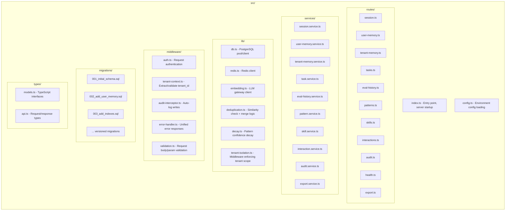

### Directory Layout

```
src/
  index.ts                    # Express app bootstrap, migration runner, server start
  config.ts                   # Env var parsing, validation, defaults
  routes/
    session.ts                # GET/PUT/DELETE /session/:id
    user-memory.ts            # POST/GET/DELETE /user/:tenant/:user/*
    tenant-memory.ts          # POST/GET/PUT/DELETE /tenant/:tenant/*
    tasks.ts                  # POST/GET/PUT /tasks/:tenant/*
    eval-history.ts           # POST/GET /eval/:tenant/:framework/:control/*
    patterns.ts               # POST/GET/PUT/DELETE /patterns/*
    skills.ts                 # GET/POST /skills/*
    interactions.ts           # POST/GET /interactions/:tenant/:user
    audit.ts                  # GET /audit/:tenant
    health.ts                 # GET /health, GET /ready
    export.ts                 # GET /export/:tenant, POST /import/:tenant
  services/
    session.service.ts        # Redis get/set/delete with TTL
    user-memory.service.ts    # CRUD + semantic search + dedup for user facts
    tenant-memory.service.ts  # CRUD + semantic search + dedup for tenant facts
    task.service.ts           # CRUD + auto-transitions + summaries
    eval-history.service.ts   # Append + query + cache-check by evidence_hash
    pattern.service.ts        # CRUD + semantic search + decay + boost
    skill.service.ts          # Version management + canary logic
    interaction.service.ts    # Append + retention cleanup
    audit.service.ts          # Append-only insert + query
    export.service.ts         # Full tenant dump/restore
  lib/
    db.ts                     # pg Pool, connection management, query helpers
    redis.ts                  # ioredis client, connection management
    embedding.ts              # HTTP client to LLM gateway /v1/embed
    deduplication.ts          # Cosine similarity check, merge strategy
    decay.ts                  # Confidence decay calculation
    tenant-isolation.ts       # Ensures all queries scoped to tenant_id
  middleware/
    auth.ts                   # Validates agent/admin tokens
    tenant-context.ts         # Extracts tenant_id from path, validates access
    audit-interceptor.ts      # Wraps write endpoints to auto-emit audit records
    error-handler.ts          # Catch-all error → JSON response
    validation.ts             # Zod/Joi schema validation per route
  migrations/
    001_initial_schema.sql    # Base tables, pgvector extension
    002_add_user_memory.sql   # User memory table
    003_add_indexes.sql       # IVFFlat indexes
    ...                       # Versioned, applied in order on startup
  types/
    models.ts                 # Domain interfaces (TenantFact, Task, Pattern, etc.)
    api.ts                    # Request/response DTOs
```

---

## Key Design Decisions

### 1. Why Redis for Sessions (Not PostgreSQL)

| Consideration | Redis | PostgreSQL |
|---------------|-------|------------|
| Latency | Sub-millisecond reads | 1-5ms reads |
| TTL support | Native per-key TTL | Requires background job or trigger |
| Data model fit | Arbitrary JSON blob (no schema needed) | Would need JSONB + cleanup logic |
| Throughput | 100K+ ops/sec single node | ~10K simple queries/sec |
| Persistence need | None (ephemeral by design) | Overkill for 4h-lived data |
| Memory efficiency | Stores only active sessions | Would accumulate expired rows |

Session data is ephemeral (4h TTL), schema-less (each agent stores different shapes), and high-frequency (read on every request). Redis is purpose-built for this access pattern. PostgreSQL would add unnecessary write-ahead-log overhead, require a cleanup job for expired sessions, and provide durability guarantees that sessions do not need.

### 2. Why PostgreSQL + pgvector (Not a Dedicated Vector DB)

- **Operational simplicity**: One database for structured data AND vector search. No Pinecone/Weaviate to operate.
- **Transactional consistency**: Fact insertion + embedding storage in a single transaction. No eventual consistency between a vector DB and relational store.
- **Joins**: Can filter by tenant_id (B-tree index) before vector search (IVFFlat). Dedicated vector DBs often lack rich metadata filtering.
- **Scale**: At expected data volumes (thousands of facts per tenant, not millions), pgvector with IVFFlat is performant (~20ms for top-5 search).
- **Trade-off accepted**: If facts grow to millions per tenant, would need to migrate to HNSW index or shard. Current scale does not justify that complexity.

### 3. Why Embedding via LLM Gateway (Not Local)

- **Model consistency**: All embedding calls route through the same gateway, ensuring the same model version produces all vectors. Avoids dimension mismatches.
- **No GPU dependency in memory-service**: Keeps the service lightweight (CPU-only container).
- **Centralized rate limiting and caching**: Gateway handles retry, circuit breaking, and potential response caching.
- **Trade-off accepted**: Adds network latency (~50ms per embed call) and a runtime dependency. Mitigated by async embedding with retry (see below).

### 4. Append-Only Audit Trail

- No UPDATE/DELETE operations permitted on the audit_trail table.
- Enforced at the application layer (no delete endpoint) and can be reinforced with PostgreSQL row-level security policies or triggers that reject UPDATE/DELETE.
- Enables compliance auditing: any fact change, task transition, or skill update is traceable to a specific agent at a specific time.

### 5. Tenant Isolation Strategy

- Every tenant-scoped query includes `WHERE tenant_id = $1` as a mandatory filter.
- The `tenant-context` middleware extracts and validates tenant_id from the URL path.
- The `tenant-isolation` library wraps database queries to inject tenant_id, preventing accidental cross-tenant data access even if a developer forgets the WHERE clause.
- Patterns are the sole exception: they are cross-tenant by design but MUST NOT contain tenant-identifiable information. The pattern.service enforces this by stripping tenant references before storage.

---

## Embedding Generation: Async with Retry

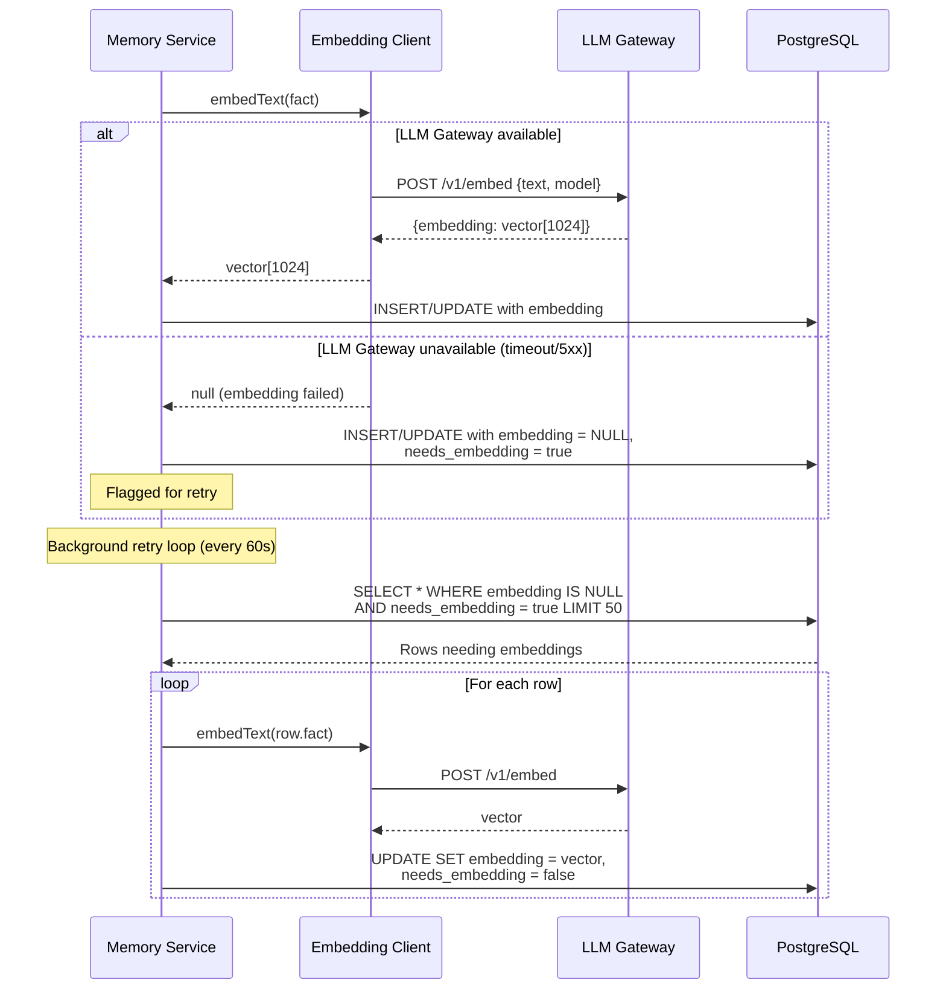

### Retry Strategy

1. On write: attempt embedding synchronously (50ms timeout)
2. If failed: store the fact without embedding, set `needs_embedding = true`
3. Background job runs every 60 seconds, picks up to 50 un-embedded rows
4. Retries with exponential backoff per row (max 3 attempts per cycle)
5. Facts without embeddings are excluded from semantic search but remain queryable via exact filters (category, tenant_id)

---

## Pattern Confidence Decay

Patterns that are never used should lose confidence over time to avoid polluting search results with stale knowledge.

### Decay Formula

```
new_confidence = current_confidence - (DECAY_RATE * periods_elapsed)
```

Where:
- `DECAY_RATE` = 0.1 (configurable via `PATTERN_DECAY_RATE`)
- `periods_elapsed` = floor((now - last_used_at_or_created_at) / DECAY_DAYS)
- `DECAY_DAYS` = 90 (configurable via `PATTERN_DECAY_DAYS`)

### Decay Application

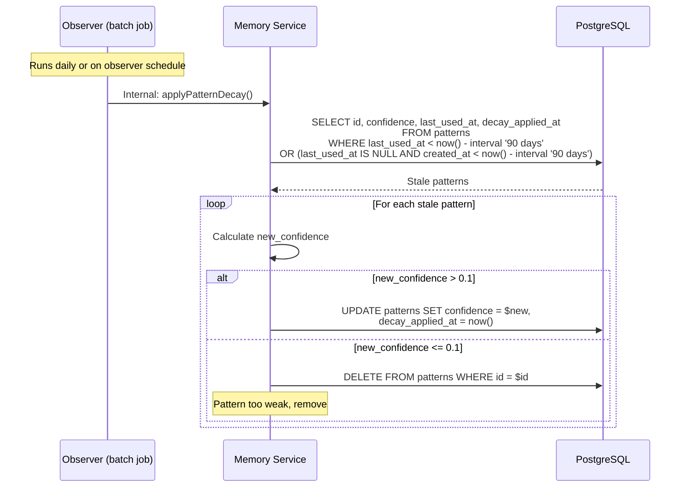

### Boost (Counter to Decay)

When a pattern is used (agent fetches it via semantic search and confirms it was helpful):
- `hit_count` incremented
- `last_used_at` reset to now
- This resets the decay clock: the pattern will not decay for another 90 days

---

## Migration Strategy

### Versioned Migrations on Startup

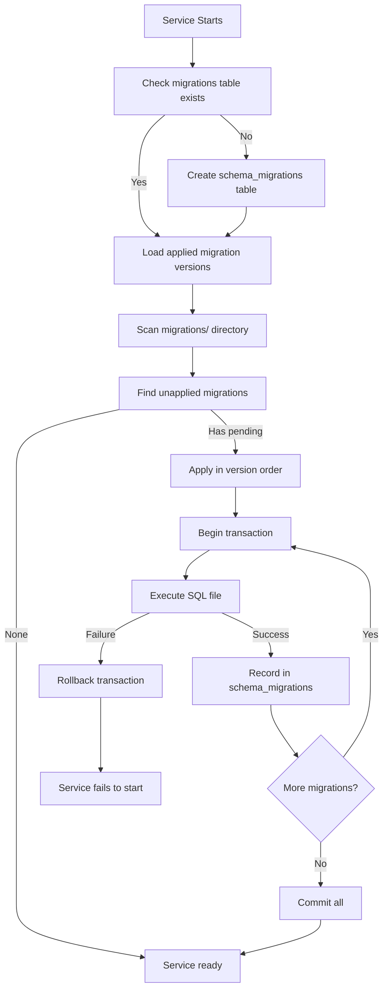

### Migration Rules

1. Migrations are numbered sequentially: `001_`, `002_`, `003_`, etc.
2. Each migration runs in a transaction (all-or-nothing)
3. Once applied, a migration is never re-run (tracked in `schema_migrations` table)
4. Migrations MUST be backward compatible: the previous service version must still work with the new schema (additive changes only, or multi-step migrations for breaking changes)
5. On failure: service refuses to start, logs the failing migration, requires manual intervention
6. No down-migrations (rollback scripts): forward-only. If a migration is wrong, write a new corrective migration.

### schema_migrations Table

```sql
CREATE TABLE IF NOT EXISTS schema_migrations (
    version TEXT PRIMARY KEY,
    applied_at TIMESTAMPTZ DEFAULT now(),
    checksum TEXT NOT NULL  -- MD5 of migration file for integrity
);
```

---

## Backup and Tenant Data Export

### Backup Strategy

| Component | Method | Frequency | Retention |
|-----------|--------|-----------|-----------|
| PostgreSQL | pg_dump (logical) or WAL archiving (continuous) | Daily full + continuous WAL | 30 days |
| Redis | Not backed up (ephemeral sessions) | N/A | N/A |

### Tenant Data Export

The `/export/{tenant_id}` endpoint produces a complete, portable JSON dump of all tenant data:

```json
{
  "tenant_id": "acme",
  "exported_at": "2026-05-11T10:00:00Z",
  "version": "1.0",
  "data": {
    "tenant_memory": [...],
    "user_memory": [...],
    "tasks": [...],
    "eval_history": [...],
    "interactions": [...],
    "audit_trail": [...]
  }
}
```

**What is included**: All tenant-scoped data (facts, tasks, evaluations, interactions, audit trail).

**What is excluded**: Patterns (cross-tenant, not owned by one tenant), skills (system-wide), session state (ephemeral).

### Import

The `/import/{tenant_id}` endpoint accepts the same format and:
1. Validates the JSON structure
2. Checks for ID conflicts (uses upsert semantics)
3. Re-generates embeddings for imported facts (since vectors are model-version-dependent)
4. Logs the entire import operation to audit trail

---

## Health and Readiness

```
GET /health  -> 200 {status: "ok", uptime: "..."}
GET /ready   -> 200 {postgres: "connected", redis: "connected"}
              OR 503 {postgres: "disconnected", redis: "connected"}
```

- `/health`: Returns 200 if the process is running. Used by container orchestrator for liveness.
- `/ready`: Returns 200 only if both PostgreSQL and Redis connections are established. Used for readiness gates (do not route traffic until ready).

---

## Performance Considerations

| Operation | Expected Latency | Strategy |
|-----------|-----------------|----------|
| Session read/write | < 1ms | Redis in-memory |
| Semantic search (top-5) | 10-50ms | IVFFlat index, pre-filtered by tenant_id |
| Fact write (with dedup) | 50-100ms | Embed + similarity check + insert/update |
| Task query (filtered) | 5-15ms | B-tree indexes on tenant_id, status, assignee |
| Eval history (latest) | 2-5ms | Composite index on (tenant_id, framework, control_id) |
| Pattern search | 10-50ms | IVFFlat, no tenant filter (cross-tenant) |
| Skill fetch (active) | 2-5ms | Direct PK lookup + status filter |

### Connection Pooling

- PostgreSQL: Connection pool (pg-pool) with min=5, max=20 connections
- Redis: Single persistent connection with auto-reconnect

### Index Strategy

- B-tree indexes for equality filters (tenant_id, user_id, status)
- IVFFlat indexes for vector similarity (embedding columns)
- Partial indexes for hot queries (e.g., tasks WHERE status IN ('open', 'in_progress'))
- No full-text-search indexes (semantic search via pgvector replaces FTS)

---

## Security Model

1. **Authentication**: All requests must include a valid service token (agent-to-service auth)
2. **Tenant isolation**: Middleware enforces tenant_id scoping on all tenant endpoints
3. **Admin scope**: Only observer holds admin scope (cross-tenant pattern reads, aggregates)
4. **No cross-tenant reads**: API returns 403 if agent requests data for a tenant it is not authorized for
5. **Audit immutability**: No application-level delete on audit_trail; database-level protection recommended (REVOKE DELETE on table)
6. **PII boundaries**: Interactions may contain PII; patterns MUST NOT. The pattern extraction pipeline strips tenant-identifying information.

---

## Error Handling

| Scenario | Behavior |
|----------|----------|
| Embedding service down | Store fact without embedding, flag for retry |
| Redis down | Session endpoints return 503; other endpoints unaffected |
| PostgreSQL down | All endpoints except session return 503 |
| Duplicate fact detected | Update existing fact (not error) |
| Invalid tenant_id | 404 (not 403, to avoid tenant enumeration) |
| Session > 256KB | 413 Payload Too Large |
| Migration failure | Service refuses to start, exits with error code |

---

## Configuration Reference

| Variable | Default | Description |
|----------|---------|-------------|
| `DB_HOST` | postgres | PostgreSQL hostname |
| `DB_PORT` | 5432 | PostgreSQL port |
| `DB_NAME` | compliance_memory | Database name |
| `DB_USER` | memory_svc | Database user |
| `DB_PASSWORD` | (required) | Database password |
| `REDIS_URL` | redis://redis:6379/0 | Redis connection string |
| `LLM_GATEWAY_URL` | http://llm-gateway:4000 | Embedding endpoint base URL |
| `EMBEDDING_DIMENSION` | 1024 | Vector dimension (must match model) |
| `SESSION_TTL_HOURS` | 4 | Session expiry in Redis |
| `INTERACTION_RETENTION_DAYS` | 90 | How long to keep interaction logs |
| `PATTERN_DECAY_DAYS` | 90 | Days of inactivity before decay applies |
| `PATTERN_DECAY_RATE` | 0.1 | Confidence reduction per decay period |
| `DEDUP_SIMILARITY_THRESHOLD` | 0.9 | Cosine similarity threshold for dedup |
| `LOG_LEVEL` | info | Logging verbosity |
| `PORT` | 5000 | HTTP server port |
