# Observer — Architecture Design

## Overview

The observer is an autonomous improvement agent that continuously monitors all LLM gateway activity, detects performance issues, diagnoses root causes, proposes fixes, and applies them with graduated autonomy. It is the system's self-improvement loop — making routing, prompts, thresholds, and model selections better over time without code deploys or human intervention (for safe changes) while escalating risky changes to humans.

The observer operates on a schedule, reads structured logs from the LLM gateway, uses a strong-tier LLM for diagnosis, and writes changes back through the gateway's admin API. It self-regulates its own aggressiveness based on its track record of successful vs. rolled-back changes.

---

## High-Level Architecture

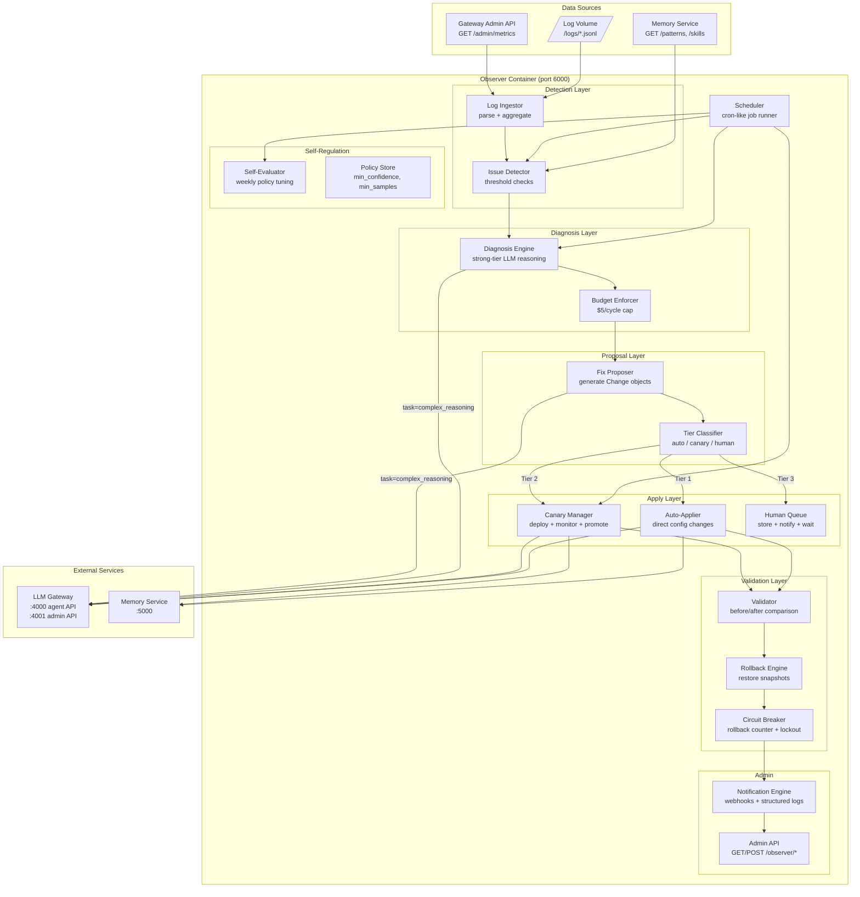

---

## Detection to Diagnosis to Proposal to Apply Pipeline

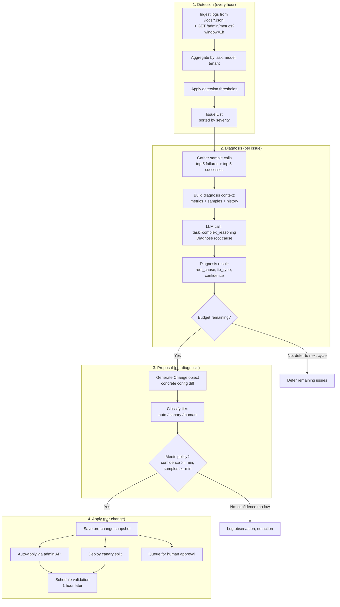

---

## Apply Engine Decision Tree

```mermaid
flowchart TD
    CHANGE[Proposed Change] --> CB_CHECK{Circuit breaker<br/>tripped?}
    
    CB_CHECK -->|Yes| FORCE_HUMAN[Force HUMAN tier<br/>regardless of type]
    CB_CHECK -->|No| TYPE_CHECK{Change type?}
    
    TYPE_CHECK -->|routing / threshold / pattern| AUTO_ELIGIBLE
    TYPE_CHECK -->|prompt rewrite / model add / fallback order| CANARY_ELIGIBLE
    TYPE_CHECK -->|model removal / policy change| HUMAN_REQUIRED
    
    AUTO_ELIGIBLE --> PREV_FAIL{Same change type<br/>failed before?}
    PREV_FAIL -->|Yes| FORCE_HUMAN
    PREV_FAIL -->|No| CONF_AUTO{confidence >= 0.80?}
    CONF_AUTO -->|Yes| SAMPLES_AUTO{samples >= 20?}
    CONF_AUTO -->|No| DOWNGRADE_CANARY[Downgrade to CANARY]
    SAMPLES_AUTO -->|Yes| MAX_DAY{Daily auto-apply<br/>limit reached?}
    SAMPLES_AUTO -->|No| DOWNGRADE_CANARY
    MAX_DAY -->|No| AUTO_APPLY[TIER 1: AUTO-APPLY]
    MAX_DAY -->|Yes| DOWNGRADE_CANARY
    
    CANARY_ELIGIBLE --> PREV_FAIL_C{Same change type<br/>failed canary before?}
    PREV_FAIL_C -->|Yes| FORCE_HUMAN
    PREV_FAIL_C -->|No| CONF_CANARY{confidence >= 0.70?}
    CONF_CANARY -->|Yes| MAX_CANARY{Concurrent canaries<br/>< max (3)?}
    CONF_CANARY -->|No| FORCE_HUMAN
    MAX_CANARY -->|Yes| CANARY_DEPLOY[TIER 2: CANARY]
    MAX_CANARY -->|No| QUEUE_CANARY[Queue for next canary slot]
    
    HUMAN_REQUIRED --> HUMAN_NOTIFY[TIER 3: HUMAN APPROVAL]
    FORCE_HUMAN --> HUMAN_NOTIFY
    DOWNGRADE_CANARY --> CANARY_ELIGIBLE

    style AUTO_APPLY fill:#c8e6c9,stroke:#2e7d32
    style CANARY_DEPLOY fill:#fff3e0,stroke:#e65100
    style HUMAN_NOTIFY fill:#ffcdd2,stroke:#c62828
```

---

## Canary Lifecycle

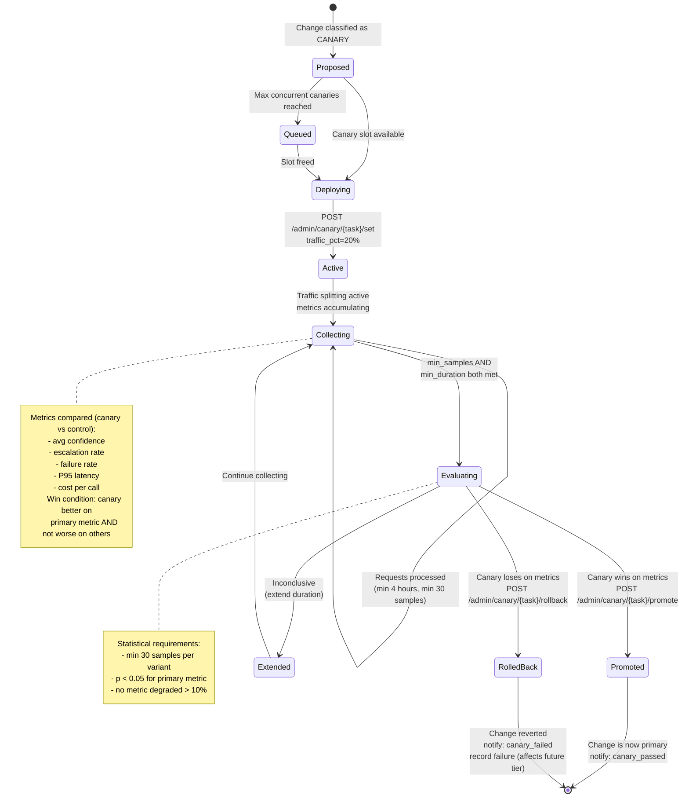

---

## Circuit Breaker State Machine

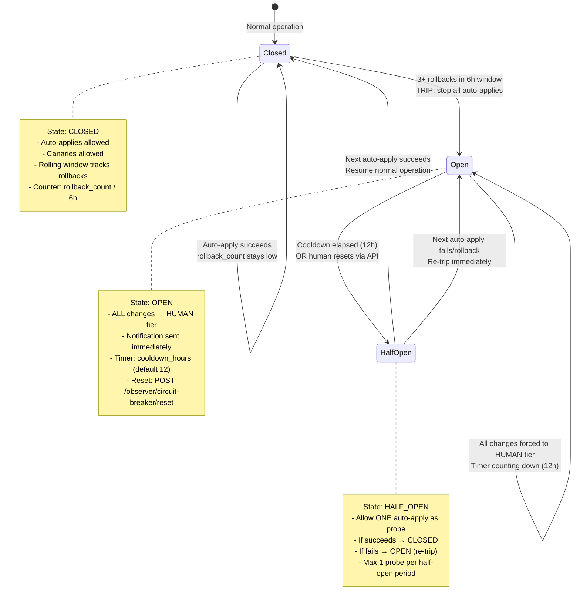

---

## Self-Regulation Feedback Loop

```mermaid
flowchart TD
    subgraph "Weekly Self-Evaluation"
        COLLECT_STATS[Collect past 7 days:<br/>total changes, auto-applied,<br/>canary pass/fail, rollbacks]
        CALC_RATES[Calculate:<br/>rollback_rate, success_rate,<br/>net_confidence_delta, net_cost_delta]
        ASSESS{Assess performance}
    end

    subgraph "Policy Adjustment"
        TIGHTEN[TIGHTEN policy:<br/>min_confidence += 0.05<br/>min_samples += 10]
        RELAX[RELAX policy:<br/>min_confidence -= 0.02<br/>(bounded: never < 0.60)]
        HOLD[HOLD: no change]
    end

    subgraph "Bounds Enforcement"
        CHECK_BOUNDS[Enforce bounds:<br/>min_confidence in [0.60, 0.95]<br/>min_samples in [10, 100]]
        RECORD[Record self-eval result:<br/>logged + auditable]
        NOTIFY_SELFREG[Notify: self_eval_complete]
    end

    COLLECT_STATS --> CALC_RATES --> ASSESS

    ASSESS -->|rollback_rate > 30%| TIGHTEN
    ASSESS -->|rollback_rate = 0% AND<br/>total_changes > 10| RELAX
    ASSESS -->|otherwise| HOLD

    TIGHTEN --> CHECK_BOUNDS
    RELAX --> CHECK_BOUNDS
    HOLD --> CHECK_BOUNDS
    CHECK_BOUNDS --> RECORD --> NOTIFY_SELFREG

    NOTIFY_SELFREG -->|feeds back into| POLICY_STORE[(Policy Store<br/>min_confidence<br/>min_samples<br/>auto_apply_enabled)]
    POLICY_STORE -->|used by| CLASSIFY_NODE[Tier Classifier<br/>in next cycle]
```

---

## Scheduled Job Execution Timeline

```mermaid
gantt
    title Observer Scheduled Jobs (24-hour view)
    dateFormat HH:mm
    axisFormat %H:%M

    section Quality Check (1h)
    Cycle 1   :q1, 00:00, 15min
    Cycle 2   :q2, 01:00, 15min
    Cycle 3   :q3, 02:00, 15min
    Cycle 4   :q4, 03:00, 15min
    Cycle 5   :q5, 04:00, 15min
    Cycle 6   :q6, 05:00, 15min
    Cycle 7   :q7, 06:00, 15min
    Cycle 8   :q8, 07:00, 15min
    Cycle 9   :q9, 08:00, 15min
    Cycle 10  :q10, 09:00, 15min
    Cycle 11  :q11, 10:00, 15min
    Cycle 12  :q12, 11:00, 15min
    Cycle 13  :q13, 12:00, 15min
    Cycle 14  :q14, 13:00, 15min
    Cycle 15  :q15, 14:00, 15min
    Cycle 16  :q16, 15:00, 15min
    Cycle 17  :q17, 16:00, 15min
    Cycle 18  :q18, 17:00, 15min
    Cycle 19  :q19, 18:00, 15min
    Cycle 20  :q20, 19:00, 15min
    Cycle 21  :q21, 20:00, 15min
    Cycle 22  :q22, 21:00, 15min
    Cycle 23  :q23, 22:00, 15min
    Cycle 24  :q24, 23:00, 15min

    section Prompt Optimization (6h)
    Prompt 1  :p1, 00:30, 30min
    Prompt 2  :p2, 06:30, 30min
    Prompt 3  :p3, 12:30, 30min
    Prompt 4  :p4, 18:30, 30min

    section Model Fitness (daily)
    Model Check :m1, 03:00, 45min

    section Self-Eval (weekly)
    Self Eval :crit, s1, 02:00, 30min

    section Validation Checks (event-driven)
    Val after auto-apply :active, v1, 01:15, 5min
    Val after auto-apply :active, v2, 04:15, 5min
    Val after canary     :active, v3, 07:00, 10min
```

### Schedule Details

| Job | Frequency | Duration | Description |
|-----|-----------|----------|-------------|
| Quality Check | Every 1h | ~15 min | Ingest logs, detect issues, diagnose, propose, apply |
| Prompt Optimization | Every 6h | ~30 min | Find declining tasks, draft improved prompts, deploy as canary |
| Model Fitness | Daily | ~45 min | Compare model performance across tasks, recommend rebalancing |
| Self-Evaluation | Weekly | ~30 min | Assess own track record, adjust policy parameters |
| Validation | Event-driven | ~5 min | Compare pre/post metrics for each applied change |
| Canary Evaluation | Continuous | ongoing | Monitor active canaries, promote/rollback when criteria met |

---

## Observer Admin API Endpoints

```mermaid
graph TD
    subgraph "Observer Admin API (port 6000)"
        subgraph "Status & Monitoring"
            S1[GET /observer/status<br/>last runs, pending, canaries, CB]
            S2[GET /observer/metrics<br/>own performance stats]
            S3[GET /observer/self-eval<br/>latest self-evaluation]
            S4[GET /health<br/>liveness check]
        end

        subgraph "Change Management"
            C1[GET /observer/changes?days=7&status=...<br/>list all changes]
            C2[GET /observer/changes/:id<br/>change detail + evidence]
            C3[POST /observer/changes/:id/approve<br/>approve human-tier change]
            C4[POST /observer/changes/:id/reject<br/>reject a change]
            C5[GET /observer/recommendations<br/>pending human approvals]
        end

        subgraph "Control"
            X1[POST /observer/pause<br/>pause all activity]
            X2[POST /observer/resume<br/>resume activity]
            X3[POST /observer/circuit-breaker/reset<br/>manually reset CB]
            X4[POST /observer/run-now<br/>trigger immediate cycle]
        end
    end

    subgraph "Callers"
        OPS[Ops/Admin Dashboard]
        ALERTS[Alert System<br/>webhook receiver]
    end

    OPS --> S1 & S2 & S3
    OPS --> C1 & C2 & C3 & C4 & C5
    OPS --> X1 & X2 & X3 & X4
    ALERTS --> S1
```

### Endpoint Reference

| Endpoint | Method | Purpose | Response |
|----------|--------|---------|----------|
| `/health` | GET | Container liveness | `{status: "ok", uptime: "..."}` |
| `/observer/status` | GET | Operational overview | `{last_quality_run, last_prompt_run, pending_changes, active_canaries, circuit_breaker_state}` |
| `/observer/changes` | GET | List all changes (filterable) | `[{id, type, status, applied_at, ...}]` |
| `/observer/changes/:id` | GET | Full change detail | `{diagnosis, change, evidence, metrics_before, metrics_after, outcome}` |
| `/observer/changes/:id/approve` | POST | Approve human-tier change | `{status: "approved", applied: true}` |
| `/observer/changes/:id/reject` | POST | Reject a change | `{status: "rejected"}` |
| `/observer/recommendations` | GET | Pending human approvals | `[{id, summary, confidence, reason}]` |
| `/observer/metrics` | GET | Observer's own stats | `{total_changes, success_rate, rollback_rate, avg_confidence_improvement}` |
| `/observer/self-eval` | GET | Latest self-evaluation | `{period, stats, policy_adjustment, current_policy}` |
| `/observer/pause` | POST | Pause all activity | `{paused: true}` |
| `/observer/resume` | POST | Resume activity | `{paused: false}` |
| `/observer/circuit-breaker/reset` | POST | Reset circuit breaker | `{state: "closed", previous: "open"}` |
| `/observer/run-now` | POST | Trigger immediate cycle | `{triggered: true, job_id: "..."}` |

---

## Module Structure

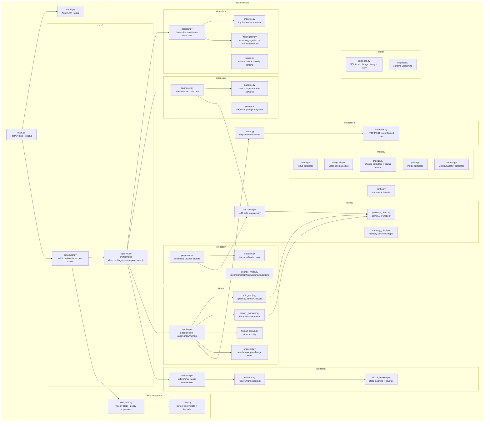

### Directory Layout

```
observer/
  src/
    main.py                       # FastAPI bootstrap, lifespan events, scheduler start
    config.py                     # All env vars, defaults, validation
    admin.py                      # Admin API route handlers

    core/
      scheduler.py                # APScheduler: register jobs, handle timing
      pipeline.py                 # Orchestrate: detect → diagnose → propose → apply

    detection/
      ingestor.py                 # Read /logs/*.jsonl, parse entries, handle rotation
      aggregator.py               # Aggregate metrics by task, model, tenant, time window
      detector.py                 # Apply threshold rules, emit Issue objects
      issues.py                   # Issue dataclass, severity enum, sorting

    diagnosis/
      diagnoser.py                # Build diagnosis prompt, call LLM, parse result
      sampler.py                  # Select top-N failure/success samples for context
      prompts/
        diagnose_issue.txt        # System prompt for diagnosis
        rewrite_prompt.txt        # System prompt for prompt optimization

    proposal/
      proposer.py                 # Generate concrete Change from Diagnosis
      classifier.py               # Tier classification: auto/canary/human
      change_types.py             # RoutingChange, PromptChange, ThresholdChange, etc.

    apply/
      applier.py                  # Dispatch to appropriate sub-handler
      auto_apply.py               # POST to gateway admin API (routing, threshold)
      canary_manager.py           # Set/monitor/promote/rollback canaries
      human_queue.py              # Persist recommendation, send notification
      snapshot.py                 # Save current state before change, restore on rollback

    validation/
      validator.py                # Schedule + execute before/after comparison
      rollback.py                 # Revert change using saved snapshot
      circuit_breaker.py          # State machine: closed/open/half-open

    self_regulation/
      self_eval.py                # Weekly: compute stats, adjust policy
      policy.py                   # Current policy params, bounds, persistence

    notification/
      notifier.py                 # Dispatch to configured channels
      webhook.py                  # HTTP POST with retry

    clients/
      gateway_client.py           # Wrapper for LLM gateway admin API (port 4001)
      memory_client.py            # Wrapper for memory service API (port 5000)
      llm_client.py               # Wrapper for LLM calls (port 4000, task=complex_reasoning)

    models/
      issue.py                    # Issue(task, issue_type, severity, metrics, samples)
      diagnosis.py                # Diagnosis(root_cause, fix_type, confidence, ...)
      change.py                   # Change(id, type, status, config_diff, snapshot, ...)
      policy.py                   # Policy(min_confidence, min_samples, ...)
      metrics.py                  # MetricSnapshot(escalation_rate, confidence, ...)

    store/
      database.py                 # SQLite: changes, canaries, circuit_breaker state
      migrations/
        001_initial.sql           # changes, canary_experiments, policy_history tables

  tests/
    test_detector.py              # Unit tests for threshold detection
    test_classifier.py            # Unit tests for tier classification
    test_circuit_breaker.py       # State machine tests
    test_validator.py             # Before/after comparison tests
    test_self_eval.py             # Policy adjustment tests
    test_pipeline_integration.py  # End-to-end pipeline mock tests

  Dockerfile                      # Single image, no GPU
  requirements.txt                # Python dependencies
```

---

## How the Observer Reads Gateway Logs

The LLM gateway writes structured JSON log entries (one per line) to a shared volume at `/logs/`. The observer reads these logs to build its understanding of system behavior.

### Log Format (written by gateway)

Each log line is a JSON object:

```json
{
  "timestamp": "2026-05-11T10:30:45.123Z",
  "trace_id": "trace-uuid-here",
  "agent": "agent-eval",
  "task": "evaluate_control",
  "tier_requested": "mid",
  "tier_used": "strong",
  "model_used": "opus-cloud",
  "escalated": true,
  "input_tokens": 3200,
  "output_tokens": 450,
  "latency_ms": 4200,
  "confidence": 0.92,
  "success": true,
  "error": null,
  "tenant_id": "acme_corp",
  "tool_calls_count": 2,
  "parse_success": true,
  "cost_usd": 0.089
}
```

### Ingestion Strategy

1. **File watching**: The ingestor watches `/logs/` for new and modified `.jsonl` files using filesystem events (inotify on Linux, kqueue on macOS).
2. **Tail-based reading**: Tracks file offsets per log file. On each read cycle, reads from the last offset to current EOF. Handles log rotation gracefully (detects inode change = new file).
3. **Buffered aggregation**: Parsed entries are buffered in memory and aggregated into time-windowed buckets (1-minute granularity for recent, 1-hour for older).
4. **Retention**: Raw log entries kept for configurable period (default 7 days in observer's in-memory/SQLite store). Aggregated metrics retained for 30 days.
5. **Supplementary API access**: For real-time metrics (not yet flushed to log), the observer also calls `GET /admin/metrics?window=1h` on the gateway admin API.

### What the Observer Extracts

| Aggregation | Metrics Computed |
|-------------|-----------------|
| Per task | avg confidence, escalation rate, failure rate, parse success rate, avg latency, avg cost |
| Per model | error rate, avg latency, availability, cost per call |
| Per tenant | total calls, avg cost, escalation patterns |
| Per task + model | confidence by model (enables model-task fitness analysis) |
| Trends | 1h vs 24h vs 7d comparisons (detect degradation) |

---

## How the Observer Writes Changes to the Gateway

The observer never modifies gateway config files directly. All changes go through the gateway's admin API (port 4001), which validates and hot-reloads the configuration.

### Gateway Admin API Calls Made by Observer

| Change Type | API Call | Example |
|-------------|----------|---------|
| Routing (task to tier) | `POST /admin/routing` | `{"task_routing": {"evaluate_control": "strong"}}` |
| Confidence threshold | `POST /admin/threshold` | `{"task": "evaluate_control", "threshold": 0.85}` |
| Start canary | `POST /admin/canary/{task}/set` | `{"model": "new-model", "traffic_pct": 20, "min_samples": 30}` |
| Promote canary | `POST /admin/canary/{task}/promote` | `{}` |
| Rollback canary | `POST /admin/canary/{task}/rollback` | `{}` |
| Get canary metrics | `GET /admin/canary/{task}/metrics` | (read-only) |
| Get overall metrics | `GET /admin/metrics?window=1h` | (read-only) |

### Write Flow (Auto-Apply Example)

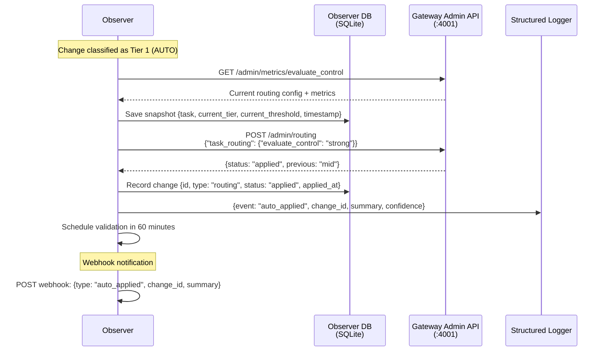

### Write Flow (Prompt Change via Memory Service)

For prompt rewrites, the observer writes new skill versions to the memory service:

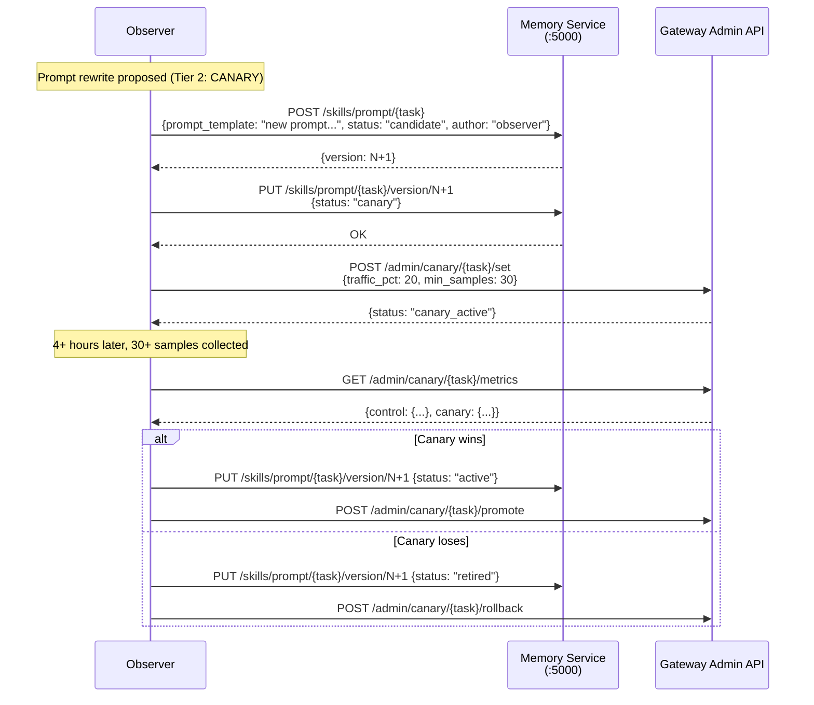

---

## Budget Enforcement Logic

The observer has a hard budget cap per analysis cycle to prevent runaway LLM costs during diagnosis.

### Budget Model

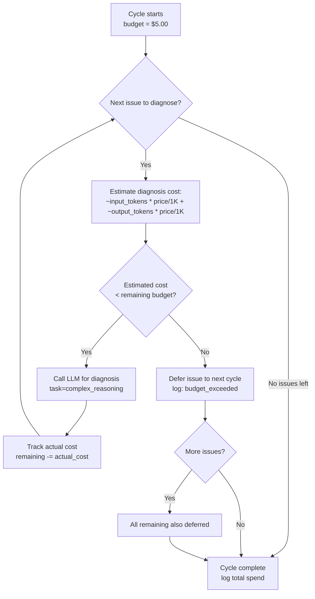

### Budget Rules

1. **Per-cycle cap**: Default $5.00 (configurable via `OBSERVER_BUDGET_PER_CYCLE_USD`)
2. **Cost tracking**: Every LLM call the observer makes goes through the gateway with `agent=observer, task=complex_reasoning`. The gateway logs the cost. The observer also tracks cost internally per cycle.
3. **Estimation before call**: Before making a diagnosis call, estimate cost based on context size (input tokens) and expected output (~500 tokens). If estimate exceeds remaining budget, defer.
4. **Priority ordering**: Issues are sorted by severity (highest first). Budget is spent on the most impactful issues first.
5. **No borrowing**: Cannot exceed budget even if a high-severity issue remains. It will be diagnosed in the next cycle.
6. **Prompt optimization calls**: Also count against budget when running in the same cycle window.
7. **Audit**: Each cycle logs total spent, issues diagnosed vs. deferred, and per-call costs.

### Cost Estimation Formula

```python
def estimate_diagnosis_cost(issue: Issue, model_pricing: dict) -> float:
    """Estimate cost of diagnosing an issue."""
    # Context: issue metrics (~200 tokens) + sample calls (5 failures * ~500 tokens each)
    estimated_input_tokens = 200 + (5 * 500) + 1000  # +1000 for system prompt
    estimated_output_tokens = 500  # diagnosis output
    
    price = model_pricing["strong"]  # diagnosis uses strong tier
    cost = (estimated_input_tokens / 1000 * price["input_per_1k"] +
            estimated_output_tokens / 1000 * price["output_per_1k"])
    return cost * 1.2  # 20% safety margin
```

---

## Notification System

### Notification Events

| Event | Trigger | Urgency |
|-------|---------|---------|
| `auto_applied` | Change auto-applied successfully | Info |
| `canary_passed` | Canary promoted to primary | Info |
| `canary_failed` | Canary rolled back | Warning |
| `rollback` | Auto-applied change rolled back | Warning |
| `human_needed` | Change requires human approval | Action required |
| `circuit_break` | Circuit breaker tripped | Critical |
| `self_eval_complete` | Weekly self-evaluation done | Info |
| `budget_exceeded` | Cycle hit budget limit, issues deferred | Warning |

### Notification Payload

```json
{
  "type": "auto_applied",
  "change_id": "chg_abc123",
  "summary": "Moved task 'evaluate_control' from mid to strong tier",
  "reason": "58% escalation rate over 48h (threshold: 40%)",
  "confidence": 0.91,
  "timestamp": "2026-05-11T10:35:00Z",
  "details": {
    "task": "evaluate_control",
    "change_type": "routing",
    "previous_value": "mid",
    "new_value": "strong",
    "triggering_metrics": {
      "escalation_rate": 0.58,
      "sample_count": 142
    }
  }
}
```

### Delivery Mechanism

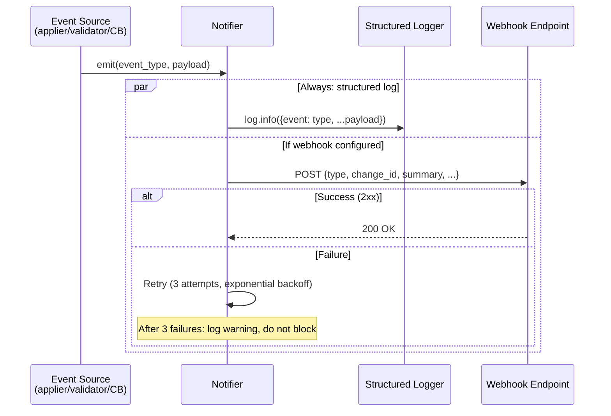

### Configuration

- `NOTIFY_WEBHOOK_URL`: Target URL for webhook delivery. If empty, only structured logs are emitted.
- `NOTIFY_ON_AUTO_APPLY`: Whether to notify on auto-applies (default: true)
- `NOTIFY_ON_CANARY`: Whether to notify on canary results (default: true)
- `NOTIFY_ON_ROLLBACK`: Whether to notify on rollbacks (default: true)
- `NOTIFY_ON_CIRCUIT_BREAK`: Whether to notify on circuit breaker trips (default: true)

---

## Key Design Decisions

### 1. Observer reads logs from a shared volume, not an event stream

**Decision:** The observer tails JSON log files from a mounted volume rather than subscribing to a message queue or event stream.

**Rationale:**
- Zero coupling: the gateway does not need to know the observer exists. It just writes logs.
- No message broker dependency (no Kafka, RabbitMQ, etc.) -- keeps the system simple and deployable on-prem.
- Log files are durable (survive observer restart -- it resumes from last offset).
- Works identically in Docker Compose and Kubernetes (volume mount is universal).
- The observer is not latency-sensitive (hourly cycles), so tail-based reading is sufficient.

### 2. SQLite for observer state, not PostgreSQL

**Decision:** The observer uses an embedded SQLite database for its own state (change history, canary tracking, circuit breaker state, policy parameters).

**Rationale:**
- The observer is a single-process service. It never needs concurrent write access from multiple instances.
- Eliminates a database dependency (simpler deployment, fewer failure modes).
- Change history is small (tens of changes per day at most).
- SQLite is ACID-compliant, handles the observer's write patterns well.
- If horizontal scaling were needed in the future, this could be migrated to PostgreSQL, but the observer's workload does not justify multi-instance deployment.

### 3. Strong-tier LLM for diagnosis, not heuristic rules

**Decision:** Root cause diagnosis uses a strong-tier LLM (e.g., Claude Opus) rather than a rule-based expert system.

**Rationale:**
- The space of possible root causes is too large and nuanced for hand-coded rules.
- The LLM can reason about prompt-model interactions, identify subtle patterns in failures, and propose creative fixes.
- Cost is bounded by the $5/cycle budget cap.
- The system improves as stronger models become available (no rule maintenance).
- Diagnosis quality directly determines fix quality -- this is where spending on a strong model pays off.

### 4. Graduated autonomy with automatic escalation, never the reverse

**Decision:** Changes start at the highest autonomy tier they qualify for (auto > canary > human). If they fail, they are escalated to a higher-touch tier permanently. They never move back down automatically.

**Rationale:**
- Once a change type has demonstrated failure, it should not be re-attempted automatically without human oversight.
- This creates a ratchet effect: the system becomes more cautious over time for problematic change types.
- Humans can manually reset (reject the change, allowing the type to be retried), but the observer never forgives on its own.
- Prevents oscillating behavior where the observer repeatedly tries and fails the same fix.

### 5. Canary uses gateway-native traffic splitting, not observer-side routing

**Decision:** The observer tells the gateway to split traffic via `POST /admin/canary/{task}/set`. It does not implement its own traffic routing.

**Rationale:**
- The gateway already has canary infrastructure (traffic splitting, per-variant metric tracking).
- Keeping traffic routing in the gateway means the observer is stateless with respect to request flow.
- The observer only makes decisions (start/stop/promote/rollback); the gateway executes them.
- Single source of truth for what traffic goes where.

### 6. Circuit breaker has a half-open probe state

**Decision:** After cooldown, the circuit breaker enters half-open state and allows exactly one auto-apply as a probe before fully closing.

**Rationale:**
- Immediate full close after cooldown could trigger another cascade of failures.
- A single probe tests whether the underlying issue (e.g., bad metric data, flapping service) has resolved.
- If the probe fails, the breaker re-trips immediately (not waiting for 3 more rollbacks).
- Mirrors the well-established circuit breaker pattern from distributed systems.

### 7. Self-regulation has hard bounds

**Decision:** The observer can tighten or relax its own policy, but `min_confidence` can never go below 0.60 or above 0.95, and `min_samples` can never go below 10 or above 100.

**Rationale:**
- Prevents runaway relaxation: even with a perfect track record, the observer cannot lower its standards below 0.60 confidence.
- Prevents paralysis: even with many rollbacks, 0.95 ensures the system can still act on very-high-confidence changes.
- These bounds are the "human intent" layer -- they define the operating envelope that the observer self-tunes within.
- Bounds themselves can only be changed by human configuration (env vars), not by the observer.

### 8. One budget per cycle, not per day

**Decision:** Budget cap applies per analysis cycle ($5 per hourly run), not per day.

**Rationale:**
- Per-cycle budgets prevent any single run from becoming expensive, regardless of how many issues exist.
- If 50 issues are detected, only the highest-severity ones get diagnosed (natural prioritization).
- Per-day budgets would allow a single cycle to consume the entire day's budget, potentially leaving the system blind for hours.
- At worst case (24 hourly cycles all hitting cap): $120/day. In practice, most cycles have few or no issues and spend <$1.

### 9. Observer does not store prompts -- Memory Service does

**Decision:** When the observer rewrites a prompt, it stores the new version in the Memory Service's skill versioning system, not in its own database.

**Rationale:**
- Memory Service is the single source of truth for skills/prompts across the system.
- Other agents read prompts from Memory Service (not from the observer).
- Enables proper versioning, canary serving, and rollback via established memory service mechanisms.
- Observer only tracks the change_id and references the skill version -- it does not duplicate prompt content.

### 10. Validation delay is configurable but defaults to 1 hour

**Decision:** After auto-applying a change, the observer waits 1 hour before validating whether it improved metrics.

**Rationale:**
- Some tasks have low traffic -- 1 hour provides enough time for ~20+ samples to accumulate.
- Shorter delays risk evaluating on too few data points (noisy conclusions).
- Longer delays mean slower feedback loops.
- 1 hour aligns with the hourly quality check cycle (validation happens at the start of the next cycle).
- Configurable via `VALIDATION_DELAY_MINUTES` for high-traffic deployments that accumulate data faster.

---

## What the Observer DOES NOT Do

| Boundary | Rationale |
|----------|-----------|
| Does NOT modify agent source code | Changes are config-level (routing, prompts, thresholds). Code deploys are a human concern. |
| Does NOT redeploy containers | It changes runtime behavior via admin APIs, not infrastructure. |
| Does NOT access tenant data directly | Only sees aggregated metrics and anonymized samples (trace_id, not PII). |
| Does NOT override human rejections | If a human rejects a change via `/observer/changes/:id/reject`, that decision is final. |
| Does NOT run during circuit breaker cooldown | When tripped, all activity pauses until cooldown or manual reset. |
| Does NOT exceed its budget | Hard cap per cycle. Remaining issues are deferred, never force-diagnosed. |
| Does NOT apply changes faster than validation can confirm | One change per task at a time. Won't stack changes before validating the previous one. |
| Does NOT make changes to escalation policy without human approval | Escalation policy affects all tenants and all agents -- too impactful for auto-apply. |
| Does NOT remove models from tiers without human approval | Model removal could cause outages if no fallback exists. Always Tier 3. |
| Does NOT access external systems | Only communicates with LLM Gateway and Memory Service. No direct internet, no cloud APIs, no tenant infrastructure. |
| Does NOT persist prompt content | Prompts live in Memory Service. Observer only holds references. |
| Does NOT learn from individual tenant data | Patterns are cross-tenant and anonymized. Observer never builds tenant-specific models. |

---

## Validation and Rollback Flow

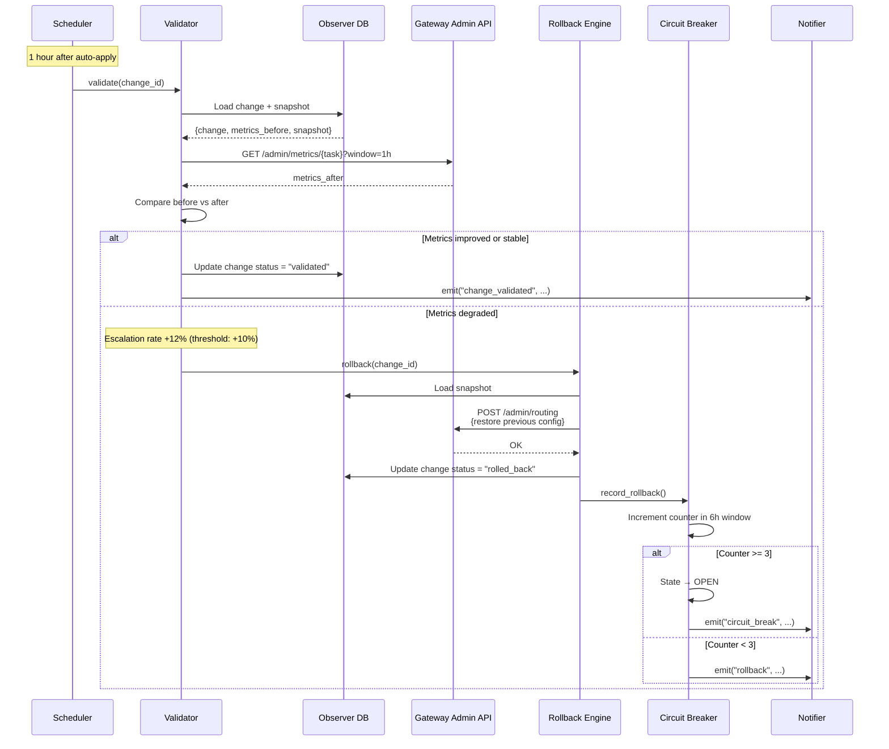

### Validation Criteria

| Metric | Rollback Threshold | Description |
|--------|-------------------|-------------|
| Escalation rate | Increased >10% absolute | Task is escalating more than before |
| Average confidence | Decreased >10% absolute | Responses are less confident |
| Failure rate | Increased >5% absolute | More errors/parse failures |
| P95 latency | Increased >50% relative | Significantly slower |

All thresholds must pass. If ANY metric breaches its threshold, the change is rolled back.

---

## Data Flow: Complete Cycle

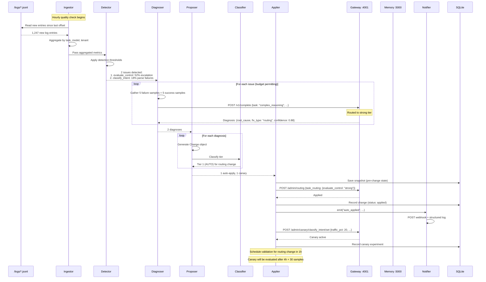

---

## Configuration Reference

```yaml
# ===== Service Configuration =====
PORT: 6000                              # Admin API port
LOG_LEVEL: info                         # Logging verbosity
LOG_PATH: /logs                         # Mounted volume with gateway logs

# ===== External Services =====
LLM_GATEWAY_URL: http://llm-gateway:4000        # Agent-facing API (for observer's own LLM calls)
LLM_GATEWAY_ADMIN_URL: http://llm-gateway:4001  # Admin API (for routing changes, canary management)
MEMORY_URL: http://memory-service:5000           # Memory service (skills, patterns)

# ===== Schedule =====
SCHEDULE_QUALITY_SEC: 3600              # Quality check: every 1 hour
SCHEDULE_PROMPTS_SEC: 21600             # Prompt optimization: every 6 hours
SCHEDULE_MODEL_FIT_SEC: 86400           # Model fitness: every 24 hours
SCHEDULE_SELF_EVAL_SEC: 604800          # Self-evaluation: every 7 days

# ===== Auto-Apply Policy =====
AUTO_APPLY_ENABLED: true                # Primary kill switch
AUTO_APPLY_MIN_CONFIDENCE: 0.80         # Minimum diagnosis confidence for auto-apply
AUTO_APPLY_MIN_SAMPLES: 20             # Minimum data samples before acting
MAX_AUTO_APPLIES_PER_DAY: 10           # Daily cap on auto-applies

# ===== Canary Policy =====
CANARY_TRAFFIC_PCT: 20                 # Percentage of traffic to canary variant
CANARY_MIN_DURATION_HOURS: 4           # Minimum canary runtime before evaluation
CANARY_MIN_SAMPLES: 30                 # Minimum samples per variant
MAX_CONCURRENT_CANARIES: 3            # Max simultaneous canary experiments

# ===== Circuit Breaker =====
CIRCUIT_BREAKER_MAX_ROLLBACKS: 3       # Rollbacks to trip breaker
CIRCUIT_BREAKER_WINDOW_HOURS: 6        # Rolling window for rollback count
CIRCUIT_BREAKER_COOLDOWN_HOURS: 12     # Cooldown before half-open

# ===== Budget =====
OBSERVER_BUDGET_PER_CYCLE_USD: 5.00    # Max LLM spend per analysis cycle

# ===== Validation =====
VALIDATION_DELAY_MINUTES: 60           # Wait time before validating a change

# ===== Self-Regulation Bounds =====
SELF_REG_MIN_CONFIDENCE_FLOOR: 0.60    # min_confidence can never go below this
SELF_REG_MIN_CONFIDENCE_CEILING: 0.95  # min_confidence can never go above this
SELF_REG_MIN_SAMPLES_FLOOR: 10         # min_samples can never go below this
SELF_REG_MIN_SAMPLES_CEILING: 100      # min_samples can never go above this

# ===== Notifications =====
NOTIFY_WEBHOOK_URL: ""                 # Webhook target (empty = log only)
NOTIFY_ON_AUTO_APPLY: true
NOTIFY_ON_CANARY: true
NOTIFY_ON_ROLLBACK: true
NOTIFY_ON_CIRCUIT_BREAK: true

# ===== Detection Thresholds =====
DETECT_ESCALATION_RATE: 0.40           # >40% escalation = issue
DETECT_LOW_CONFIDENCE: 0.70            # avg <0.7 = issue (min 10 samples)
DETECT_PARSE_FAILURE_RATE: 0.15        # >15% parse failures = issue
DETECT_COST_SPIKE_MULTIPLIER: 2.0      # >2x baseline cost = issue
DETECT_ERROR_RATE: 0.05                # >5% errors = issue
DETECT_LATENCY_SPIKE_MULTIPLIER: 2.0   # P95 >2x baseline = issue
DETECT_STALE_PATTERN_DAYS: 90          # Unused >90 days = stale
DETECT_MIN_SAMPLES: 10                 # Minimum samples before detecting
```

---

## Deployment

- **Image:** Single Docker container, independently versioned (`OBSERVER_VERSION`)
- **Port:** 6000 (admin API)
- **No GPU required**
- **CPU/Memory:** 1 CPU, 512MB RAM typical; 2GB max for large log ingestion
- **Volumes:** `/logs` (read-only, shared with LLM gateway)
- **Database:** Embedded SQLite at `/data/observer.db` (persistent volume)
- **Dependencies:** LLM Gateway (must be running), Memory Service (must be running)
- **Health check:** `GET /health` returns 200 when process is alive
- **Startup:** Resumes from last log offset, loads policy from SQLite, starts scheduler
- **Shutdown:** Graceful on SIGTERM (finish current cycle, flush state to SQLite)
- **Single instance:** Observer is designed as a single-process service. No horizontal scaling needed or supported.
