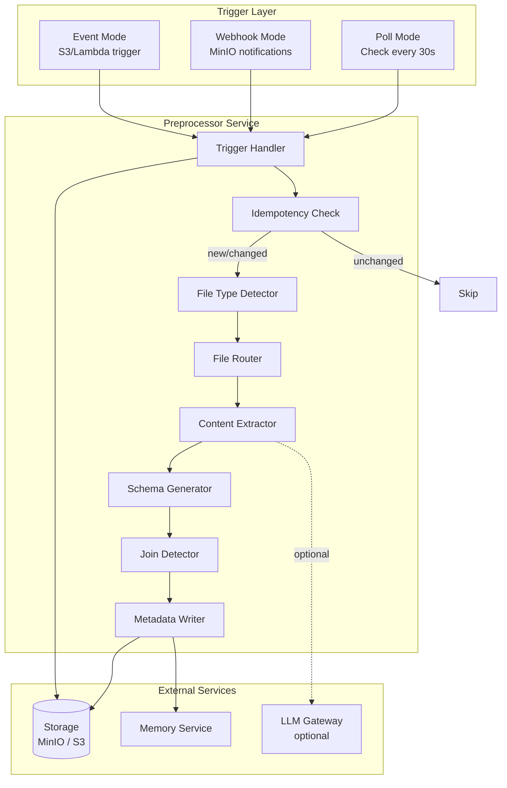
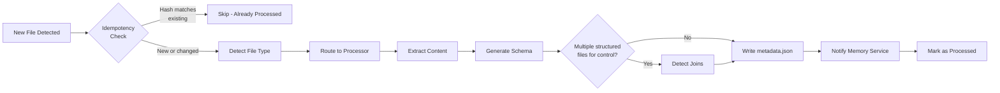
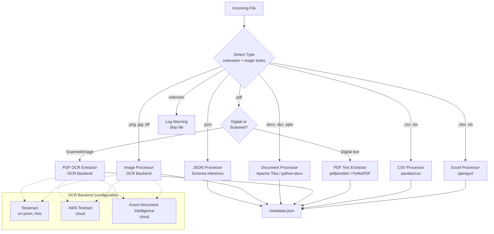
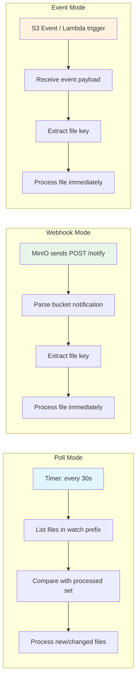
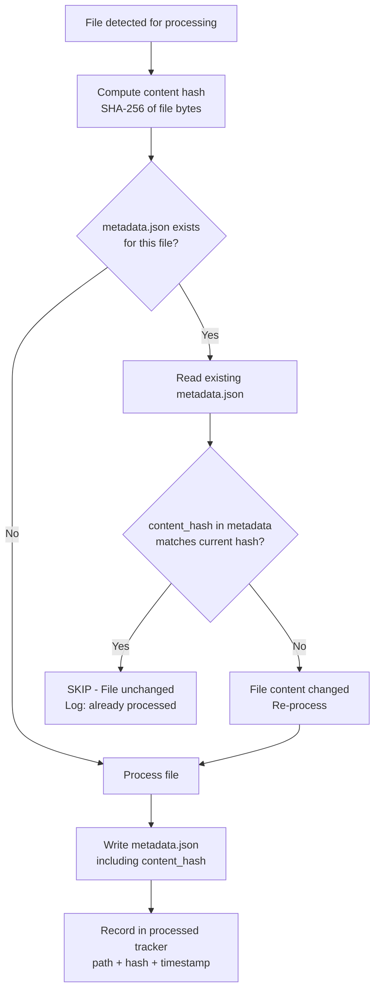
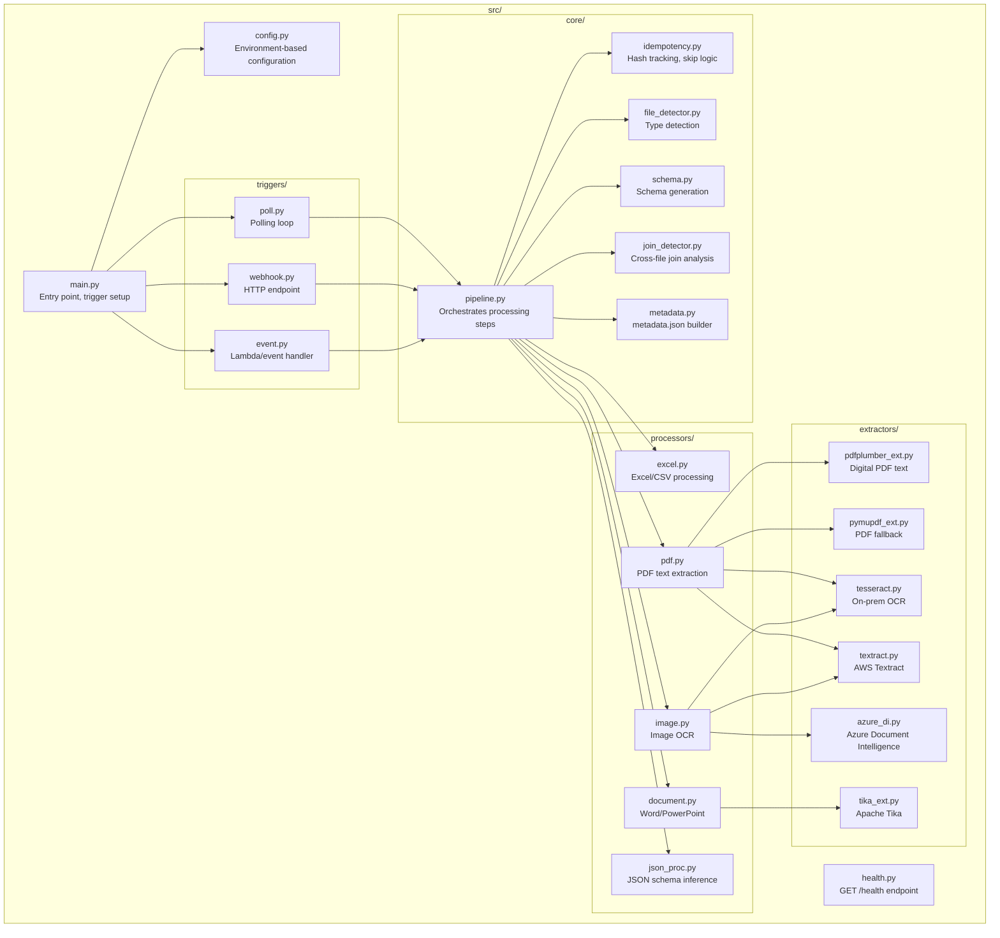

# Preprocessor Service - Design Document

## Overview

The preprocessor is a file ingestion service that converts raw uploads (Excel, CSV, PDF, Word, images) into structured metadata consumable by evaluation agents. It runs independently, triggered by file upload events, and does not perform any evaluation or require GPU resources.

**Core principle:** Prepare data, never evaluate it.

---

## High-Level Architecture



---

## Processing Pipeline



---

## File Type Routing



---

## Trigger Modes Comparison



| Mode | Latency | Complexity | Best For |
|------|---------|------------|----------|
| Poll | Up to 30s delay | Lowest | On-prem, simple deployments |
| Webhook | Near real-time | Medium | MinIO with notifications enabled |
| Event | Real-time | Highest | AWS with Lambda/EventBridge |

---

## Idempotency Check Flow



**Idempotency guarantees:**
- Same file content always produces identical `metadata.json` output
- Content hash (SHA-256) is the source of truth for change detection
- Processed tracker prevents redundant work across restarts
- No side effects on skip (no memory notification, no re-write)

---

## Module Structure



---

## Detailed Source Layout

```
preprocessor/
├── Dockerfile
├── requirements.txt
├── REQUIREMENTS.md
├── DESIGN.md
├── src/
│   ├── main.py                  # Entry point: parse config, select trigger, start
│   ├── config.py                # Pydantic settings from env vars
│   ├── health.py                # GET /health (Flask/FastAPI minimal)
│   ├── triggers/
│   │   ├── __init__.py
│   │   ├── poll.py              # Periodic scan of watch prefix
│   │   ├── webhook.py           # HTTP POST receiver (MinIO notifications)
│   │   └── event.py            # Lambda/EventBridge event handler
│   ├── core/
│   │   ├── __init__.py
│   │   ├── pipeline.py          # Main orchestration: detect → extract → schema → joins → write
│   │   ├── file_detector.py     # File type detection (extension + python-magic)
│   │   ├── schema.py            # Column type inference, sample rows, row counts
│   │   ├── join_detector.py     # Cross-file common column detection
│   │   ├── idempotency.py       # Content hash computation, processed file tracking
│   │   └── metadata.py          # Build and serialize metadata.json
│   ├── processors/
│   │   ├── __init__.py
│   │   ├── excel.py             # openpyxl for .xlsx, xlrd for .xls, csv module for .csv
│   │   ├── pdf.py               # Route to digital extractor or OCR based on content
│   │   ├── document.py          # python-docx, python-pptx, or Tika fallback
│   │   ├── image.py             # Route to configured OCR backend
│   │   └── json_proc.py         # Parse JSON, infer schema, summarize structure
│   └── extractors/
│       ├── __init__.py
│       ├── base.py              # Abstract base class for all extractors
│       ├── tesseract.py         # pytesseract wrapper (on-prem OCR)
│       ├── textract.py          # AWS Textract client (cloud OCR)
│       ├── azure_di.py          # Azure Document Intelligence client
│       ├── pdfplumber_ext.py    # pdfplumber for digital PDF text extraction
│       ├── pymupdf_ext.py       # PyMuPDF/fitz as fallback PDF extractor
│       └── tika_ext.py          # Apache Tika for Word/PowerPoint
├── tests/
│   ├── test_pipeline.py
│   ├── test_processors.py
│   ├── test_extractors.py
│   ├── test_idempotency.py
│   ├── test_join_detector.py
│   └── fixtures/                # Sample Excel, PDF, Word, image files
└── common/                      # Copied from /common at build time
    ├── storage_client.py
    ├── memory_client.py
    ├── llm_client.py
    └── logger.py
```

---

## Key Design Decisions

### 1. No GPU Required

All OCR processing uses CPU-based Tesseract. The Docker image includes the Tesseract binary and language data. This keeps the image portable to any machine without GPU drivers or CUDA setup.

### 2. Configurable Extraction Backends

Backends are selected via `OCR_BACKEND` and `PDF_BACKEND` environment variables. The extractor layer uses a strategy pattern with a common interface:

```python
class BaseExtractor(ABC):
    @abstractmethod
    def extract_text(self, file_bytes: bytes, **kwargs) -> str: ...

    @abstractmethod
    def is_available(self) -> bool: ...
```

Fallback chain: if the primary backend fails or is unavailable, the system tries the next configured backend before raising an error.

### 3. Idempotency by Content Hash

- SHA-256 of file bytes serves as the content fingerprint
- The hash is stored in `metadata.json` alongside the output
- On re-encounter, hash is compared before any processing begins
- This ensures correctness even across service restarts

### 4. Join Detection Strategy

When multiple structured files exist for the same control/tenant prefix:
1. Collect all column names from each file's schema
2. Find exact name matches across files
3. Score confidence based on: name match, type compatibility, value overlap (sampled)
4. Report join candidates with confidence score in metadata

### 5. Memory Notification (Not Evaluation)

After successful processing, the preprocessor notifies the memory service:
```python
memory.tenant_remember(
    tenant_id=tenant_id,
    fact=f"New file uploaded: {filename}, type: {file_type}",
    category="evidence",
    source="preprocessor"
)
```
This allows evaluation agents to discover new evidence without polling storage directly.

### 6. LLM Usage is Optional

The preprocessor works fully without an LLM gateway. LLM is only used for:
- Ambiguous column type detection (when heuristics fail)
- File relevance classification (is this compliance evidence?)

If `LLM_GATEWAY_URL` is not set, these steps are skipped gracefully.

---

## Configuration Reference

| Variable | Default | Description |
|----------|---------|-------------|
| `STORAGE_ENDPOINT` | `http://minio:9000` | Storage service URL |
| `STORAGE_BUCKET` | `compliance-artifacts` | Primary bucket name |
| `MEMORY_URL` | `http://memory-service:5000` | Memory service URL |
| `LLM_GATEWAY_URL` | (none) | LLM gateway URL (optional) |
| `TRIGGER_MODE` | `poll` | `poll`, `webhook`, or `event` |
| `POLL_INTERVAL_SEC` | `30` | Seconds between poll cycles |
| `WATCH_PREFIX` | `uploads/` | Storage prefix to watch |
| `OCR_BACKEND` | `tesseract` | `tesseract`, `textract`, or `azure_di` |
| `PDF_BACKEND` | `pdfplumber` | `pdfplumber`, `pymupdf`, or `tika` |
| `MAX_FILE_SIZE_MB` | `100` | Maximum file size to process |
| `LOG_LEVEL` | `info` | Logging verbosity |
| `PORT` | `7000` | HTTP port for health check and webhook |

---

## Error Handling

| Scenario | Behavior |
|----------|----------|
| File exceeds `MAX_FILE_SIZE_MB` | Skip, log warning, write error metadata |
| OCR backend unavailable | Try fallback backend, then fail with error metadata |
| Storage unreachable | Retry 3x with backoff, then crash (trigger restart) |
| Memory service down | Log warning, continue (notification is best-effort) |
| LLM gateway down | Skip LLM-dependent steps, continue with heuristics |
| Corrupt file (cannot parse) | Write error metadata with reason, do not crash |
| Unsupported file type | Skip, log info |

---

## Health Check

`GET /health` on the configured `PORT` returns:

```json
{
  "status": "healthy",
  "trigger_mode": "poll",
  "ocr_backend": "tesseract",
  "pdf_backend": "pdfplumber",
  "files_processed": 142,
  "last_processed_at": "2026-05-10T14:32:01Z"
}
```

---

## Docker Image

```dockerfile
FROM python:3.11-slim

# Install Tesseract OCR
RUN apt-get update && apt-get install -y \
    tesseract-ocr \
    tesseract-ocr-eng \
    libmagic1 \
    && rm -rf /var/lib/apt/lists/*

WORKDIR /app
COPY requirements.txt .
RUN pip install --no-cache-dir -r requirements.txt

COPY common/ /app/common/
COPY src/ /app/src/

HEALTHCHECK --interval=30s --timeout=5s \
    CMD curl -f http://localhost:7000/health || exit 1

CMD ["python", "-m", "src.main"]
```

---

## Sequence: Full File Processing

```
1. Trigger detects new file "uploads/tenant-123/access_review.xlsx"
2. Idempotency check: compute SHA-256 of file bytes
3. Check if metadata.json exists with matching hash → does not exist
4. Detect type: extension=.xlsx, magic bytes confirm Excel
5. Route to Excel processor
6. Excel processor:
   a. Open with openpyxl
   b. For each sheet: read columns, types, row count, sample 5 rows
7. Schema generator: infer column types (string, date, numeric, ID)
8. Join detector: check other files in same prefix for common columns
9. Build metadata.json with all gathered information
10. Write metadata.json to storage alongside original file
11. Notify memory service: "New file uploaded: access_review.xlsx, type: excel"
12. Record file path + hash in processed tracker
13. Done
```
