# Deployment Architecture — On-Prem & AWS

## Overview

This document provides high-level architecture diagrams for both deployment modes. The same Docker images deploy to both environments — only infrastructure configuration changes via environment variables.

---

## On-Premises Architecture (Docker Compose)

### Network Topology

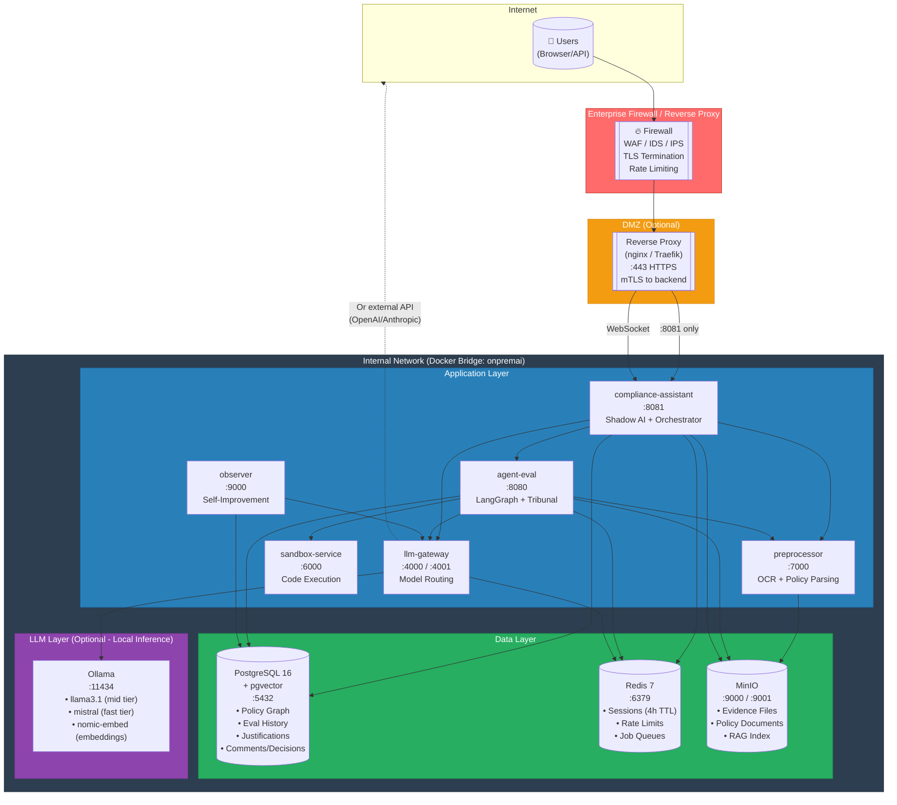

### Security Zones

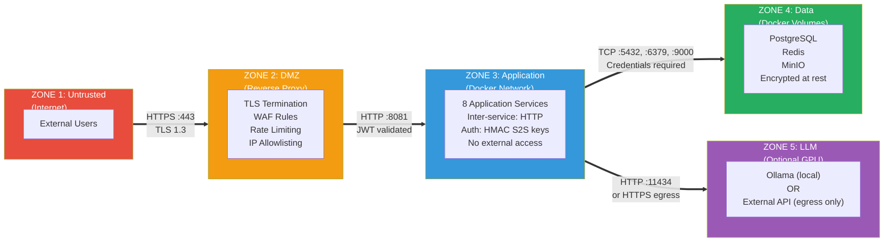

### On-Prem Data Flow

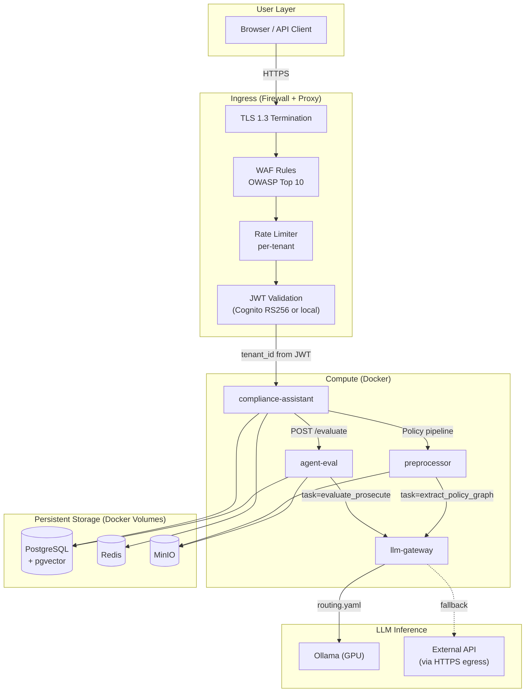

### Hardware Requirements

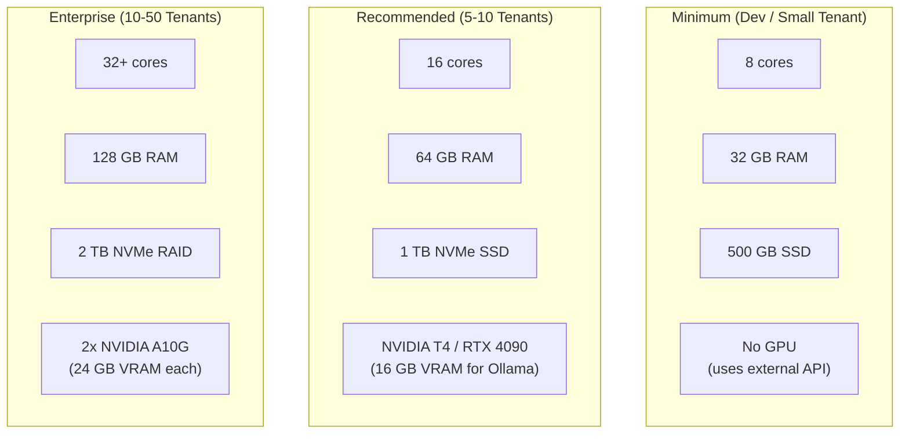

---

## AWS Architecture (Production)

### High-Level AWS Architecture

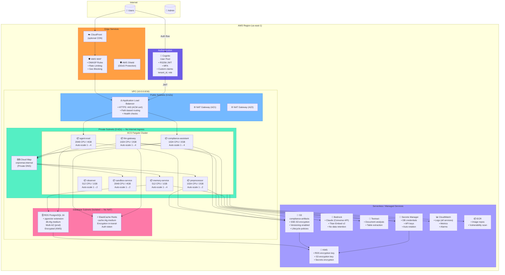

### AWS Security Architecture

```mermaid
graph TB
    subgraph Perimeter["Perimeter Security"]
        direction LR
        SHIELD_P["🛡️ Shield Advanced<br/>DDoS L3/L4/L7"]
        WAF_P["🛡️ WAF v2<br/>• SQL injection<br/>• XSS<br/>• Rate: 2000 req/5min<br/>• Geo-restrict"]
        ACM["🔒 ACM Certificate<br/>TLS 1.2+ only<br/>Auto-renewal"]
    end

    subgraph Network["Network Security"]
        direction LR
        SG_ALB["🔒 SG: ALB<br/>Inbound: 443 from 0.0.0.0/0<br/>Outbound: ECS SG only"]
        SG_ECS["🔒 SG: ECS Services<br/>Inbound: ALB SG only<br/>Outbound: DB SG + NAT"]
        SG_DB["🔒 SG: Database<br/>Inbound: ECS SG only<br/>Outbound: None"]
        NACL["🔒 NACLs<br/>DB subnet: deny all<br/>except ECS CIDR"]
    end

    subgraph Identity["Identity & Access"]
        direction LR
        COGNITO_ID["🔐 Cognito<br/>• MFA enforced<br/>• Password policy<br/>• JWT RS256<br/>• Custom claims"]
        IAM_TASK["🔐 Task IAM Roles<br/>• Least privilege<br/>• Per-service policies<br/>• No * resources"]
        IAM_EXEC["🔐 Execution Roles<br/>• ECR pull only<br/>• Secrets read only<br/>• CloudWatch write"]
    end

    subgraph DataProtection["Data Protection"]
        direction LR
        KMS_KEY["🔐 KMS CMK<br/>• Key rotation enabled<br/>• Key policy restricts<br/>  to service roles"]
        RDS_ENC["🔒 RDS Encryption<br/>• At-rest (AES-256)<br/>• In-transit (TLS)<br/>• IAM DB auth"]
        S3_ENC["🔒 S3 Encryption<br/>• SSE-S3 default<br/>• Bucket policy<br/>• Block public access<br/>• VPC endpoint"]
        REDIS_ENC["🔒 Redis Encryption<br/>• In-transit TLS<br/>• Auth token<br/>• No public access"]
    end

    subgraph Monitoring["Security Monitoring"]
        direction LR
        CT["📋 CloudTrail<br/>• All API calls<br/>• S3 data events<br/>• Multi-region"]
        GD["🔍 GuardDuty<br/>• Anomaly detection<br/>• Threat findings<br/>• Auto-remediation"]
        CONFIG["📋 AWS Config<br/>• Compliance rules<br/>• Drift detection<br/>• Auto-remediate"]
        CW_ALARMS["🚨 CloudWatch Alarms<br/>• Auth failures > 10/min<br/>• 5xx errors > 5%<br/>• Latency P99 > 5s"]
    end

    subgraph TenantIsolation["Tenant Isolation"]
        direction LR
        APP_TENANT["🏢 Application Layer<br/>• tenant_id from JWT<br/>• Query filter on ALL<br/>  data access<br/>• Never from request body"]
        DB_TENANT["🏢 Database Layer<br/>• PostgreSQL RLS<br/>• SET app.current_tenant<br/>• Defense-in-depth"]
        S3_TENANT["🏢 Storage Layer<br/>• Prefix: {tenant_id}/<br/>• IAM conditions:<br/>  s3:prefix = tenant_id"]
    end

    Perimeter --> Network
    Network --> Identity
    Identity --> DataProtection
    DataProtection --> Monitoring
    Monitoring --> TenantIsolation

    style Perimeter fill:#e74c3c,color:#fff
    style Network fill:#f39c12,color:#fff
    style Identity fill:#9b59b6,color:#fff
    style DataProtection fill:#2980b9,color:#fff
    style Monitoring fill:#27ae60,color:#fff
    style TenantIsolation fill:#1abc9c,color:#fff
```

### IAM Roles per Service (Least Privilege)

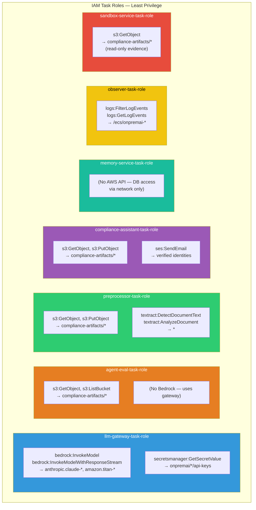

### Network Flow (AWS)

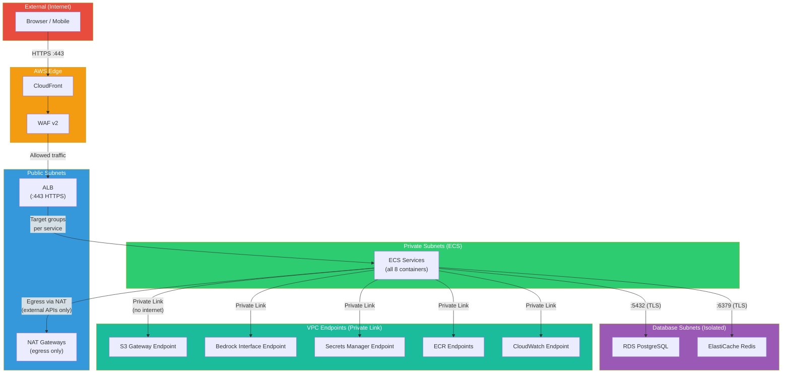

### Data Encryption

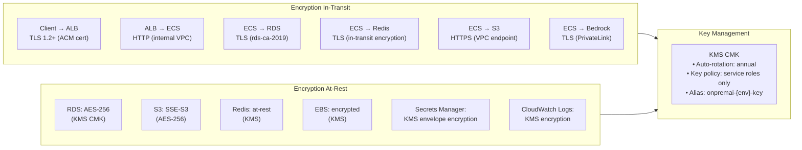

---

## Service Communication Patterns

### Both Environments

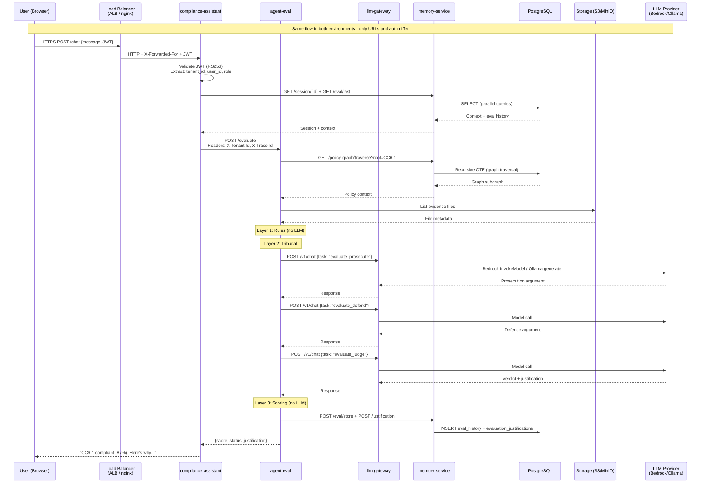

---

## Adapter Configuration

### Environment Variable Mapping

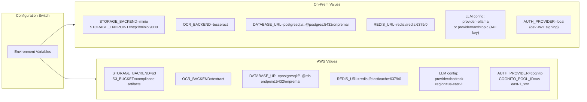

---

## Scaling Comparison

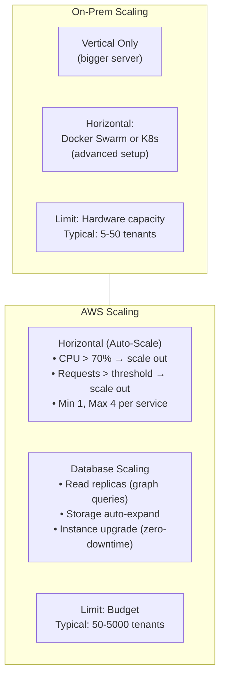

---

## Disaster Recovery

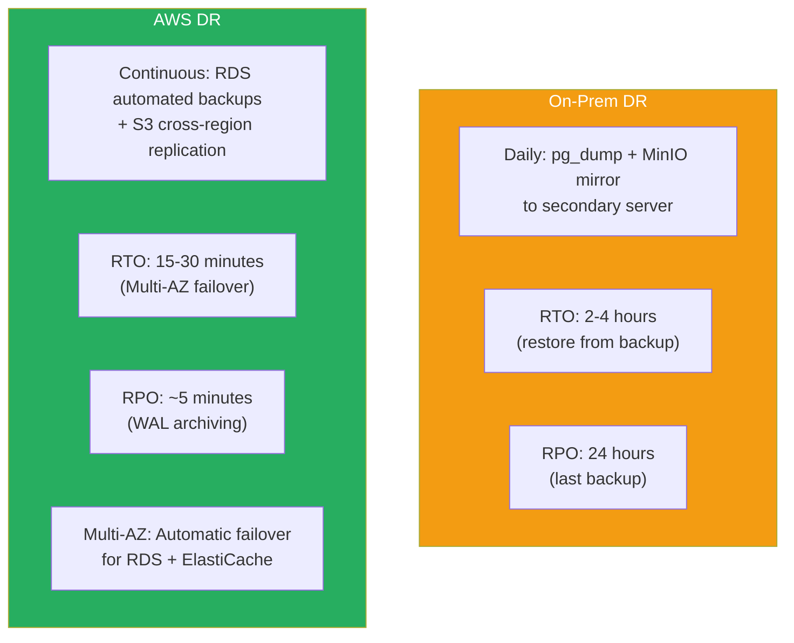

---

## Deployment Pipeline

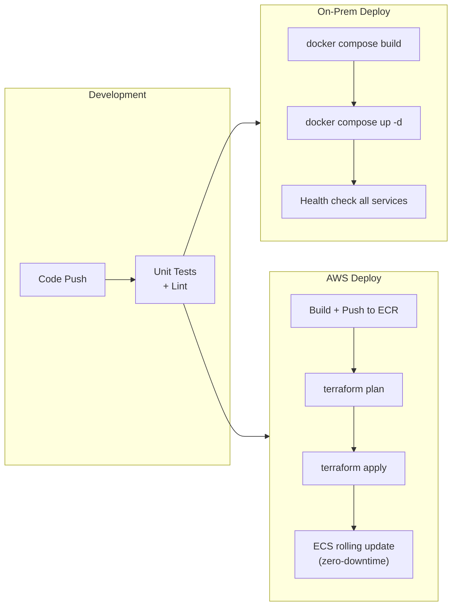

---

## Cost Summary

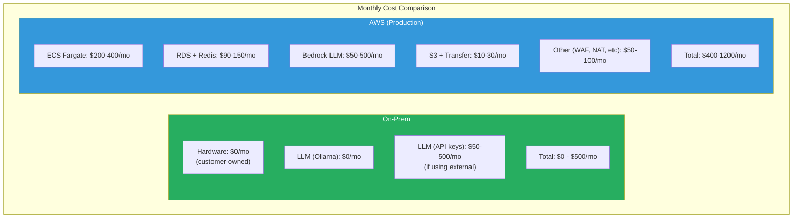
