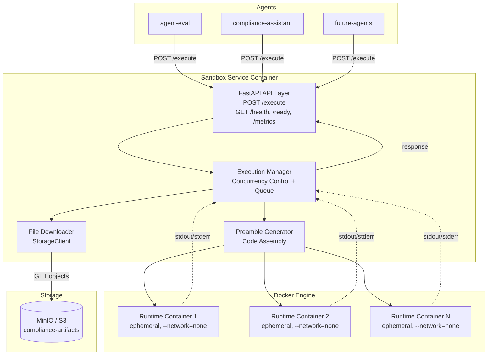
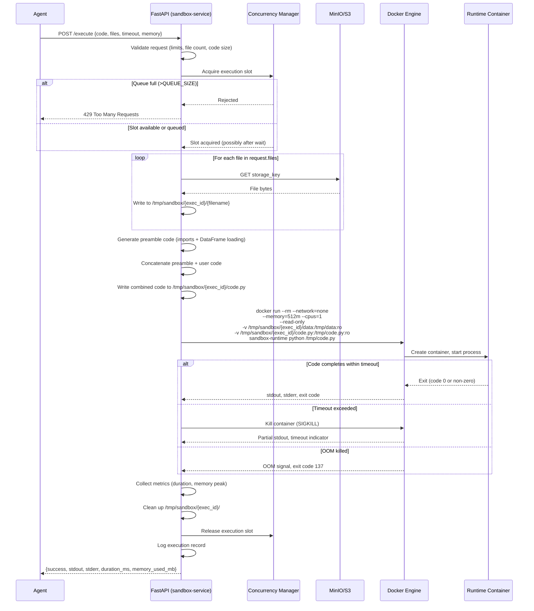
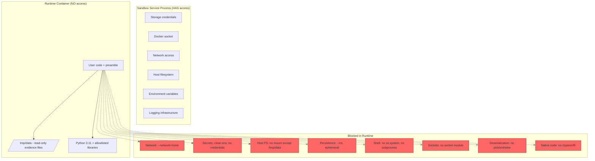
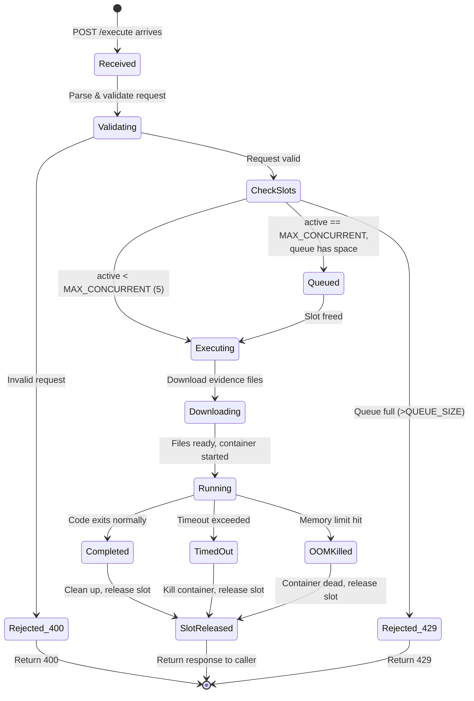
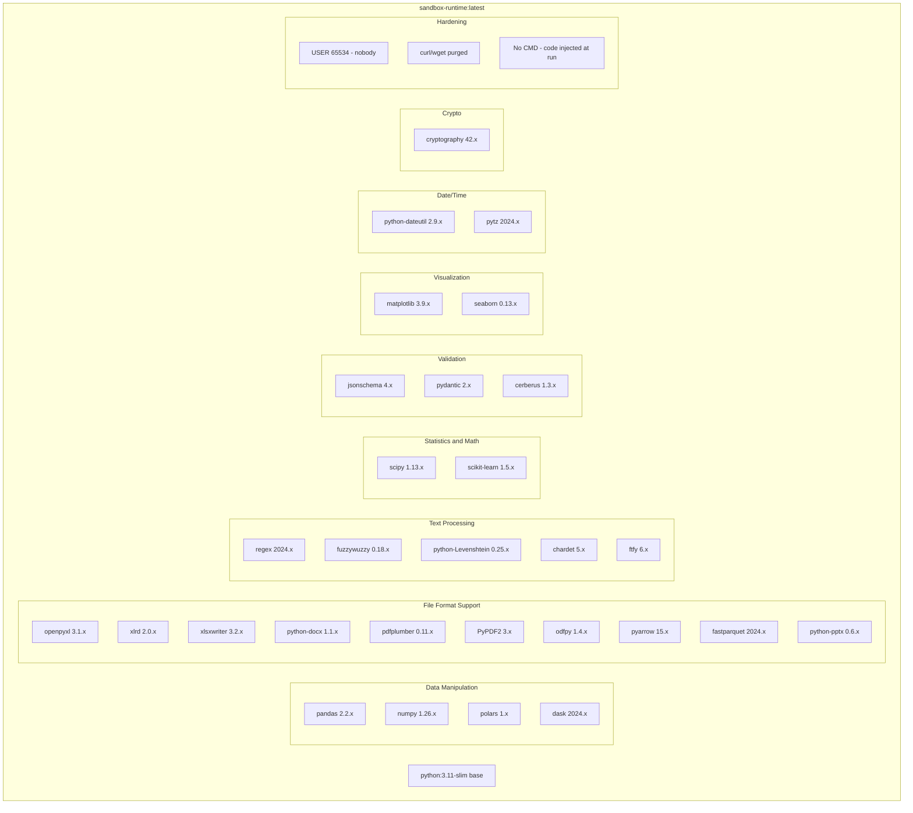
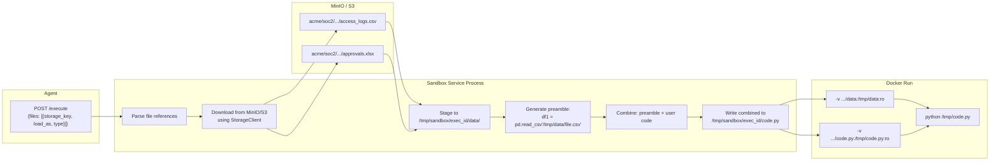
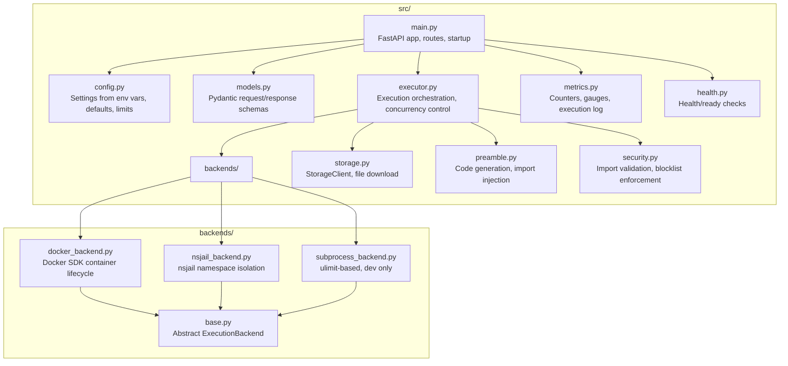
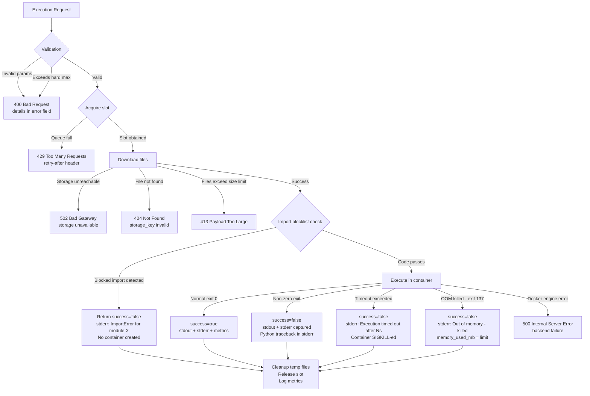

# Sandbox Service - Architecture Design Document

## Overview

The Sandbox Service is an isolated code execution engine that receives Python code and evidence file references from any agent, downloads those files from object storage (MinIO/S3), runs the code in ephemeral Docker containers with zero network access, and returns structured results (stdout, stderr, duration, memory usage) to the caller.

The service exists to allow LLM-generated analysis code to run safely against compliance evidence without risking agent memory, secrets, host access, or inter-service communication.

---

## High-Level Architecture



---

## Execution Flow Sequence Diagram



---

## Security Isolation Model



### Security Boundaries Summary

| Layer | What it prevents |
|-------|-----------------|
| `--network=none` | All TCP/UDP/ICMP traffic; DNS resolution; HTTP calls |
| `--read-only` | Writing to container filesystem (except tmpfs) |
| `--memory=512m` | Memory exhaustion attacks |
| `--cpus=1` | CPU starvation of host/other containers |
| `--rm` | State persistence between executions |
| No env vars | Secret exfiltration |
| Read-only data mount | Evidence file tampering |
| Import blocklist | Shell escape, network bypass, native code |
| `USER 65534` (nobody) | Privilege escalation within container |
| No Docker socket mount | Container escape via Docker API |
| SIGKILL on timeout | Infinite loops, resource holding |

---

## Concurrency Management



### Concurrency Parameters

| Parameter | Default | Description |
|-----------|---------|-------------|
| `MAX_CONCURRENT_EXECUTIONS` | 5 | Containers running simultaneously |
| `QUEUE_SIZE` | 20 | Requests waiting for a slot |
| Backpressure response | HTTP 429 | Returned when queue is full |

Implementation uses an `asyncio.Semaphore(MAX_CONCURRENT)` with bounded queue. When a slot is released, the next queued request proceeds immediately. The queue operates FIFO.

---

## Runtime Image Contents



---

## Data Flow: Evidence Files Into the Container



### Data Flow Steps

1. Agent sends `files` array with `storage_key` (object path), `load_as` (variable name), and `type` (csv, excel, etc.)
2. Service downloads each file from storage into a unique temp directory: `/tmp/sandbox/{execution_id}/data/`
3. Service generates Python loading code for each file based on its type
4. Generated preamble is prepended to user-submitted code
5. Both the data directory and the code file are bind-mounted into the runtime container as **read-only**
6. The runtime container sees files at `/tmp/data/` and code at `/tmp/code.py`
7. After execution completes (or is killed), the temp directory is deleted

---

## Module Structure



### Module Responsibilities

| Module | Responsibility |
|--------|---------------|
| `main.py` | FastAPI application, route definitions, lifespan events |
| `config.py` | Pydantic Settings model, environment variable parsing, limit constants |
| `models.py` | `ExecuteRequest`, `ExecuteResponse`, `FileReference` schemas |
| `executor.py` | Semaphore-based concurrency, orchestrates download-generate-execute-cleanup |
| `backends/base.py` | Abstract `ExecutionBackend` with `run(code, data_dir, limits) -> Result` |
| `backends/docker_backend.py` | Docker SDK (`docker-py`) container creation, run, wait, remove |
| `backends/nsjail_backend.py` | nsjail subprocess with namespace/cgroup isolation |
| `backends/subprocess_backend.py` | Plain subprocess with ulimit (dev/test only) |
| `storage.py` | `StorageClient` wrapping boto3/minio-py for file download |
| `preamble.py` | Generates import block and DataFrame loading statements |
| `security.py` | Static analysis of user code for blocked imports; runtime hook generation |
| `metrics.py` | In-memory counters for executions, success/failure, durations |
| `health.py` | `/health` (liveness) and `/ready` (storage + Docker reachable) |

---

## Error Handling



### Error Categories

| Category | HTTP Status | `success` field | Cause |
|----------|-------------|-----------------|-------|
| Validation error | 400 | N/A (no execution) | Invalid code, bad limits, wrong file spec |
| Concurrency overflow | 429 | N/A (no execution) | All slots and queue positions occupied |
| Storage failure | 502 | N/A (no execution) | Cannot reach MinIO/S3 |
| File not found | 404 | N/A (no execution) | Referenced storage_key does not exist |
| File too large | 413 | N/A (no execution) | Total file size exceeds limit |
| Blocked import | 200 | `false` | Static analysis caught forbidden module |
| Runtime exception | 200 | `false` | Python error in user code (KeyError, etc.) |
| Timeout | 200 | `false` | Execution exceeded timeout_sec |
| OOM killed | 200 | `false` | Memory usage exceeded memory_limit_mb |
| Backend failure | 500 | N/A | Docker engine unreachable, internal error |

Note: Runtime errors (exceptions, timeout, OOM) return HTTP 200 with `success=false` because the service operated correctly -- the user code simply failed. This allows agents to parse the response uniformly.

---

## Key Design Decisions

### 1. Docker-in-Docker (not subprocess)

**Decision**: Use Docker containers for execution isolation (Backend A).

**Rationale**:
- **Namespace isolation**: Each container gets its own PID namespace, mount namespace, network namespace, and user namespace. A subprocess shares all of these with the host.
- **Resource enforcement**: Docker's cgroup integration provides hard memory limits and CPU quotas. With `subprocess`, ulimit provides weaker guarantees (e.g., no memory cgroup).
- **Network isolation**: `--network=none` completely removes the network stack from the container. With subprocess, you would need iptables rules or network namespaces configured manually.
- **Cleanup guarantee**: `--rm` ensures the container and its filesystem are destroyed regardless of how the process exits (crash, OOM, timeout). Subprocess cleanup is error-prone.
- **Blast radius**: A container escape is orders of magnitude harder than a subprocess sandbox escape. For running untrusted LLM-generated code, this is the appropriate threat model.
- **No warm pool needed**: Container startup (~500ms) is irrelevant in a 30-45s async evaluation cycle, so the complexity tax of Docker is minimal.

**Trade-off accepted**: Requires Docker socket access in the service container. Mitigated by running the service container with limited Docker socket permissions and never mounting the socket into runtime containers.

### 2. Cold Pool (Fresh Container Per Execution)

**Decision**: Create and destroy a container for every single execution. No warm pool, no container reuse.

**Rationale**:
- The entire eval cycle is async and takes 30-45 seconds. 500ms container startup is < 2% of total latency.
- Fresh containers guarantee zero state leakage between executions.
- Eliminates pool management complexity (sizing, health checks, stale containers, cleanup).
- Every execution starts from a known-good state -- no risk of corrupted Python environment from a previous run.
- Resource accounting is exact: each container's memory and CPU usage belongs to exactly one execution.

### 3. Preamble Code Generation

**Decision**: The service generates a Python preamble that imports common libraries and loads DataFrames, then prepends it to user code before execution.

**Rationale**:
- **Agent simplicity**: The LLM-generated code can reference `df1`, `df2` directly without writing boilerplate file-loading code.
- **Path abstraction**: User code never knows or cares about the actual filesystem path. The preamble handles the mapping from `load_as` variable names to file paths.
- **Import standardization**: The preamble provides `import pandas as pd`, `import numpy as np`, etc., ensuring consistent aliases across all generated code.
- **Warnings suppression**: `warnings.filterwarnings('ignore')` prevents noisy deprecation warnings from polluting stdout.

**Generated preamble example**:
```python
import pandas as pd
import numpy as np
import json
import re
import hashlib
from datetime import datetime, timedelta
from collections import Counter, defaultdict
from pathlib import Path
import warnings
warnings.filterwarnings('ignore')

df1 = pd.read_csv('/tmp/data/access_logs.csv')
df2 = pd.read_excel('/tmp/data/approvals.xlsx')
```

The `load_as` field maps to the variable name. The `type` field determines which pandas reader to use:
| Type | Reader |
|------|--------|
| `csv` | `pd.read_csv(path)` |
| `excel` | `pd.read_excel(path)` |
| `parquet` | `pd.read_parquet(path)` |
| `json` | `pd.read_json(path)` |
| `pdf` | Not loaded as DataFrame; file path assigned as string |

### 4. Import Allowlist/Blocklist Enforcement

**Decision**: Two-layer enforcement -- static analysis before execution + runtime import hook inside the container.

**Layer 1: Static Analysis (in service, before container creation)**

The `security.py` module performs AST-based analysis of user code:

```python
import ast

BLOCKED_MODULES = {
    'os', 'subprocess', 'shutil', 'socket', 'http', 'urllib',
    'requests', 'httpx', 'sqlite3', 'psycopg2', 'pymongo',
    'pickle', 'shelve', 'ctypes', 'cffi', 'importlib',
}

BLOCKED_ATTRIBUTES = {
    ('os', 'system'), ('os', 'popen'), ('os', 'exec'),
    ('os', 'spawn'), ('shutil', 'rmtree'),
}

def check_code_safety(code: str) -> list[str]:
    """Returns list of violations, empty if safe."""
    tree = ast.parse(code)
    violations = []
    for node in ast.walk(tree):
        if isinstance(node, ast.Import):
            for alias in node.names:
                module = alias.name.split('.')[0]
                if module in BLOCKED_MODULES:
                    violations.append(f"Blocked import: {alias.name}")
        elif isinstance(node, ast.ImportFrom):
            if node.module:
                module = node.module.split('.')[0]
                if module in BLOCKED_MODULES:
                    violations.append(f"Blocked import: from {node.module}")
    return violations
```

If violations are found, no container is created. Response returns immediately with `success=false` and the violation details in stderr.

**Layer 2: Runtime Import Hook (defense in depth)**

The preamble includes an import hook that blocks dynamic imports that might bypass static analysis:

```python
import builtins
_original_import = builtins.__import__
_BLOCKED = {'os', 'subprocess', 'socket', 'http', 'urllib', ...}

def _safe_import(name, *args, **kwargs):
    top_level = name.split('.')[0]
    if top_level in _BLOCKED:
        raise ImportError(f"Module '{name}' is not available in sandbox")
    return _original_import(name, *args, **kwargs)

builtins.__import__ = _safe_import
```

This catches `__import__('os')`, `importlib.import_module('subprocess')`, and other dynamic import patterns that AST analysis might miss.

### 5. Docker Socket Security

**Decision**: The service container mounts the host Docker socket but applies several mitigations.

**Mitigations**:
- The Docker socket is only mounted into the **service container**, never into runtime containers.
- The service uses the Docker SDK with a restricted set of operations: `create`, `start`, `wait`, `logs`, `remove`. No image pull, no exec, no network create.
- Runtime containers are created with `--security-opt=no-new-privileges` to prevent privilege escalation.
- Runtime containers run as `USER 65534` (nobody) -- even if they escape the container, they have no privileges.
- The service validates all Docker API parameters before calling -- no user input reaches Docker flags directly.
- In production, consider using a Docker socket proxy (e.g., Tecnativa/docker-socket-proxy) that only allows container-related API calls.

**Future hardening** (not required for initial deployment):
- Use rootless Docker or Podman to eliminate the privileged socket entirely.
- Use gVisor (`--runtime=runsc`) for syscall-level sandboxing within containers.

### 6. Two-Image Architecture

**Decision**: Separate service image from runtime image.

**Rationale**:
- **Different change cadence**: The service code changes frequently (new features, bug fixes). The runtime image changes rarely (only when adding new Python libraries).
- **Size optimization**: The runtime image is large (~1.5GB with all scientific libraries). Keeping it separate means service deploys don't re-pull the runtime layer.
- **Security surface**: The service image needs network access, storage credentials, Docker SDK. The runtime image needs none of these -- keeping them separate enforces this boundary.
- **Testability**: The runtime image can be tested independently (run sample code, verify library imports work).

---

## Monitoring and Metrics

### Metrics Collected

| Metric | Type | Description |
|--------|------|-------------|
| `sandbox_executions_total` | Counter | Total executions attempted |
| `sandbox_executions_success` | Counter | Executions completing with `success=true` |
| `sandbox_executions_failed` | Counter | Executions completing with `success=false` |
| `sandbox_executions_timeout` | Counter | Executions killed by timeout |
| `sandbox_executions_oom` | Counter | Executions killed by OOM |
| `sandbox_execution_duration_ms` | Histogram | End-to-end execution time distribution |
| `sandbox_file_download_duration_ms` | Histogram | Time spent downloading evidence files |
| `sandbox_active_executions` | Gauge | Currently running containers |
| `sandbox_queued_requests` | Gauge | Requests waiting for execution slot |
| `sandbox_memory_used_mb` | Histogram | Peak memory per execution |
| `sandbox_rejected_429` | Counter | Requests rejected due to queue overflow |
| `sandbox_blocked_imports` | Counter | Executions rejected by import blocklist |

### Structured Execution Log

Every execution produces a structured JSON log entry:

```json
{
  "timestamp": "2026-05-11T14:23:01.432Z",
  "trace_id": "exec-a7b3c9d2",
  "agent": "agent-eval",
  "duration_ms": 3420,
  "download_ms": 850,
  "execution_ms": 2570,
  "success": true,
  "exit_code": 0,
  "memory_used_mb": 187,
  "file_count": 2,
  "total_file_size_mb": 12,
  "timeout": false,
  "oom_killed": false,
  "blocked_imports": [],
  "stdout_size_bytes": 234,
  "stderr_size_bytes": 0
}
```

### Health Endpoints

| Endpoint | Purpose | Checks |
|----------|---------|--------|
| `GET /health` | Liveness probe | Service process alive |
| `GET /ready` | Readiness probe | Storage reachable + Docker socket accessible + runtime image available |
| `GET /metrics` | Operational dashboard | Aggregated counters and gauges |

---

## API Contract

### POST /execute

**Request**:
```json
{
  "code": "string (required) - Python code to execute",
  "files": [
    {
      "storage_key": "string - object path in storage",
      "load_as": "string - Python variable name for this data",
      "type": "string - csv|excel|parquet|json|pdf"
    }
  ],
  "timeout_sec": "int (optional, default 60, max 300)",
  "memory_limit_mb": "int (optional, default 512, max 2048)"
}
```

**Response (200)**:
```json
{
  "success": "boolean",
  "stdout": "string - captured standard output (truncated at MAX_OUTPUT_SIZE_MB)",
  "stderr": "string - captured standard error",
  "duration_ms": "int - wall-clock time from container start to exit",
  "memory_used_mb": "int - peak resident memory"
}
```

**Error Responses**:
- `400` - Invalid request body
- `404` - Referenced storage_key not found
- `413` - Total file size exceeds limit
- `429` - Service at capacity, retry later
- `500` - Internal error (Docker engine failure)
- `502` - Storage backend unreachable

---

## Deployment Topology

```mermaid
graph LR
    subgraph "Docker Host"
        subgraph "Compose Network"
            SS[sandbox-service<br/>Port 9000<br/>1GB RAM, 2 CPU]
            MINIO[minio<br/>Port 9000/9001<br/>Storage]
        end

        DS[/var/run/docker.sock]

        subgraph "Ephemeral (created on demand)"
            R1[runtime container<br/>512MB, 1 CPU<br/>--network=none]
            R2[runtime container<br/>512MB, 1 CPU<br/>--network=none]
        end
    end

    SS ---|Docker socket| DS
    DS ---|creates| R1
    DS ---|creates| R2
    SS ---|storage API| MINIO
```

The runtime containers are **not** part of the compose network. They are created directly via the Docker socket with `--network=none`, making them completely isolated from all other services including the sandbox service itself. Communication between the service and runtime happens only via:
1. Bind-mounted files (code + data, read-only)
2. Captured stdout/stderr after container exits

---

## Configuration Reference

| Variable | Default | Description |
|----------|---------|-------------|
| `STORAGE_ENDPOINT` | `http://minio:9000` | Object storage URL |
| `STORAGE_BUCKET` | `compliance-artifacts` | Bucket name |
| `STORAGE_ACCESS_KEY` | (required) | Storage credentials |
| `STORAGE_SECRET_KEY` | (required) | Storage credentials |
| `EXECUTION_BACKEND` | `docker` | `docker`, `nsjail`, or `subprocess` |
| `DOCKER_SOCKET` | `/var/run/docker.sock` | Path to Docker socket |
| `RUNTIME_IMAGE` | `yourorg/compliance-sandbox-runtime:latest` | Runtime container image |
| `MAX_CONCURRENT_EXECUTIONS` | `5` | Parallel execution limit |
| `DEFAULT_TIMEOUT_SEC` | `60` | Default execution timeout |
| `MAX_TIMEOUT_SEC` | `300` | Hard maximum timeout |
| `DEFAULT_MEMORY_MB` | `512` | Default memory limit |
| `MAX_MEMORY_MB` | `2048` | Hard maximum memory |
| `MAX_OUTPUT_SIZE_MB` | `1` | Stdout truncation limit |
| `MAX_FILE_COUNT` | `10` | Max files per request |
| `MAX_TOTAL_FILE_SIZE_MB` | `100` | Max total download size |
| `QUEUE_SIZE` | `20` | Max queued requests |
| `LOG_LEVEL` | `info` | Logging verbosity |
| `PORT` | `9000` | Service listen port |

---

## Future Extensibility

The design explicitly supports these future enhancements without architectural changes:

1. **Artifact output**: Runtime containers could write to a `/tmp/output` directory (mounted writable). Service collects output files and uploads to storage, returning download URLs.
2. **Multi-language**: Runtime image could include Node.js or R. The `type` field in the request could specify the language, and the backend selects the appropriate interpreter.
3. **GPU access**: A `gpu: true` flag in the request could trigger `--gpus` flag on the Docker run command for ML-heavy analysis.
4. **Streaming output**: For long-running code, a WebSocket endpoint could stream stdout in real-time using `docker attach`.
5. **Warm pool**: If sync use cases emerge requiring sub-100ms startup, a pool manager can pre-create containers waiting for code injection.
6. **Distributed execution**: Multiple sandbox-service replicas behind a load balancer, each with its own Docker host, scaling horizontally.
